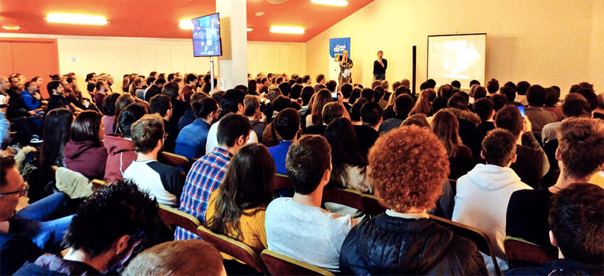

L'événement [Codeurs en Seine](https://www.codeursenseine.com/2019/) s’est tenu le 21 novembre dernier au Kindarena à **Rouen** avec près de 1000 participants. Depuis 2009, l’initiative de quelques développeurs aguerris s’est ainsi agrandie pour le bonheur de notre **communauté numérique** et **novatrice**.

## Une organisation rodée et efficace

Depuis plusieurs années, le BearStudio a la fierté d'être un des sponsors de l'événement et de mobiliser une partie de son [équipe](https://www.bearstudio.fr/team) dans l'organisation de cette journée.

Le BearStudio était **sponsor** et une partie de son [équipe](https://www.bearstudio.fr/team) fut organisatrice de l'événement axé sur des **conférences** aussi instructives qu’inspirantes. Nous vous proposons donc un retour sur notre expérience 2019 !

« Niveau organisation nous sommes bien rodés, ça tourne bien, on a simplifié plein de choses, notamment à l’accueil, ça se fluidifie bien. Nous avons eu pas mal d’organisateurs cette année donc ça permet de bien avancer et de répartir les tâches. » ([Rudy Baer)](https://www.linkedin.com/in/rudybaer/)

Les intervenants très hétéroclites et tous prêts à nous apporter leur lumière sur **JavaScript**, l’**ITCSS** ou encore sur le bien-être au travail. [Andréa Cauchoix](https://www.linkedin.com/in/andr%C3%A9a-cauchoix/) livre ses impressions :

« Super première de Codeurs en Seine pour moi, j’ai beaucoup aimé les plénières d’ouverture et de fin. L’organisation est vraiment chouette et rodée. Les organisateurs sont vraiment aux petits soins avec les speakers et ça fait plaisir. Les deux personnes qui se sont occupées de la salle C étaient adorables et très rassurantes. Des belles rencontres et de beaux échanges. C’est vraiment top de pouvoir avoir les retours avec les gommettes sur le tableau de nos **conférences**. »

## Partager les connaissances et débattre sur les métiers web et design

### Les plénières

La journée s’est divisée en deux formats de **conférences**. Nous saluons tout particulièrement les plénières de [Thierry Croix](https://www.linkedin.com/in/thierrycroix/), [Benjamin Anseaume](https://www.linkedin.com/in/benjaminanseaume/) et [Frédéric Leguédois](https://www.linkedin.com/in/fr%C3%A9d%C3%A9ric-legu%C3%A9dois/) qui simplifient, démystifient et orientent les nouvelles conditions de **développement** et de coopération entre professionnels du **web**. Une vraie réussite !

<figure>

<figcaption>

Salle des plénières - Copyright Arnaud Lemercier

</figcaption>

</figure>

### Les conférences

Les **conférences** d’une quarantaine de minutes tout au long de la journée sur différents sujets techniques ou sur l’écosystème du **web** ont également permis à tout le monde d’y trouver son compte. De la **cybersécurité** à la **programmation** en passant par le **design system**, les visiteurs ont pu apprendre et échanger sur les rudiments du **développement** et de l’**[expérience utilisateur](https://www.bearstudio.fr/prestations/ux-design)**. 

Le domaine du **développement** se caractérise par sa continuelle évolution, ce « refresh » quasi permanent de nos connaissances sur les techniques employées. Ainsi, « nous consommons de la connaissance que nous redistribuons par la suite ». Codeurs en Seine a donc été créé pour diffuser de la connaissance, prendre du recul sur celle-ci et partager les solutions techniques appropriées. 

<figure>

<figcaption>

Une des conférences de Codeurs en Seine

</figcaption>

</figure>

## Les sponsors de Codeurs en Seine ont la parole

Du côté des sponsors, quelques animations, des goodies et de belles rencontres professionnelles. L’autre utilité de Codeurs en Seine est de favoriser le **recrutement** des différents profils en recherche d’emploi, la promotion d’**entreprises** actrices de ce secteur et permettre aux **startups** de créer des **synergies** entre elles ou auprès de grands groupes, en Normandie, comme dans la France entière. 

« C’est avant tout avoir une présence et se faire connaître dans la région auprès des différents acteurs (étudiants, partenaires, etc.), promouvoir l’entreprise, faire éventuellement du **recrutement** et montrer les projets sur lesquels nous sommes actifs. Pour nous, c’est aussi une occasion d’inviter nos collaborateurs à participer, à s’enrichir et à apprendre des choses. » ([Thierry Libeau](https://www.linkedin.com/in/thierry-libeau/) - Manager IT - [Sopra Steria](https://www.soprasteria.com/fr))

<figure>

<figcaption>

Stand Enovea

</figcaption>

</figure>

<figure>

<figcaption>

Stand Microsoft

</figcaption>

</figure>

## Qu’en pensent les visiteurs ?

Tout au long de la journée, nous avons pu avoir des **retours d’expérience** via notre système de notation de conférences et quelques témoignages.

« J’ai assisté à des présentations ce matin qui étaient de qualité et assez pointues sur pas mal de domaines. Comme c’était dit à la plénière, cela permet à nos jeunes d’avoir des retours de ce qui se fait sur le marché à la fois en matière de technologies et en matière de spécificités liées à leur métier en évitant de baigner dans un monde marketing qui peut nous noyer dans des appellations, des technologies ou des choses qui paraissent compliquées alors qu’à la base nous répondons à des problèmes simples. » ([Benoît Poirier](https://www.linkedin.com/in/poirierbenoit/) - Architecte Microsoft - Sopra Steria)

[Julie Fiolet](https://www.linkedin.com/in/juliefiolet/), **UX** & **UI Designer** chez [Ftel](https://www.ftel.fr/) (également **sponsor** de l’événement) nous confie ses impressions sur la promotion 2019 : 

« Je ne suis pas venue ce matin car il y avait plein de trucs pour les devs et pour ma part, je ne comprends pas une seule ligne de code. Justement cette après-midi c’est la première fois que je viens car il y avait beaucoup plus de **conférences** qui n’étaient pas sur le **développement**, le **code**, mais plus sur l’**ux design** avec notamment «  Et si Mario était ux designer ? » et une autre qui avait l’air très intéressante sur le **bien être au travail**. »

A ce propos, Rudy Baer (Fondateur/CTO du [BearStudio](https://www.bearstudio.fr/) et secrétaire de l’association Codeurs en Seine) nous explique le processus de choix pour les différentes **conférences** :  
« Historiquement il y a 4 tracks : **JAVA**, **Web**, **devOps**, **Agilité**. Ça a toujours été dans l’ADN de Codeurs en Seine et on a toujours essayé d’avoir des sujets variés comme l’ux design par exemple. Codeurs en Seine est une conférence assez hétérogène. Lors du « Call For Paper », les gens soumettent leur sujet et nous sommes une trentaine de personnes à voter tout en faisant attention à la diversité des sujets. »

Pour conclure, Codeurs en Seine s’affiche de plus en plus sur la scène régionale comme le rendez-vous qualitatif des professionnels du **web** et des **logiciels** en Normandie.

Toutefois, cet événement reste sous-côté au niveau national. « On a de bonnes **conférences**, notre programme, notre organisation et notre nombre de participants est plutôt pas mal donc on doit continuer à faire connaître et parler de Codeurs en Seine pour le faire passer peut être sur deux jours l’année prochaine. » (Rudy Baer).

### Auteur

Marlène Ziapkoff
