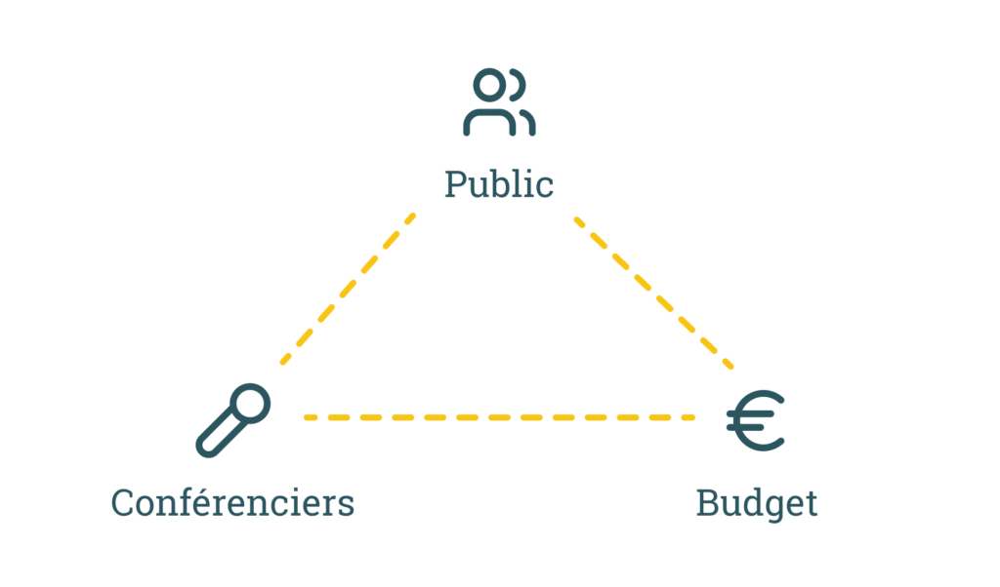
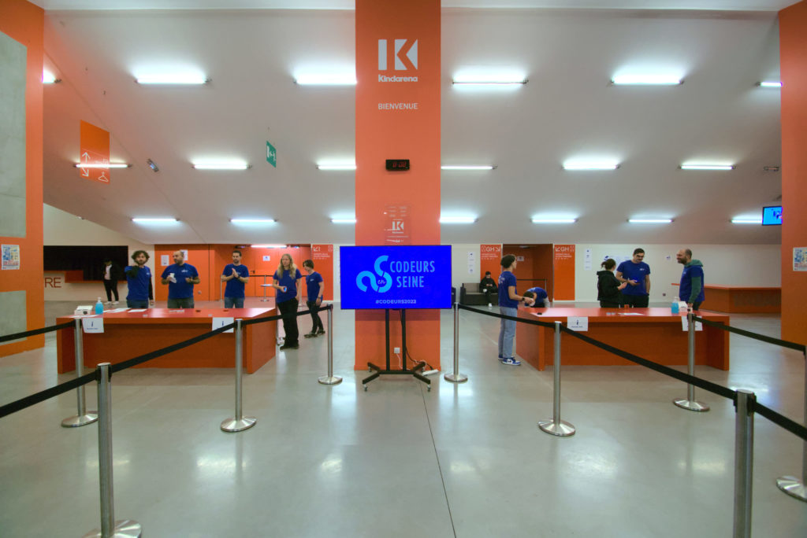

## Les différents points à gérer

Bon... actif dans l'organisation [Codeurs En Seine](https://www.codeursenseine.com) je commence à avoir un peu de recul... Petit disclaimer : je ne suis pas à l'origine de cette journée de conférences. J’ai rejoint un groupe de bénévoles qui avait déjà fait une grosse partie du boulot et surtout l’événement avait déjà une bonne aura au niveau national. Mais je suis quand même plutôt fier d’avoir contribué à augmenter le nombre de visiteurs de 500 à plus de 1000 en quelques années !

Petit historique chiffré :

### Au cas où, Codeurs En Seine c’est quoi ?

Codeurs en Seine est une journée de conférences gratuites qui se déroule à Rouen, pour découvrir, apprendre et partager autour du monde du développement.

### Mais dis-moi Rudy, pourquoi tu nous racontes tout ça ?

Je me dis que ça peut toujours servir à quelques uns **MAIS SURTOUT** ça va nous servir à nous. En effet, comme toute association de bénévoles, en 6 ans on en a vu passer des bénévoles et c’est un peu chiant de devoir tout ré-expliquer donc voici la doc !

### Codeurs en Seine, la recette secrète !

Ce genre d’événement repose sur 3 gros piliers : les conférenciers, le public et le budget. Je vais détailler tout ça par ordre chronologique de prise en charge (même si certaines choses se font en parallèle).

#### Le budget

Forcément, avec les années, c’est plus facile d’avoir une idée du budget mais il y a forcément des changements qui ont un impact dessus d’une édition à l’autre. D’ailleurs si ça vous intéresse, on publie le détail du budget depuis quelques années :

- [Archive de Codeurs en Seine de l'année 2019](https://archive-201x.codeursenseine.com/2019/review-2019)

- [Bilan de l'édition 2019 de Codeurs en Seine](https://archives-codeurs-en-seine.netlify.app/archive-2020/2020/review-2019)

Mais sinon voici les gros postes de dépenses :

##### La location du lieu d’accueil

Lors du passage de l’université qui nous permettait d’aller jusqu'à 500 personnes au Palais des Sport de Rouen, ce poste de dépense est apparu, et en est aujourd'hui le plus gros poste.  
L’avantage c’est qu’un certain nombre de points logistiques sont intégrés dans la prestation : location de chaises (parce que oui, pour asseoir 1000 personnes il en faut des chaises 😁), sécurité, installation, nettoyage, entretien des latrines etc..

Fortement lié au budget de la salle, il y a toute la partie son & vidéo. Nous travaillons depuis quelques années avec le groupe [En Scène](https://www.groupe-enscene.fr/presentation) qui a l’habitude de nous accompagner et qui a su s’adapter parfaitement à nos évolutions. Au début, on se chargeait d’enregistrer quelques panels, mais vu le boulot que ça représente on a décidé de laisser faire des pros. Cette année, nous avons également mis en place le [sous-titrage pour les sourds et malentendants](https://www.youtube.com/watch?v=V5vLYzVEWxA&list=PLbbYL6fWx8WyCEehq-sZx_iM3a4NVAoi-&index=4). Stream en direct pour l’année prochaine ?

Enfin, le reste du budget est alloué aux repas pour les visiteurs, des remboursements de frais de transport des intervenant.es et un peu de logistique type impression, sacs poubelles et gommettes.

Donc pour assurer notre budget, il faut trouver des sous !

Historiquement Codeurs en Seine a toujours été financé par des entreprises privées. C’est ce qu’on appelle des sponsors. Il y a 2 principales raisons pour qu’une entreprise donne de l’argent pour un tel évènement :

- Soutenir les communautés de dev et permettre à ce genre d'événement d'exister (oui ça paraît altruiste mais ça existe).

- Obtenir un retour sur investissement via de la publicité, trouver des profils à recruter et/ou vendre un produit ou une technologie à des développeurs.

##### Comment est-ce qu'on les trouve ?

Après plusieurs années, certains sponsors viennent d'eux-mêmes mais sinon il faut faire un peu de prospection en contactant des entreprises potentiellement intéressées. Généralement, ce sont des bénévoles avec des profils un peu business qui s’occupent de ça mais il y a aussi des profils plus axés “dev” qui vont simplement sourcer dans leur entreprise ou leur réseau perso. Si vous souhaitez sponsoriser Codeurs en Seine vous aussi, c'est [ici](https://www.codeursenseine.com/2023/sponsors) qu'il faut aller !

##### Qu’est ce qu’on leur dit ?

Globalement on leur évoque les raisons ci-dessus et on complète en détaillant ce qu’il y a dans le [dossier de sponsoring](https://drive.google.com/file/d/1zclVxBxeUZFUxX2kxVXCoAW8CnFr3p40/view).

Depuis quelques années, d’autres sources financières sont apparues :

- Les dons du public via [Helloasso](https://www.helloasso.com/associations/codeurs-en-seine/formulaires/1/widget) - ce sont de petits montant mais ça reste utile.

- La métropole de Rouen nous a accordé notre première subvention cette année. Merci à celles et ceux qui ont rendu ça possible.

#### Les conférenciers

Ok, on a le lieu, la logistique principale, maintenant il nous faut un programme !  
Du coup pour ça il nous faut de bons sujets et des gens capables d’en parler. Il faut donc lancer un "appel à orateur" ou _call for paper_ en anglais. 

C’est très connu et commun dans les communautés tech et après avoir essayé divers logiciels pour gérer ça, on a choisi [Conference Hall](https://conference-hall.io/) pour recueillir les sujets. L’une des raisons principales c’est qu’il est très facile pour un orateur de proposer ses sujets dans différentes conférences sans avoir à tout copier-coller. Et côté organisateur, l’interface est pensée pour faciliter la sélection. (oui c’est pas parfait mais c’est open source donc si t’es pas content, tu peux faire une PR).

Du coup concrètement, on prépare le CFP en définissant les thématiques, la durée des talks etc. On récolte les sujets de début juin jusqu'à début septembre.

En parallèle, on communique par mail et sur les réseaux sociaux, principalement Twitter, sur la possibilité de soumettre un sujet. Des bénévoles peuvent également aller contacter certains speakers pour leur dire de poster un sujet. Surtout si ce sont des personnes qui n’ont pas l’habitude de donner des conférences.

Concernant la ligne éditoriale, on essaye de composer une vision large de la tech, on va donc essayer d’avoir :

- un sujet par gros type ([front](https://www.bearstudio.fr/prestations/dev-front), [back](https://www.bearstudio.fr/prestations/dev-back), ops…)

- un sujet par techno principale (javascript, php, java etc),

- quelques sujets de niveau débutant, intermédiaire et expert

- quelques sujets de niche (hello [rust](https://www.bearstudio.fr/blog/developpement/rust) :p)

- quelques sujets avec des têtes ou des noms connus (parce que ça attire le public…)

- mais aussi avec des inconnus (histoire de ne pas avoir toujours les mêmes) et des locaux #Normandie (parce qu’on est là avant tout pour faire progresser notre communauté qui est principalement normande) !

Ce qui généralement nous donne un programme assez diversifié et il y en a pour tous les goûts.

Pour les keynotes, qui sont des conférences plénières, on essaye d'être à la fois original et d’aller puiser dans des industries et/ou thématiques éloignées de la tech mais qui peuvent résonner et apporter un point de réflexion intéressant. Cette année par exemple, on a eu [un faux astrophysicien](https://www.youtube.com/watch?v=duSKKN_53xQ&t=10s), [un homme politique](https://www.youtube.com/watch?v=SAbsGftoxxI) et un [ex-magicien devenu développeur](https://www.youtube.com/watch?v=V5vLYzVEWxA) (il ne le mentionne pas dans la conf mais je vous jure que c’est vrai).

Mais bon, revenons à nos moutons, une fois que l’appel à orateur est fini, s'ensuit la période de vote des bénévoles de mi septembre à début octobre. Ensuite on se fait une soirée pizzas durant laquelle on échange et on sélectionne les sujets.

À partir de là, des bénévoles s'occupent de mettre à jour le site et de mettre le [programme en ligne](https://www.codeursenseine.com/2022/programme). Certains préparent la communication autour de ça, d’autres s'occupent de communiquer avec les speakers, réserver des hôtels, préparer le repas speakers de la veille etc.

#### Le public

On a la chance d’avoir une communauté établie et un public fidèle mais il y a quand même du boulot pour faire venir les gens. Déjà il faut communiquer sur les canaux historiques mais d’années en années, il faut évoluer pour suivre les usages et attirer un nouveau public.  
Historiquement la communication se faisait essentiellement par mail et sur Twitter mais depuis quelques années il y a le [Slack de Codeurs En Seine](https://go.codeursenseine.com/slack), d’autres channels communautaires, des posts Linkedin etc. Il y aussi des  bénévoles qui prennent leur bâton de pèlerins et vont promouvoir Codeurs en Seine auprès de leur entreprise ou des écoles de la région.

Même si on a arrêté de donner des goodies Codeurs En Seine, il y a toujours des affiches et quelques stickers à produire. Au fur et à mesure des années, on a aussi tenu à simplifier le système des inscriptions mais il faut quand même gérer le processus. 

## L’organisation sur une année ?

L’organisation d’une édition commence en général fin janvier/début février et se termine APRÈS l’event, c’est-à-dire mi-décembre.

Tout s’articule essentiellement autour de 3 outils :

- Un board Trello pour suivre les tâches

- Des channel Slack organisateurs pour communiquer entre nous 

- Une réunion les lundis midi 2 à 4 fois par mois (en fonction de l'échéance restante avant le jour J) durant laquelle on passe en revue chaque action à faire, on essaye de trouver des volontaires et on prend des décisions - clairement, c’est pas sur cette partie où nous sommes les meilleurs mais dans l’ensemble on se marre bien et on arrive à avancer, c’est ça qui compte.

### La veille

La veille c’est la préparation !  
On s’occupe de se faire livrer le matériel et on installe les salles. Pour les salles de conférences, les principales tâches consistent à vérifier le travail des prestataires pour tout ce qui est logistique (chaises, pupitres, électricité) et son/vidéo (test micro, affichage).

Pour la partie accueil des visiteurs, on organise les files, on affiche de la signalétique, on briefe les bénévoles qui seront en charge de scanner les visiteurs.

Pour la partie sponsors, on vérifie les tables mises à leur disposition et tous les branchements nécessaires. On les accueille pour leur permettre d’installer leur stand en avance.

On prépare également une salle à la disposition des orateurs pour qu'ils puissent s'isoler/travailler/répéter/discuter entre eux tout au long de la journée.  
Enfin, il nous reste la partie préparation des points repas et de la logistique autour de ça (j’avoue que je connais moins cette partie donc je peux moins détailler :p).

En fin de journée, certains bénévoles vont chercher des orateurs à la gare pour les amener à leur hôtel, puis au repas des Speakers qui permet à tout le monde - organisateurs et orateurs - de commencer officieusement l’event dans un moment convivial (même si certains sont fatigués ou d’autres stressés).

### Le jour J

En plus des organisateurs présents tout au long de l’année, on renforce l’organisation avec des bénévoles jour J (qu’il faut trouver avant bien entendu). Ça commence donc par un rendez-vous vers 7h du matin afin de finir les derniers préparatifs et briefer les équipes. Ensuite tout le monde se répartie entre gestion de salle, speakers, sponsors, visiteurs, nourriture, vidéos, photos et gestion des imprévus…

### Après le jour J

Même si pour beaucoup, Codeurs en Seine se termine en fin de journée, il reste encore des tâches pour les organisateurs, à savoir :

- Payer les prestataires et les frais de déplacement des orateurs

- Communiquer pour remercier tout le monde (visiteurs, sponsors, orateurs et bénévoles)

- Récupérer les enregistrements, faire le montage vidéo et mettre les VOD sur YouTube 

- Ranger le matos qu’on a balancé en vrac dans les voitures le soir

- Essayer de capitaliser sur les problèmes qu’on a rencontrés pour mieux faire l’année suivante

- Publier les photos de l’événement

- …

## Quelques tips

Avant de terminer je vais lister quelques petits conseils qui peuvent servir à tous et à toutes :

- On a toujours besoin de bénévoles donc n’hésitez pas à vous proposer si ça vous dit. On est clairement pas les meilleurs sur l’onboarding des nouveaux mais on n’est pas méchants :).

- En tant que bénévoles, n’hésitez pas à proposer votre aide pour prendre une tâche mais n’oubliez pas qu’il est important de communiquer sur votre avancement (y compris sur du non avancement). Tout le monde fait comme il peut donc on ne vous en voudra pas de ne pas toujours pouvoir accorder du temps à l’orga, mais pour éviter de créer des tensions ou de la frustration, il ne faut vraiment pas hésiter à se manifester plutôt que de disparaître ou de faire l’autruche…

- En tant qu’association, il y a pas mal de produits ou d'outils en ligne d’ordinaire payants mais qui sont gratuits pour les assos. Il faut souvent juste faire une demande dans un recoin un peu obscur du site du produit (pour Codeurs En Seine, on a G Suite, Slack et Netlify pour le site web en version gratuite).

- Pour éviter de devoir systématiquement programmer des talks animés par les entreprises qui sponsorisent l’événement, on a eu l’idée un peu diabolique de créer un pack “platinium” avec un tarif très élevé pour les sponsors qui souhaiteraient vraiment s’assurer une intervention le Jour J. Morale de l’histoire : personne n’a jamais pris cette option.

Voilà, je ne sais pas trop comment conclure cet article à part en remerciant les fondateurs de Codeurs En Seine et tous les organisateurs et bénévoles depuis tant d'années… Je vous assure que cette conférence a un impact énorme sur ma vie professionnelle (avant même que je rejoigne l’organisation) et que les 10 dernières années de ma vie n'auraient pas du tout été les mêmes si Guillaume Lours, Yann Petit et Youen Chene n'avaient pas eu cette brillante idée.

Alors merci !!!

