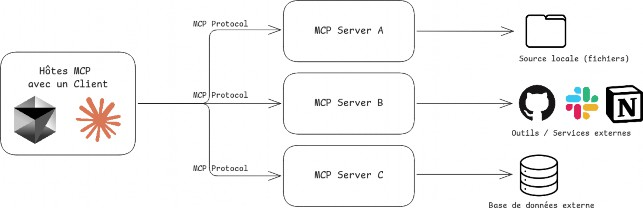
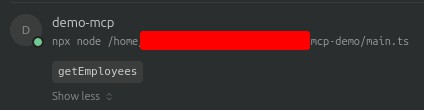
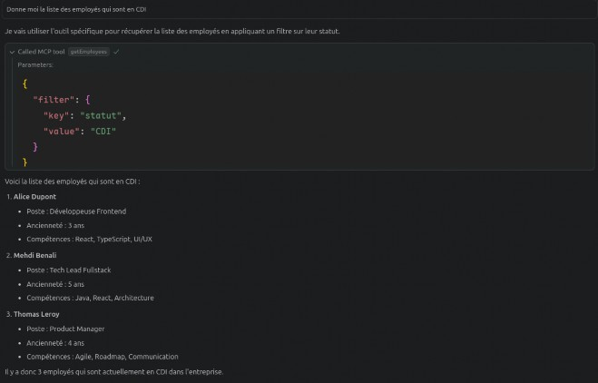

[Cet article est également disponible en anglais ! 🇬🇧](https://noe.tatoud.com/blog/what-is-mcp/)

## État des lieux rapide

Ces derniers mois, l'efficacité des *LLM* n’a cessé de croître, bouleversant nos habitudes et notre quotidien de développeur. De plus en plus sollicités pour écrire du code, débogguer, concevoir ou nous assister à chaque étape de notre travail, ces modèles sont en train de devenir des copilotes incontournables.

> **LLM** (Large Language Model, ou grand modèle de langage) est une intelligence artificielle entraînée sur de grandes quantités de texte pour **comprendre, générer et raisonner en langage naturel**.

Le grand public a déjà commencé à adopter des outils comme ChatGPT (OpenAI), LeChat (Mistral), ou d’autres solutions basées sur l'IA générative.

Mais au-delà d'échanges textuels et d'interactions basiques, et si l’on allait plus loin ? Et si l’IA pouvait **interagir directement et en autonomie avec nos outils** ? Modifier du code ? Interroger une base de données ?

C’est précisément ce que permettent les **agents IA**.

## Quelle est la différence entre un bot, un assistant IA et un agent IA ?

##### Bot

C'est un programme très simple. Il suit des règles pré-définies et donne des réponses automatiques. Par exemple, un chatbot sur un site web qui vous propose des réponses toutes faites ("Tapez 1 pour parler à un conseiller").  
👉 **Il ne comprend pas vraiment, il applique des scripts.**

##### Assistant IA (comme Siri, Alexa ou ChatGPT)

Il est plus avancé. Il comprend ce qu’on lui dit, répond de manière plus naturelle, et peut effectuer des tâches simples (envoyer un message, faire une recherche, etc.).  
👉 **Il attend qu'on lui parle et fait ce qu’on lui demande, mais ne prend pas d’initiatives.**

##### Agent IA

C’est le niveau supérieur. Il peut **agir seul**, prendre des décisions **sans qu’on lui dise quoi faire**, et s’adapter à ce qui se passe autour de lui. Par exemple, un agent IA pourrait surveiller votre boîte mail, repérer un rendez-vous important, réserver un taxi et vous prévenir — sans que vous ayez à le demander.  
**👉 Il est autonome, intelligent, et apprend avec le temps.**

Je ne vais pas rentrer dans les détails du fonctionnement d'un Agent IA mais vous pouvez lire cet article de Google qui est une bonne entrée en matière: [Google Cloud - Qu'est-ce q'un agent IA ?](https://cloud.google.com/discover/what-are-ai-agents?hl=fr)

Jusqu’à présent, une des contraintes principale dans la création d'un agent était qu'il fallait mettre en place des connecteurs uniques, très spécifiques à chaque source de données et à chaque modèle. Une approche fastidieuse, peu scalable, et rarement généralisable.

## MCP: Here comes a new challenger

C’est là que le **Model Context Protocol (MCP)** entre en scène. Lancé fin 2024 par **Anthropic** (l’entreprise à l’origine de Claude), ce protocole open-source offre aux agents IA une méthode simple, standardisée et sécurisée pour se connecter à des outils, données et services, **sans avoir besoin d'intégrations spécifiques à chaque fois**.

## Théorie : comment ça fonctionne ?

Derrière le Model Context Protocol se cache une idée simple mais puissante : permettre à une IA de **découvrir dynamiquement, interroger et manipuler des outils ou des services** sans avoir à écrire une intégration dédiée pour chaque cas. Pour y parvenir, MCP définit un protocole de communication standardisé entre différents acteurs.



##### Les acteurs :

**Hôtes MCP :** ce sont des applications comme Claude Desktop, des environnements de développement (IDEs) ou des outils d’IA qui souhaitent accéder à diverses sources de données ou capacités via MCP.  
👉 **Ils envoient des requêtes pour enrichir leur contexte (code, fichiers, docs, etc.) en utilisant le protocole.**

**Clients MCP :** ce sont des composants intermédiaires qui gèrent une connexion 1:1 avec un serveur MCP.  
👉 **Ils traduisent les requêtes des hôtes en appels vers un serveur MCP spécifique, assurant le dialogue entre les deux.**

**Serveurs MCP :** ce sont de petits programmes autonomes qui exposent une fonctionnalité ou un type de données via le protocole MCP (ex : fichiers locaux, historique Git, base de connaissances…).  
👉 **Chaque serveur est spécialisé et peut être combiné avec d'autres** **pour enrichir les capacités d’un hôte.**

##### Et les assistants IA dans nos IDE ?

Les assistants IA que nous utilisons aujourd’hui dans nos environnements de développement ont déjà bien évolué. D’abord conçus pour suggérer du code ou répondre à des questions simples, ils deviennent peu à peu de **véritables agents intelligents**, capables de **comprendre le contexte**, **prendre des décisions**, et **agir directement dans nos projets**.

Avec l’arrivée du **mode agent** ces assistants gagnent en autonomie et en flexibilité. Ils peuvent désormais se connecter dynamiquement à des outils externes — bases de données, API, fichiers locaux, historique Git, etc... Cela leur permet non seulement de mieux répondre à nos requêtes, mais aussi d’exécuter des actions complexes de manière proactive, en s’adaptant à chaque contexte.

C’est une étape majeure : l’assistant devient acteur, intégré profondément dans notre environnement de travail.

Ajouter des serveurs MCP à ces agents permet de **déverrouiller des capacités sur mesure** : accéder à des données locales, interroger des services métier, ou manipuler des fichiers spécifiques. Cela transforme l’agent en **interface unifiée entre l’IA et nos outils**, sans avoir à coder chaque intégration à la main.

## Pratique : exemple concret avec TypeScript et `@modelcontextprotocol/sdk`

### Mise en situation

Extrait de données sur les employés :

```
[
  {
    "nom": "Alice Dupont",
    "poste": "Développeuse Frontend",
    "anciennete": "3 ans",
    "competences": "React, TypeScript, UI/UX",
    "statut": "CDI"
  },
  {
    "nom": "Mehdi Benali",
    "poste": "Tech Lead Fullstack",
    "anciennete": "5 ans",
    "competences": "Java, React, Architecture",
    "statut": "CDI"
  },
  {
    "nom": "Julie Morel",
    "poste": "QA Analyst",
    "anciennete": "2 ans",
    "competences": "Tests automatisés, Cypress", 
    "statut": "CDD"
  },
  {
    "nom": "Thomas Leroy",
    "poste": "Product Manager",
    "anciennete": "4 ans",
    "competences": "Agile, Roadmap, Communication",
    "statut": "CDI"
  },
  {
    "nom": "Claire Nguyen",
    "poste": "Développeuse Backend", 
    "anciennete": "1 an",
    "competences": "Node.js, PostgreSQL, Docker", 
    "statut": "Alternance"
  },
  {
    "nom": "Romain Garcia", 
    "poste": "Designer UI/UX", 
    "anciennete": "2 ans",
    "competences": "Figma, Accessibilité, Design Sys", 
    "statut": "Freelance"
  }
]
```

L'objectif ici va être de construire un mini serveur MCP afin de récupérer cette liste et de l'utiliser via Cursor.

Initialiser un projet Node 24 avec pnpm :

```
$ mkdir demo-mcp
$ cd demo-mcp
$ pnpm init -y
```

Installer les dépendances :

```
$ pnpm add zod @modelcontextprotocol/sdk
```

Nous n'aurons besoin que d'un seul fichier : `main.ts`.

Commençons par créer notre serveur :

```
import { McpServer } from "@modelcontextprotocol/sdk/server/mcp.js";

const server = new McpServer({ 
  name: "Gestionnaire d'employés", 
  version: "1.0.0",
  description: "Un serveur MCP de démonstration",
});
```

Ok, maintenant ajoutons un outil (tool) à notre serveur.

On doit préciser trois choses importantes :

- Le nom de l’outil : `'getEmployees'`

- Une description : `"Récupère la liste de tous les employés en appliquant un filtre si nécessaire"`. Cela permet au LLM d’avoir plus de contexte pour savoir quand et comment l’utiliser.

- Un schéma de validation d’entrée, pour indiquer au LLM quels paramètres peuvent être utilisés. On peut utiliser n'importe quelle bibliothèque de validation suivant le [Standard Schema](https://github.com/standard-schema/standard-schema). Avec `zod`, on peut en plus ajouter des descriptions aux paramètres.

- Et bien sûr, le corps de la fonction exécutée par l’outil.

Ajoutons tout cela à notre fichier `main.ts` :

```
server.tool( 
  "getEmployees",
  "Récupère la liste de tous les employés en appliquant un filtre si nécessaire",
  {
    filter: z
      .object({ 
        key: z
        .enum(["nom", "poste", "anciennete", "competences", "statut"])
        .describe("Les clés de la table des employés utilisées pour filtrer les employés"),
        value: z.string(),
      })
      .optional()
      .describe("Filtrer la liste d'employés"),
  },
  async ({ filter }) => {
    const employees = await getEmployees({ 
      where: filter?.key,
      value: filter?.value,
    });

    return {
      content: [{ type: "text", text: JSON.stringify(employees, null, 2)}],
    };
  }
);
```

Super ! Notre serveur est presque prêt, mais il faut maintenant faire en sorte que les clients MCP puissent communiquer avec notre serveur.

Une solution simple est de lire depuis l’entrée standard et d’écrire sur la sortie standard du processus courant ( `stdio/stdout` ).

Heureusement, la bibliothèque `@modelcontextprotocol/sdk` fournit une abstraction simple pour cela : `StdioServerTransport` .

```
import { StdioServerTransport } from "@modelcontextprotocol/sdk/server/stdio.js";

const transport = new StdioServerTransport(); 
await server.connect(transport);
```

Et voilà, notre serveur est désormais prêt à être utilisé !

Connectons-le à Cursor. Pour cela, il suffit d'ajouter dans notre fichier `.cursor/mcp.json` (à la racine de votre projet par exemple) :

```
{
  "mcpServers": { 
    "demo-mcp": {
      "command": "npx",
      "args": ["node", "/chemin-vers-votre-projet/demo-mcp/main.ts"]
    }
  }
}
```

Maintenant, notre agent IA a accès au serveur MCP et aux outils qu’il propose.

On peut vérifier que le serveur est bien connecté dans les paramètres de Cursor :



Maintenant, essayons de lui poser une question, par exemple :  
**"Donne-moi la liste des employés qui sont en CDI."**

(Ici le modèle utilisé est `claude-3.5-sonnet`, mais cela n'a pas vraiment d’importance.)

Le LLM va comprendre qu’il peut faire appel à l’outil de notre serveur, choisir les bons paramètres, récupérer les données, et nous renvoyer une réponse formatée à partir de celles-ci



## À quoi s'attendre dans le futur ?

Depuis début 2025, l’adoption du **MCP** connaît une croissance fulgurante. De plus en plus d’acteurs, des startups aux grandes plateformes, contribuent à l’écosystème en publiant des **serveurs MCP** capables d’interagir avec toutes sortes de systèmes : bases de code, bases de données, APIs métier, outils internes, fichiers, etc.  
Des noms comme **Microsoft**, **Cloudflare**, **Open AI** ou encore des éditeurs de frameworks et d’IDE s’impliquent activement.

MCP s’impose peu à peu comme le **standard d’interopérabilité entre IA et outils métiers**. Là où l’on bricolait des connecteurs spécifiques et rigides, on dispose désormais d’un protocole **modulaire, déclaratif et sécurisé**, conçu pour collaborer naturellement avec des modèles de langage.

Cela ouvre un nouveau champ de possibilités : agents personnalisés, automatisations intelligentes, assistants capables de naviguer dans une base de code ou d'analyser des logs en contexte, voire même des actions de haut niveau comme la gestion de déploiement ou le contrôle d’environnements.

Le tout, sans dépendance technologique forte : MCP est **ouvert, extensible et agnostique**, ce qui permet à n’importe quel outil ou service d’exposer ses capacités à la volée.

Alors si vous êtes curieux, testez-le, créez vos propres serveurs, exposez vos outils, et partagez vos expériences avec la communauté.

## Pour aller plus loin

👉 [Introduction - Model Context Protocol (Anthropic)](https://modelcontextprotocol.io/introduction)

👉 [Créez un serveur MCP en 5 étapes // Un codage efficace (Matt Pocock)](https://www.youtube.com/watch?v=FRogt98OF80)

##### Et pour découvrir de nouveaux sujets, n'hésitez pas à consulter nos derniers articles publiés !

- [Du code au coeur : nos engagements associatifs annuels](https://www.bearstudio.fr/blog/actualites-web-numerique/du-code-au-coeur-nos-engagements-associatifs-annuels)

- [Léa English : Étude de cas UX](https://www.bearstudio.fr/blog/design-css/lea-english-etude-de-cas)

- [Le bon et le mauvais développeurs : les soft skills](https://www.bearstudio.fr/blog/developpement/le-bon-et-le-mauvais-chasseur-developpeur-les-soft-skills)

Auteur : Noé Tatoud  
[LinkedIn](https://www.linkedin.com/in/noetatoud/) - [X](https://twitter.com/nowaytatoud) - [Github](https://github.com/ntatoud)
