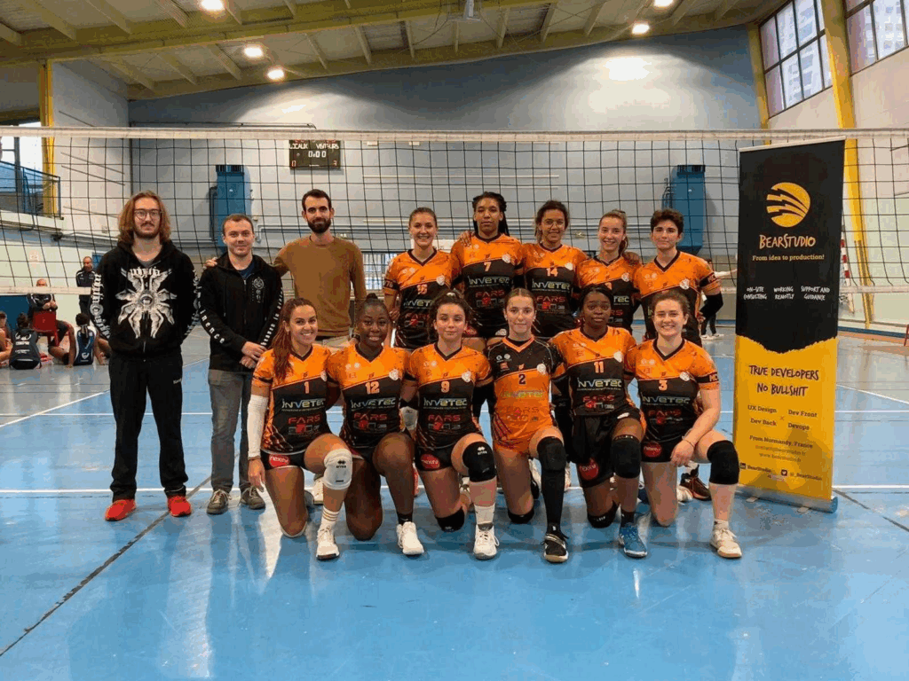

## Un engagement associatif ancré dans notre culture

Au BearStudio, les engagements associatifs font partie de notre culture. En plus du développement, du design et de la formation, nous avons aussi un rituel important qui nous tient à cœur : les dons aux associations !

Ces dons aux associations se veulent collaboratifs. Chaque année, en Octobre, un appel est fait aux membres du BearStudio et ceux qui gravitent autour, pour que chacun ait l’occasion de présenter une association qui lui est chère. C’est ainsi que, depuis 2020, une vingtaine d’associations a été mise en avant afin qu’une donation puisse être effectuée.

## L’origine de notre démarche solidaire

##### Une idée née d'une augmentation… différente

Tout a commencé avec [Quentin](https://www.bearstudio.fr/team/quentin-lerebours) il y a quelques années, l’un de nos collaborateurs. Lors d’une réunion d’augmentation autour d’une pizza (on vous invite à lire [cet article](https://ppbearstudio.wpengine.com/blog/entrepreneuriat/comment-deleguer-la-responsabilite-pour-les-augmentations) sur notre processus d'augmentation), Quentin a fait une demande atypique. Une fois n’est pas coutume, s’étant renseigné sur l’impact financier de son augmentation, il a souhaité l’utiliser en deux temps :

- Dans un premier temps, il a demandé à BearStudio de recruter un stagiaire pour faire avancer son side project : [TraveledMap](https://www.traveledmap.com/fr).

- Dans un second temps, il a souhaité soutenir une association par le biais d’une donation en fin d’année. 

C’est pourquoi, durant 2 ans, le BearStudio a versé le montant équivalent à son augmentation aux causes qu’il souhaitait. Suite à cette initiative portée par Quentin au départ, BearStudio a désiré pérenniser l’action. C’est ainsi que depuis 2020 l’entreprise a effectué 24 donations à différentes associations pour une valeur proche de 35 000€.

## Zoom sur quelques associations soutenues

##### Atelier Sainte Claire

[Atelier Sainte Claire](https://rouen.fr/associations/ateliers_sainte_claire) _est une association qui aide des adultes en situation de handicap psychique._ Ce don a permis l’installation de deux ruches dans les Ateliers Sainte Claire à Rouen. Ce qui a permis de récolter environ 20 kg de miel sur l’année.

##### France Parrainage

Au Pérou dans la ville d’Abancay, [France Parrainage](https://www.france-parrainages.org/international/decouvrez-dans-quel-pays-parrainer?gad_source=1&gclid=Cj0KCQiAsaS7BhDPARIsAAX5cSB-Tx2KsE0L9Be3lttG9_5u90Dupw64eTIM8K-ra_TwfxnCI0RLMW0aAslGEALw_wcB) a mis en place une aide alimentaire à des étudiants en difficultés suite à la pandémie. En Inde, ce don permet d’aider des jeunes démunis dans leur scolarité. Au total, les dons ont permis d’aider des familles et leurs enfants issus de contextes socio-économiques et familiaux difficiles.

##### Mécénat Cardiaque

[Mécénat Cardiaque](https://mecenat-cardiaque.org/) est une association qui a pour but d’aider les enfants atteints de malformations cardiaques d’être opérés lorsque cela est impossible dans leur pays, faute de moyens techniques ou financiers. Ils sont alors pris en charge dans 11 villes françaises, 2 villes suisses ou 1 ville espagnole. Ils sont hébergés par des familles d’accueil bénévoles et en Suisse parfois dans une maison spécialisée.

##### Association Delfina

[Association Delfina](https://www.associationdelfina.fr/) _a pour but de venir en aide aux populations défavorisées en Afrique._  
Madagascar : Amélioration des locaux d’éducation du collège Marovantaza et également d’installer 6 panneaux solaires. Approfondissement du puits de Pont Banty pour atteindre le niveau de l’eau qui a baissé. Fourniture de livres de lecture, de matériels scolaires et d’équipements pour l’établissement scolaire.

##### Maromme Canteleu Volley

[Maromme Canteleu Volley](https://mcv76.fr/) est le club de Volley-ball dans lequel [Soraya](https://www.bearstudio.fr/team/soraya-benchakroune) a commencé sa “carrière” de Volleyeuse. Bénévole pendant de nombreuses années et évoluant dans ce club depuis plus de 3 ans. Elle a souhaité que le don du BearStudio serve à acheter des ballons et des accessoires pour l’organisation des séances d'entraînement. Ainsi permettre aux jeunes joueurs de pouvoir être le mieux encadrés.

##### Rouen Handball

Compétiteur né, Quentin reprend le Handball en dernière division après quelques années d’arrêt. Il reprend les armes au sein du club [Rouen Handball](https://www.rouen-handball.fr/) qui évolue jusqu’en N1 Féminine et Masculine. Quentin, souhaitant représenter le BearStudio jusque dans les gymnases, a  demandé un don qui a permis à son équipe de se fournir en équipements.

##### Foot Tourvilles sur Arques

[Foot Tourvilles sur Arques](https://tourville-sur-arques.footeo.com/) est le club d’un de nos deux [Hugo](https://www.bearstudio.fr/team/hugo-perard) préféré. Il y a évolué depuis l’âge de 6 ans (soit presque 18 ans), où il a pu se former au poste de défenseur. BearStudio a pu soutenir son club notamment dans l’achat de matériel et d’ensembles de survêtements.

## L’impact de ces contributions

Ces contributions offrent aux collaborateurs de BearStudio l’occasion de s’engager dans des causes qui leur tiennent à cœur. En plus des bénéfices concrets qu’elles apportent aux associations soutenues, elles permettent également à BearStudio de profiter d’une réduction fiscale prévue par l’État français.

## Le mécénat de compétences : un nouveau pas vers l’engagement

Cette année, au BearStudio, nous avons également commencé le bénévolat par le mécénat de compétences, à savoir offrir des heures de savoir-faire au service d’associations en demande. C’est le cas de [Nhung](https://www.bearstudio.fr/team/nhung-duong) et [Ivan](https://www.bearstudio.fr/team/ivan-dalmet) qui œuvrent pour [Sistech](https://sis.tech/donation-sistech-refugee-women/). Sistech soutient l’émancipation professionnelle des femmes réfugiées dans les métiers de la tech et du numérique en France, en Italie et en Grèce. Nhung est présente pour les aider sur le côté administratif et business, tandis qu’Ivan les aide en discutant et pratiquant le français afin qu’elles puissent s’améliorer et le pratiquer le plus souvent possible.  

Quentin, lui aussi aide l’association Passerelle Numérique au Vietnam, dont l’objectif est de sélectionner (sur la base de leur niveau et de la précarité de leurs familles) des futurs étudiants pour financer leurs 3 années d’études dans l’informatique. Quentin donne deux ateliers différents l’un basé sur l’infrastructure distribuée et l’autre sur le thème de l’utilisation de l’IA dans les métiers du numérique.

## Ensemble, pour une action durable

En tant que salariés de BearStudio, nous sommes fiers de contribuer à des projets qui font la différence pour certains. Ensemble, nous espérons continuer à soutenir des associations et des clubs, tout en explorant de nouvelles façons de redonner à la communauté.

Si vous connaissez une association alignée avec nos valeurs, nous serions ravis d’en discuter avec vous !
