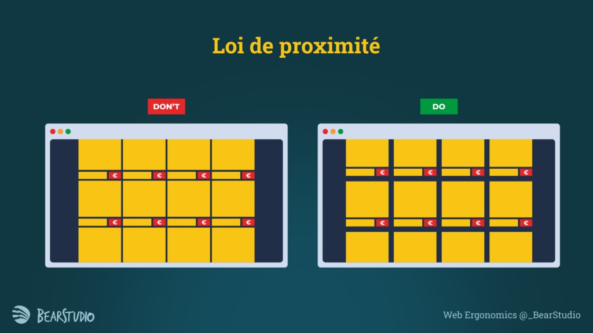

Le design ne se résume pas à l'esthétique. Il joue un rôle crucial dans la manière dont les utilisateurs perçoivent et interagissent avec un produit ou un service, et cette [expérience utilisateur (UX) est primordiale](/blog/posts/pourquoi-lexperience-utilisateur-est-elle-importante). En effet, un bon design facilite la compréhension et l'utilisation afin de créer une expérience positive. À l'inverse, un mauvais design peut entraîner de la confusion et pousser les utilisateurs à délaisser votre produit. Le design est par conséquent un facteur clé de succès pour toute application.

C'est pourquoi posséder des notions de design est un véritable atout pour un dev front. En effet ces connaissances peuvent permettre d’avancer sur des features sans maquettes tout en gardant un design réfléchi ou encore de faciliter la communication avec les designers pour arriver au meilleur résultat possible. Pas besoin de devenir un expert en design pour ça : l'objectif est d'acquérir des bases applicables facilement, pas de savoir faire un design system de A à Z. 

## Les bases du design pour les dev front : Que faut-il savoir ?

Commencez par des concepts simples mais indispensables comme les théories/lois de la Gestalt appliquées au design. La Gestalt est une théorie psychologique née en Allemagne au début du XXe siècle, cherchant à expliquer notre façon de percevoir ce qui nous entoure. De ces lois ont découlé des notions de design, qui permettent rapidement d’améliorer des interfaces et de détecter des mauvaises pratiques. 

### Loi de proximité 

Les éléments proches les uns des autres sont perçus comme appartenant à un même groupe. Si des éléments sont trop proches ou, au contraire, trop éloignés, on risque de mal associer les informations entre elles.

Exemple à gauche ici, si tout est espacé de la même façon, sauriez vous me dire si le prix est au dessus, ou en dessous de l’item qu’il concerne ? Avec les bons espacements, on voit que l’exemple de droite devient beaucoup plus clair.

Je vous invite à lire [cet article qui en parle plus en détails](/blog/posts/la-loi-de-proximite) si le sujet vous intéresse

### Loi de similarité

 Les éléments qui se ressemblent (forme, couleur, taille) sont vus comme appartenant à un même ensemble. 

Ici, dans un formulaire avec des cases à cocher, si elles ne sont pas visuellement identiques, on ne les associera pas instinctivement, même si elles appartiennent au même champ.

Ces deux lois sont essentielles pour poser les bases, mais d’autres principes de la Gestalt peuvent enrichir votre compréhension si cela vous intéresse. En parallèle, voici d’autres notions fondamentales :

### Le feedback

Chaque action doit produire une réaction visible, compréhensible et immédiate. Que ce soit un toast indiquant le succès d’une action ( création, sauvegarde …), un loader pour montrer que c’est en cours de chargement ou encore l’invalidation d’un champ de formulaire, un bon feedback est essentiel à une bonne expérience utilisateur.

### L’affordance

Un design doit être compréhensible : chaque élément doit indiquer clairement son utilité. Par exemple, un bouton doit ressembler à un bouton.

### Apprentissage externe

Les utilisateurs ont des attentes basées sur leurs expériences passées. Une barre avec une icône de loupe, c’est une barre de recherche. Il est préférable de respecter ces conventions pour ne pas désorienter les utilisateurs. 

Je ne dis pas qu’on ne peut pas innover, mais quand on n’est pas designer, autant rester dans les habitudes des utilisateurs.

### Apprentissage interne

De la même manière, un utilisateur va apprendre à utiliser l’application qu’on lui met entre les mains. Il faut donc rester cohérent au sein du projet. Si le bouton “valider” est à droite et “annuler” à gauche dans une modale, ils ne doivent pas être inversés dans une autre.

### Hiérarchie visuelle

Tout ne doit pas être au même niveau ou à la même taille. L’information importante peut être mise en valeur avec une police plus grande, un gras plus prononcé, ou une couleur marquante. Si on ne veut pas diminuer la taille d’un élément pour pas qu’il ne devienne trop petit, utiliser une couleur plus claire par exemple peut permettre d’obtenir le même effet. Attention cependant à garder une cohérence visuelle entre les éléments de même type et de même importance.

En intégrant ces principes, il sera plus simple en tant que dev front de comprendre les choix faits par les designers, et encore mieux, pouvoir nous-même ajouter des fonctionnalités sans passer par l’étape designer (ou seulement pour qu’il valide), si celui-ci n’est pas disponible ou qu’il n’y en a pas pour le projet.

### Faire des maquettes

Pour aller plus loin, vous pouvez vous pencher sur la réalisation de maquettes/ modifications de maquettes existantes. Pourquoi ? Imaginons qu’on vous demande une feature complexe sans maquette : il sera plus simple et rapide d'expérimenter et de faire valider son design sur un outil comme figma, plutôt que directement dans le code. 

Figma, en particulier, est un outil puissant et accessible. Avec lui, vous pouvez créer des composants réutilisables et garder une cohérence dans vos designs. Pour bien débuter, de nombreux tutoriels sont disponibles, et la [documentation officielle](https://help.figma.com/hc/fr/sections/23536356509975-Cr%C3%A9er-des-syst%C3%A8mes-de-design) est un excellent point de départ. Vous pouvez également trouver des starter pour figma, avec des composants déjà disponibles, comme c’est le cas de notre starter [Start UI Figma](https://www.figma.com/community/file/1025698982013308087). Je vous invite à checker ça, ne serait-ce que pour apprendre et expérimenter sans avoir à partir de zéro. 

### Conclusion

Apprendre le design n’est pas une question de changer de carrière, mais plutôt d’élargir votre champ de compétences. En tant que dev front, maîtriser quelques bases de design vous permettra d’être plus autonome, de proposer des solutions adaptées et de collaborer efficacement avec les designers.
