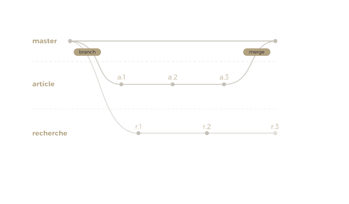
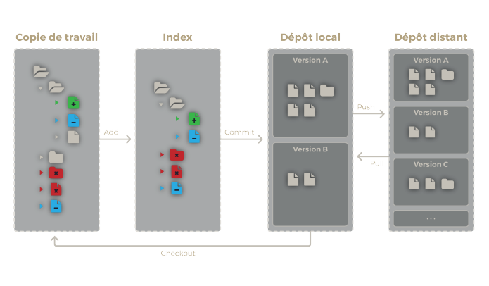

## De quoi s’a**git**\-il ?

Outil incontournable à n’importe quel développeur, Git n’est pas un gestionnaire de versions, mais LE gestionnaire de version. Principalement pensé pour le code, il permet de gérer les différentes modifications de n’importe quel document texte, tout en étant parfaitement pensé pour le travail collaboratif. Si vous ne connaissez pas, ou que vous souhaitez simplement renforcer vos connaissances, vous êtes au bon endroit !

A travers cet article, nous allons vous expliquer le fonctionnement de Git, comment vous en servir, et surtout, comment régler les petits soucis sans y laisser des plumes.

C’est parti !

## Comment ça fonctionne ? Pour comprendre, il va falloir co**git**er un peu !

### Comment sont gérées les modifications sur votre ordinateur ?

Pour bien utiliser Git, il est important de comprendre comment il gère toutes les versions et modifications de vos fichiers. C’est donc par cela que nous allons commencer.

Git gère une architecture dite “à trois arbres”. Mais on pourrait aussi bien parler de trois zones, ou de trois espaces. Les voici :

- La **copie de travail (working directory)** représente votre espace de travail. C’est l’endroit où vous avancez sur vos tâches en cours en éditant des fichiers. Jusque là, rien qui sorte de l’ordinaire !
- **L’index (staging area)** est une zone de transition. Cette zone représente l’ensemble des modifications qui constitueront la prochaine version de votre travail. Ces modifications peuvent être ajoutées à l’index grâce à la commande :

```
git add <noms de fichiers>
```

> La commande `add` pemet d’ajouter les modifications de la copie de travail à l’index. C’est à dire que ces modifications feront partie de la prochaine version de votre travail (**ATTENTION !** Ce sont bien des modifications que l’on ajoute, et non pas des fichiers ! Ainsi, la suppression d’un fichier doit être ajoutée à l’index. Ça va, la tête ?).

- Le **dépôt local (local repository)** est l’endroit où sont conservées toutes les versions de votre travail. Une version est composée de modifications ayant été précédemment ajoutées à l’index, et ayant été validées grâce à la commande :

```
git commit [-m <filename>]
```

La commande commit permet d’ajouter à votre dépôt local une nouvelle version de votre travail. Un commit doit être associé à un message décrivant le contenu de celui-ci. Pour cela, vous pouvez par exemple :

- Utiliser la commande commit avec l’option -m pour entrer directement un message
- Ne pas utiliser l’option. Dans ce cas, Git ouvrira un éditeur de texte dans le terminal afin que vous entriez le message de commit.

Chaque commit est associé à un identifiant unique, son hash, qui permet ensuite de s’y référer.

<figure>


<figcaption>

Architecture Git

</figcaption>

</figure>

Voilà, maintenant, vous savez selon quels processus sont gérées les modifications de votre travail. Pourtant, si vous ouvrez votre dépôt Git dans votre explorateur de fichiers, il est probable que l’état actuel des arbres ne vous saute pas aux yeux... et c’est normal ! Tout ce que vous montre l’explorateur de fichiers, c’est le contenu de votre copie de travail. Pour connaître l’état de votre index, il suffit d’utiliser la commande :

```
git status
```

> La commande status permet d’afficher l’index et la copie de travail. La copie de travail est affichée en deux parties, les fichiers qui sont “suivis” par Git et ceux qui ne le sont pas encore. Chaque fichier est annoté de façon à connaître le type de modification qui le concerne.

## Comment accéder aux différentes versions de votre travail ?

Un des intérêts d’utiliser un logiciel de versionnement, c’est de pouvoir consulter les différentes versions de son travail. Il est possible de lister tous les commits effectués grâce à la commande :

```
git log
```

Il est également possible de retourner à une ancienne version afin de naviguer dedans grâce à la commande

```
git checkout <commit>
```

La commande checkout a deux fonctions. D’une part, elle permet de visionner une ancienne version de votre projet. D’autre part, elle permet de changer de branche (nous verrons cela plus loin). Son comportement dépend des arguments avec lesquels elle est appelée.

> Dans tous les cas, elle a pour résultat de mettre à jour votre copie de travail avec le contenu de la version sur laquelle vous venez de faire le checkout.

Dans les parties suivantes, nous étudierons plus en détail le comportement de la commande ci-dessus.

## Apprendre à gagner du temps, ça vous branche ?

Avec les **branches**, on attaque la partie épineuse de Git (sans mauvais jeu de mot, pour cette fois). Pourtant, une fois que vous saurez les maîtriser, vous vous rendrez compte qu’elles sont indispensables au versionnement efficace de votre travail. Pour bien se représenter les branches, il faut les voir comme des progressions différentes de votre projet. Elles sont constituées d’une succession de commits.

La branche principale de votre projet se nomme par défaut master.

L’objectif des branches est de pouvoir paralléliser facilement le [développement](https://www.bearstudio.fr/prestations/dev-back) de plusieurs fonctionnalités de votre projet. Cela permet de gagner en clarté et de faciliter la possibilité de retour en arrière. Et je peux vous le prouver.

Imaginez que vous développez une application web comportant, entre autre, une fonctionnalité de publication d’article et une fonctionnalité de recherche parmi ces articles. Imaginez maintenant que vous ne prenez pas la peine de créer deux branches différentes pour développer ces deux fonctionnalités. Vous travaillez tantôt sur l’une, tantôt sur l’autre. Voici à quoi peut ressembler l’historique des commits de votre projet :


Pendant un temps, tout va bien, et vous vous demandez bien à quoi peuvent servir ces maudites (à dire avec l’accent Québecquois) branches (tabarnac !). **Mais voilà qu’un beau jour, vous vous rendez compte que vous regrettez la modification de l’algorithme de recherche.**

Vous souhaitez donc retrouver une version antérieure de cette fonctionnalité, par exemple le commit r1. Pas de problème, c’est à ça que sert Git ! Oui mais voilà. Entre ce commit et votre dernier commit, il y a également des progressions sur la fonction de publication que vous ne souhaitez pas annuler. Cela complique un peu les choses, non ? **Et cela n’arriverait pas en suivant plutôt le schéma suivant :**



Maintenant que vous êtes convaincu, voici un petit mode d’emploi des branches

- **Pour créer une nouvelle branche**, il faut utiliser la commande :

```
git branch <branch name>
```

- **Pour lister vos branches**, utilisez la même commande mais cette fois-ci sans argument :

```
git branch
```

- **Pour supprimer une branche**, c’est encore la même commande, avec une option :

```
git branch -d <branch name>
```

> Vous l’aurez compris, la commande branch permet d’accéder aux fonctionnalités de gestion des branches. Il existe de nombreuses autres options que l’on ne listera pas ici (par exemple pour renommer une branche). Nous vous renvoyons à la documentation officielle de Git.

- **Pour changer de branche**, il faut utiliser la commande :

```
git checkout <branch name>
```

Une fois que vous êtes sur la branche souhaitée, vous pouvez avancer sur votre travail normalement. Les commits effectués sur une branche ne seront alors pas visibles sur les autres branches.

## Fuuuuuuu-sion !

C’est bien joli d’avoir toutes les fonctionnalités sur des branches différentes, mais une fois qu’elles sont terminées, on aimerait bien les rassembler. Histoire d’avoir quelque chose qui ressemble à un vrai projet, quoi. Dans ce cas, il suffit de fusionner les branches en question. La fusion se fait en partant d’une branche A vers une branche B. Par exemple, on fusionne la branche “inscription” dans la branche “develop”.

Il faut se placer sur la branche destination et lancer la commande suivante :

```
git merge <source branch name>
```

> La commande merge permet d’importer les modifications d’une branche vers la branche courante. Cependant, il arrive que les deux branches fusionnées comportent des modifications sur les mêmes portions des mêmes fichiers. Il y a alors des conflits, et il faut les régler. On en parle juste après ;-) Un merge peut aussi être annulé : git merge --abort.

### Ici, pas besoin d’être diplomate pour régler les conflits

Comme mentionné plus haut, lorsque l’on merge des branches ensemble, des conflits peuvent apparaître. Cela signifie simplement que deux portions d’un même fichier ont été modifiées dans deux commits différents et que Git ne sait pas traiter cela.

Faut-il garder la version de la branche source ? Celle de la branche destination ? Ou encore, faut-il combiner les deux ? Git ne peut hélas pas le deviner. Tout ce qu’il peut faire pour vous, c’est faire ressortir les conflits grâce à des suites de caractères bizarres, ça ressemble à ça :

```
<<<<<<< HEAD
  <meta name="description" content="Sandbox website">
  <meta name="author" content="Axelle Boucher">
=======
  <meta name="description" content="Test project">
  <meta name="author" content="Bear Studio">
>>>>>>> feature-B
```

Sympa, non ?

Ce que vous avez à faire, c’est de sélectionner les portions de fichier à garder (et supprimer les caractères bizarres, bien entendu ! ). Ensuite, il faut indiquer à Git que les conflits ont été réglés. Pour cela, il suffit d’utiliser la commande `add` (dont nous avons déjà parlé) sur les fichiers concernés pour ajouter les modifications à l’index courant.

Enfin, effectuez un commit. Git vous proposera un message de commit par défaut que vous pouvez conserver. Et voilà, c’est tout !

## Les dépots distants : l'origin du monde

Si vous avez lu jusqu’ici sans vous endormir, vous savez normalement gérer votre dépôt Git local et [versionner](https://www.bearstudio.fr/blog/developpement/versionner-entite-jpa) votre travail sans en créer manuellement plusieurs copies aux noms compliqués.

Mais si vous vous déplacez et devez utiliser un autre ordinateur, vous n’avez plus accès à vos fichiers. Une solution serait d’en emporter une copie sur un support amovible. Mais ne serait-ce pas un peu saper tous les efforts effectués jusqu’ici pour éviter de multiplier les copies de votre projet ?

Il existe heureusement une solution simple. En effet, il est possible d’héberger un dépôt Git sur un serveur distant (c’est donc… un dépôt distant !)

Pour utiliser un dépôt distant, il faut l’indiquer à Git grâce à la commande :

```
git remote add <name> <url>
```

> La commande git remote add permet de configurer Git pour ajouter un dépôt distant disponible. Vous l’aurez compris, ça sera le nom donné au dépôt distant (le nom par défaut est "origin" et c’est également celui que vous trouverez dans de nombreux exemples et tutoriels sur le web, cet article y compris). Le paramètre, quant à lui, est l’adresse où est hébergé le dépôt.

Vous pouvez consulter la liste des dépôts distants que vous avez paramétrés grâce à la commande :

```
git remote -v
```

Une fois le dépôt distant ajouté, vous pourrez à votre guise mettre à jour le dépôt distant avec votre dépôt local (et vice versa), ainsi que récupérer votre travail depuis n’importe quel ordinateur bénéficiant d’un accès internet.

Pour faire simple, il y a trois catégories d’opérations possibles sur un dépôt distant :

- Envoyer des données depuis votre dépôt local vers un dépôt distant. Cela est possible grâce à la commande :

```
git push origin <branch name>
```

> La commande push permet de transférer les différents commits sur un dépôt distant. Elle prend en premier argument le dépôt distant et en deuxième argument le nom de la branche sur laquelle envoyer les modifications.

- Récupérer des données du dépôt distant (et les placer sur votre dépôt local). Cela est possible grâce à la commande :

```
git pull
```

> La commande pull permet de mettre à jour une branche locale par rapport à une branche distante. Il faut se placer sur la branche à mettre à jour et lancer la commande. On peut dire que cela revient à lancer git fetch suivi de git merge.

- Et bien entendu, consulter l’état du dépôt distant comme vous le faites déjà sur votre dépôt local. Souvent, il suffira d’ajouter des options ou arguments aux commandes que vous connaissez déjà. Voici les plus couramment utilisées :

```
git log origin <branch name>
```

```
git branch -r
```

Si on ajoute le dépôt distant au schéma précédent, il ressemble maintenant à cela :

<figure>



<figcaption>

Architecture Git avec le dépôt distant

</figcaption>

</figure>

### Il est où le dépôt distant ? Il est où ?

Où vous voulez ! Il suffit d’une simple machine (enfin, ça ne fonctionne pas avec un minitel) pour pouvoir héberger un dépôt distant. Vous pouvez même avoir un dépôt distant sur votre propre machine, juste à côté de votre dépôt local. Mais sachez que ça ne sert à rien. Plus couramment, on appréciera d’avoir son dépôt distant sur un serveur dédié. Pour cela, deux options s’offrent à vous.

- **Vous pouvez choisir de configurer votre propre serveur Git, afin de pouvoir héberger gratuitement autant de dépôts que vous le souhaitez** (dans la limite de l’espace mémoire dudit serveur). Cela n’est pas foncièrement compliqué, et vous pouvez facilement trouver des guides sur le web vous expliquant comment procéder.
- **La seconde option est d’utiliser les services d’un des gestionnaires de dépôts disponibles sur le web**. Les plus connus sont GitHub, GitLab, BitBucket. Sachez qu’il peut être nécessaire de souscrire à un abonnement payant pour pouvoir posséder un nombre illimité de dépôts, cacher leur visibilité au public, etc. De nombreux critères sont à prendre en compte avant de choisir !

## A vous de jouer versionner !

Vous connaissez maintenant les bases du logiciel Git. Il ne vous reste plus qu'à mettre en pratique en l'utilisant dans vos projets ! Et très vite, on vous expliquera comment vous sortir des situations épineuses dans la suite de ce guide (coming soon ;-) )

### Auteur

Axelle Boucher  
[https://twitter.com/axelle_boucher](https://twitter.com/axelle_boucher)
