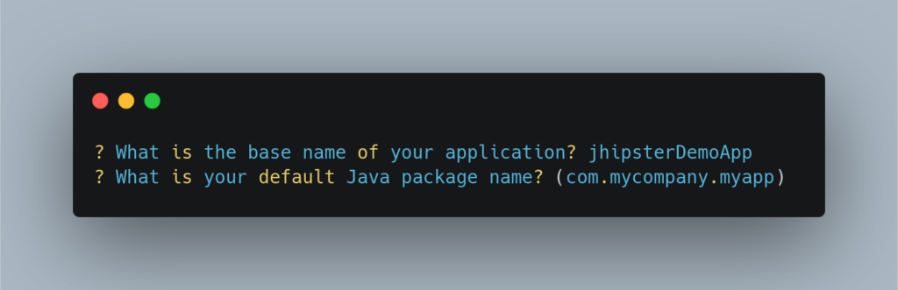
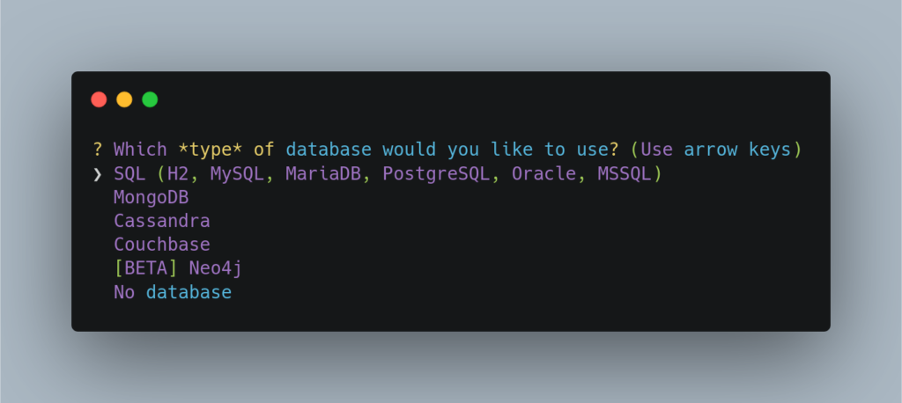
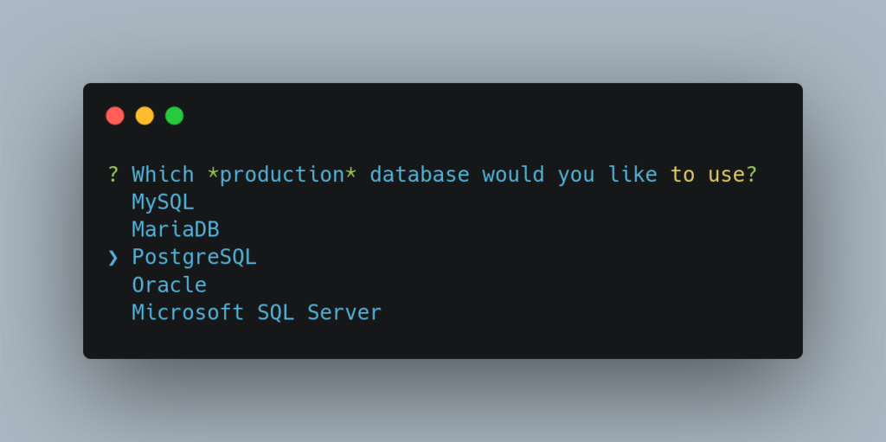
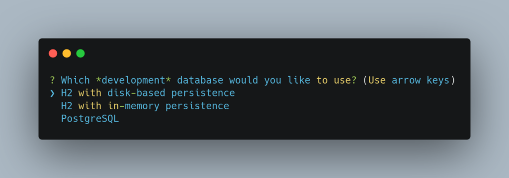
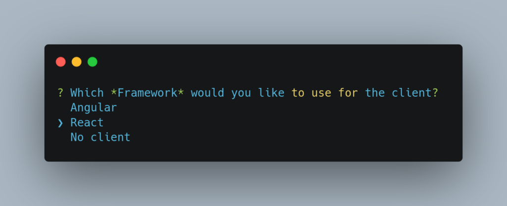
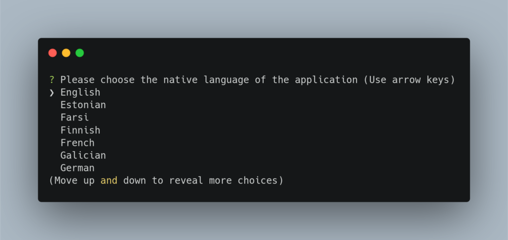

## Pourquoi un générateur de projet ?

Sur tous les [projets techniques](https://www.bearstudio.fr/prestations), notamment les applications web, les mêmes problématiques reviennent toujours. Comme la gestion des entités, la création des requêtes CRUD (Create, Read, Update, Delete) pour chaque entité, la gestion des comptes et de rôles, ou encore le développement d’une partie administration par exemple.

Toutes ces mêmes problématiques ont un coût en développement non négligeable et ne font pas partie des problématiques liées au métier de l’application.

Les **générateurs de projets** ont pour but d’[alléger le temps passé sur le développement](https://www.bearstudio.fr/blog/developpement/jhipster-une-technologie-qui-vous-fait-economiser-de-largent) de ces types de problématiques récurrentes. Ils vont pouvoir générer automatiquement les parties non spécifiques au métier, qui n'apportent pas de valeur ajoutée à l’application développée.

Développés par des communautés compétentes et souvent en [open-source](https://www.bearstudio.fr/blog/developpement/linux-logiciels-libres-et-open-source-retrouvez-votre-liberte), les générateurs de projets apportent aussi un cadre au projet en développement avec l’apport de normes et de standards.

---

## Le projet jHipster

**Java Hipster** ou [jHipster](https://www.jhipster.tech) est un projet **open-source** qui permet de générer une application web complète avec une partie [back-end](https://www.bearstudio.fr/prestations/dev-back) en **Java / Spring-Boot** et une partie [front-end](https://www.bearstudio.fr/prestations/dev-front) avec la techno de son choix parmi :

- React ⚛️
- Angular
- Vue JS

Le principe de **jHipster** est relativement simple. Vous définissez un **schéma d’entités** (leurs définitions + leurs relations) et à partir de ce schéma, jHipster va pouvoir générer :

- La création des entités dans la base de données du projet
- La définition des entités dans le back-end
- La mise en place d’une API et des requêtes CRUD pour gérer les entités
- La modélisation des entités dans le front-end
- Les services d’accès aux entités côté front-end
- Une partie d’administration des entités dans le projet front
- La gestion des comptes utilisateurs et de leurs rôles

Le projet rassemble aujourd’hui plus de 15 700 stars sur [Github](https://github.com). Il est utilisé par de nombreux grands groupes comme HBO, HSBC, Bosch, Carrefour, Adobe, Ippon, voire même Google.

---

## Générer son premier projet jHipster !

Pour générer un projet jHipster, vous avez deux options principales :

- Passer par l’outil en ligne : [https://start.jhipster.tech/#/](https://start.jhipster.tech/#/)

- Passer par le jHIpster CLI

La première option est plutôt recommandée lorsque vous débutez avec jHipster et que vous voulez vous faire une idée de son potentiel.

Si vous voulez plutôt passer par l’outil en ligne de commande vous pouvez utiliser npm pour installer le CLI :

`npm install -g generator-jhipster`

Voici les différentes étapes pour générer un projet jHipster via le CLI :

Commencez par créer un dossier pour votre projet jHipster :

`mkdir jhipsterDemoApp && cd jhipsterDemoApp`

Lancez la commande : jhipster

Le CLI de **jHipster** se lance et vous demande quel type d’application vous voulez générer. Ici nous allons sélectionner “Monolithic application”. C’est-à-dire que nous aurons une seule application avec un serveur unique pour l’ensemble des opérations à réaliser.

Les autres options concernent les micro-services. Lorsque vous commencez un projet, une architecture en micro-services est rarement nécessaire. Elle trouve plutôt son utilité lorsqu’une application doit supporter un grand nombre de requêtes à traiter, lorsqu’il y a déjà plusieurs milliers d’utilisateurs au moins.

Le CLI demande ensuite le nom de l’application à générer, vous pouvez laisser par défaut le nom du dossier créé. Choisissez aussi le nom de package pour la partie back-end.

Vous pouvez choisir d’utiliser ou non le jHipster registry qui vous permettra d’accéder à différentes statistiques et données sur votre application.

jHipster est capable de gérer différents types de bases de données : les bases classiques de type SQL, mais aussi les bases No-SQL comme MongoDB. On sélectionne ici le type SQL.

jHipster va alors demander les types à utiliser en développement et en production. Pour le développement, le type H2 avec persistance sur le disque est très pratique. Il permet aux développeurs du projet de ne pas avoir à configurer eux-mêmes une **base de données** pour travailler sur le projet.

Vous pouvez choisir d’utiliser un système de cache supplémentaire sur la **base de données**.

Si vous le souhaitez, vous pouvez rajouter des options spécifiques à votre projet jHipster, comme la recherche avec Elasticsearch.

Maintenant pour la partie front-end du projet, vous avez le choix entre [Angular](https://angular.io) et [React](https://fr.reactjs.org). Pour avoir VueJS il faudra passer par ce [blueprint](https://github.com/jhipster/jhipster-vuejs).

On sélectionne par exemple ici React.

Vous pouvez aussi choisir un thème Bootstrap par défaut pour votre projet.

Vous avez le choix d’intégrer ou non un système de traduction et de sélectionner les différentes langues à supporter.

Enfin le CLI vous demande si vous voulez rajouter un outil pour les tests unitaires ou utiliser un module présent dans le jHipster marketplace. On ne va rien ajouter ici pour notre génération.

On valide et ensuite jHipster génère le projet dans le dossier courant. Il va générer tous les fichiers nécessaires au bon fonctionnement du back-end et du front-end.

On retrouve ensuite dans le projet généré, 2 sous-projets, 1 pour le back-end en **Java** avec le framework **Spring-Boot** et 1 pour le front-end avec des fichiers TypeScript et la librairie React Js.

Lançons maintenant le projet en mode développement :

Pour lancer le serveur back :

`./mvnw`

Pour lancer la partie front-end :

`yarn && yarn start`

Et voilà vous avez généré et lancé votre premier projet jHipster ! 🎉🎉🎉

Vous pouvez vous connecter en tant qu’administrateur sur la plateforme (admin / admin) et découvrir les écrans générés par jHipster.

---

## Gérer son schéma d’entités avec le JDL Studio

Voyons maintenant comment importer un schéma d’entités dans un projet **jHipster**.

jHipster propose un outil en ligne nommé [JDL Studio](https://start.jhipster.tech/jdl-studio/) particulièrement utile et simple d’utilisation.

Cet outil va vous permettre de déclarer vos différentes entités ainsi que les relations entres elles via une [syntaxe](https://www.jhipster.tech/jdl/entities-fields) assez simple.

Vous pouvez ensuite exporter ce schéma dans un fichier via l’outil.

Ce même fichier peut ensuite être importé dans votre projet via cette ligne de commande :

`jhipster import-jdl jhipster-jdl.jh`

jHipster va alors vouloir écraser certains fichiers, vous pouvez répondre oui à chaque fois parce que c’est la première génération d’entités dans votre projet.

Et voilà vos entités vont être créées dans votre projet et vous allez pouvoir les gérer depuis l’administration.

---

## Quelques bonnes pratiques

Comme vous l’avez vu, **jHipster** vous a généré pas mal de fichiers pour chacune de vos entités. Dans le back-end, pour chaque entité, on retrouvera par exemple :

- Une couche **repository** : pour accéder à la base de données et faire des opérations dans celle-ci en rapport avec l’entité
- Une couche **service** : pour contenir la logique sur l’entité
- Une couche **resource** : pour lister les endpoints dans l’API qui seront disponibles sur l’entité

A chaque fois que l’on veut mettre à jour une entité, jHipster va regénérer les fichiers liés à celle-ci. Pour éviter les conflits sur ces fichiers, il est nécessaire de ne pas les utiliser pour la logique propre à son application. Pour cela, une méthode que nous utilisons au BearStudio est d’étendre les fichiers générés par jHipster.

Ainsi, si l’on veut ajouter un nouveau endpoint accessible dans l’API par exemple pour l’entité “Location” on va créer ces 3 fichiers :

- `LocationResourceExtended` qui étend la classe **Java** `LocationResource` précédemment générée par jHipster
- `LocationServiceExtended` qui étend `LocationService`
- `LocationRepositoryExtended` qui étend `LocationRepository` 

De ce fait, lorsqu’on modifiera l’entité Location, il n’y aura pas de conflits avec la re-génération de jHipster sur ces fichiers.

---

## Mettre à jour une entité

Pour mettre à jour une entité avec jHipster il vous suffit de modifier votre **schéma d’entités** précédemment créé via le JDL Studio et de le réimporter. Vous pouvez aussi modifier l’entité via le CLI avec la commande suivante :

`jhispter entity NomEntité`

jHipster vous demande si vous voulez simplement regénérer les fichiers liés à l'entité, ou ajouter / supprimer des champs et relations à votre entité.

Une fois votre choix fait et vos modifications appliquées, le générateur va modifier tous les fichiers liés à votre entité et il vous demandera votre autorisation pour cela. Vérifiez bien pour chaque fichier que les modifications proposées par jHipster ne vont pas impacter votre propre logique. C'est pour cela qu'il vaut mieux étendre et ne pas modifier les fichiers de bases générés par jHipster.

### Mise à jour de la base de données avec Liquibase

Lorsque vous mettez à jour une entité, jHipster va vouloir mettre à jour la table liée à cette entité en proposant une modification des fichiers Liquibase gérant cette table.

> Mais c'est quoi Liquibase ?

[Liquibase](https://www.liquibase.org/) est une bibliothèque permettant de versionner et d'appliquer des changements dans un schéma de **base de données**.

jHipster utilise ainsi Liquibase pour gérer les tables liées aux entités du projet.

Les fichiers liés à Liquibase sont dans le dossier `/src/main/resources/config/liquibase` de votre projet.

Le fonctionnement de Liquibase avec jHipster est simple :

- Le sous-dossier `changelog` contient des fichiers XML représentants chacun un `changelog` (une suite de modifications à appliquer dans le schéma)
- Le fichier `master.xml` rassemble la liste des `changelogs` à appliquer avec les liens vers les fichiers XML du sous-dossier `changelog`

Lors de la génération initiale de vos entités, jHipster va créer les fichiers Liquibase (les changelogs) pour créer les tables correspondantes aux entités.

Et lorsque vous allez vouloir mettre à jour une entité, jHipster va proposer de modifier les fichiers Liquibase générés à la base. Or Liquibase est un outil pour **versionner** les changements sur les bases de données. [Un peu à la manière de Git](https://www.bearstudio.fr/blog/developpement/git) avec les commits, chaque changement devra se faire dans un nouveau `changelog` et il est impossible de modifier un `changelog` précédent. Liquibase lèvera une erreur si vous autorisez jHipster à modifier les fichiers Liquibase initiaux.

Pour ce point vous avez deux options possibles :

- **Votre projet n'est pas encore en production**, vous êtes au stade du setup. Alors vous pouvez autoriser jHipster à écraser les fichiers Liquibase de base et vider votre base de données locale avec la commande suivante : `./mvnw clean` pour que votre projet en local fonctionne toujours.
- **Votre projet est déjà en production**. Dans ce cas, vous allez devoir créer un nouveau `changelog` sous forme de fichier XML et indiquer dans celui-ci les modifications à appliquer en respectant la syntaxe de Liquibase (documentation : [https://docs.liquibase.com/change-types/home.html](https://docs.liquibase.com/change-types/home.html)). N'oubliez pas d'indiquer le nouveau changelog dans le fichier `master.xml`.

Si vous souhaitez ne pas avoir à vous occuper de cette partie, vous pouvez utiliser ce [blueprint](https://www.npmjs.com/package/generator-jhipster-with-new-changelogs).

## Aller plus loin

Pour supporter jHipster : [https://opencollective.com/generator-jhipster](https://opencollective.com/generator-jhipster)

Guide d'utilisation : [https://www.ionos.fr/digitalguide/sites-internet/developpement-web/jhipster/](https://www.ionos.fr/digitalguide/sites-internet/developpement-web/jhipster/)

_"Etre productif avec jHipster"_ \- **Julien Dubois**, Devoxx France 2017 : [https://www.youtube.com/watch?v=wJruVpv0WH4](https://www.youtube.com/watch?v=wJruVpv0WH4)
