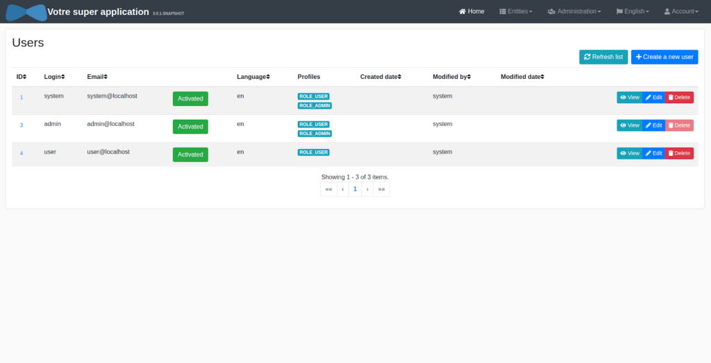

_**Disclaimer :** Cet article n’est pas orienté sur l’aspect technique de JHipster et s’adresse donc principalement aux entrepreneurs et aux startups. Cependant il permet aussi de faire un rappel de certaines idées aux développeurs, voire même aux CTO._

Pour consulter une présentation technique de JHipster, vous pouvez lire [cet article](https://www.bearstudio.fr/blog/developpement/jhipster-generateur-projet-hipsters).

## Présentation de JHipster

[JHipster](https://www.jhipster.tech/) est un _générateur de projet_ mais aussi un _générateur de code_ pour le développement d'_applications web_. JHipster génère une _API_ ainsi qu'une _interface web._

Avant d'entrer dans le vif du sujet, définissons les termes ci-dessus, qui sont incontournables même si vous n'êtes pas spécialistes…

### **Générateur de projet**

C'est un outil qui permet de créer tous les fichiers et dossiers de la base du projet de développement. Pour qu'un site ou une application web fonctionne, il est nécessaire d’avoir des fichiers contenant du code. Les fichiers créés par le générateur sont souvent des fichiers de configuration du projet. Mais selon la qualité du générateur, certaines fonctionnalités fréquemment utilisées sont déjà présentes (la possibilité de se créer un compte et s’authentifier par exemple).

### **Générateur de code**

À la différence du générateur de projet, le générateur de code va simplifier la suite des développements du projet. Par exemple, lorsque vous souhaitez ajouter une nouvelle fonctionnalité telle que les “abonnements” à votre service, un générateur de code permettra de gagner du temps en créant les fichiers et le code nécessaire, sans la logique métier évidemment. En d’autres termes, le générateur va créer tout ce qui ne dépend pas de la logique spécifique à votre projet.

### **Application web**

Ici, je parle de sites web réactifs, qui vont grossir et sont pensés pour être très interactifs. Par exemple, on peut différencier le site du BearStudio, qui est un site simpliste sans grande interaction avec l’utilisateur, de Trello qui est une vraie application sur laquelle l’utilisateur va se connecter et interagir avec une multitude de pages et de fonctionnalités.

### **API**

Ce terme n’est pas le plus évident à comprendre, mais est primordial lorsqu’on lance un projet tech. Voici ma définition simple d’une [API](https://www.bearstudio.fr/blog/developpement/votre-api-est-elle-vraiment-restful) : _c’est l’ensemble du code qui assure la logique de projet que vous créez, et qu’on peut questionner simplement pour obtenir des informations comme “Quelle est la liste des utilisateurs de l’application ?” ou “Créer une nouvelle souscription pour l’utilisateur numéro 1”._

L’avantage d’une API, c’est qu’elle est réutilisable, puisqu’elle peut être appelée depuis n’importe où : votre site web, votre application mobile, un logiciel, etc.

A propos d’API, on parle aussi souvent de **back-end**. Ce n’est pas exactement la même chose, mais en vulgarisant, on peut dire que ce sont des synonymes.

_Note : Une API est souvent protégée par un système d’authentification, pour ne pas exposer toutes les données à n’importe qui._

### **Interface web**

Lorsqu’on parle d’interface web (ou UI), il s'agit de la partie visible de votre application. L’interface web peut aussi être appelée **[front-end](https://www.bearstudio.fr/prestations/dev-front)**, car c’est la partie "avant", que va utiliser l’utilisateur alors que le [backend](https://www.bearstudio.fr/prestations/dev-back) est à l’arrière, caché aux yeux du client.

Gardez en tête que cette UI doit être ergonomique (on parle d’[UX design](https://www.bearstudio.fr/prestations/ux-design)) et souvent _responsive_. Cela signifie qu'elle doit pouvoir s’adapter au différents terminaux sur laquelle elle est utilisée (mobile, ordinateurs…).

## Les fonctionnalités de JHipster

### **Tout ce qu’il faut pour démarrer rapidement** votre implémentation

La raison principale pour laquelle nous adorons JHipster au BearStudio et que nous l’utilisons dès que nous en avons la possibilité, c’est que ce générateur permet de **lancer votre projet numérique et votre startup en un temps record**. Cela sous-entend aussi que **les coûts du développement de votre projet sont réduits**, car celui-ci pourra se terminer plus rapidement.

Si vous vous demandez comment JHipster nous apporte ce gain de temps, la réponse est simple : la plupart des fonctionnalités communes à tous les projets numériques sont incluses dès la génération de votre projet JHipster. En voici une liste :

Pour la **gestion des utilisateurs** :

- Création de compte à l’aide d’un email et d’un mot de passe
- Activation de compte grâce à un lien envoyé par e-mail
- Connexion au compte
- Réinitialisation du mot de passe oublié via l’envoi d’un e-mail
- Accès aux détails du compte connecté
- Edition des informations du compte (mot de passe, etc.)
- Gestion de rôles (existence d’un espace administrateur différent de l’espace utilisateur)
- Gestion des utilisateurs grâce à un listing paginé (administrateur)
- Possibilité de créer un nouvel utilisateur (administrateur)
- Possibilité de voir le détail d’un utilisateur, l’éditer, le supprimer, l’activer, etc. (administrateur)

Pour la **gestion du contenu** de l’application web, JHipster propose une page de création, visualisation et édition des données (aussi appelées entités). Par exemple, si votre application gère des commandes, lors de la génération de l’entité _Commandes_, une page en fera le listing, et il sera aussi possible de les éditer.

La **langue** du contenu peut aussi être changée selon les paramètres qui ont été choisis à la génération du projet.

Pour finir, un projet généré avec JHipster donne accès à des outils techniques très intéressants, qui permettent de gagner du temps lors du développement ou lorsqu'on fait du **monitoring** :

- Le [JDL de JHipster](https://start.jhipster.tech/jdl-studio/), est un outil permettant de construire le schéma de données de votre application, et lorsque ce modèle a été pensé, il est possible de générer tous les fichiers qui permettront de manipuler les données de l’application (les stocker, les récupérer, les consulter…). Le _modèle de données_ correspond à l’ensemble des entités qui vont interagir ensemble pour répondre à vos problèmes métiers. Par exemple, une application qui permet de commander dans des restaurants aura une entité _Restaurant_ qui pourra posséder plusieurs entités _Commandes_, l’entité _Commande_ étant liée à l’_Utilisateur_ qui la passe.
- Comme expliqué dans le point précédent, JHipster permet de générer des entités à partir du schéma de données, mais il permet aussi de générer et regénérer des entités indépendamment de l’utilisation du JDL. La génération va faire gagner beaucoup de temps aux développeurs, mais va aussi ajouter un menu dans le backoffice permettant d’accéder aux données et d’en créer, comme expliqué dans la partie gestion de contenu.
- Un accès à la base de données avec la console de H2, si la base de données de développement l'utilise.
- Une “documentation de l’API” autogénérée grâce à Swagger (OpenAPI).
- Les métriques du serveur permettant de voir l’utilisation de sa mémoire, et d’autres statistiques qui sont rarement utiles, mais auxquelles on adore avoir accès le jour où on en a besoin.
- Un audit affichant la liste des connexions à l’application
- Une page de gestion des niveaux de logs. Les logs sont des traces laissées par les développeurs, afin de savoir ce qui se passe dans l’application. Ils sont très utiles pour analyser si des erreurs surviennent dans votre application, et comprendre pourquoi ces problèmes sont présents.

Dans la prochaine partie, nous allons voir que ce générateur de projet possède un très large choix de **technologies**.

Selon le projet à développer, il est clair que les technologies à utiliser peuvent varier car elles simplifieront les développements ou répondront mieux à vos besoins.

### Les performances de JHipster en termes d'interface utilisateur

JHipster intègre les 3 technologies les plus utilisées pour simplifier les développements : _[React](https://fr.reactjs.org/)_, [_Angular_](https://angular.io/) et _[VueJS](https://fr.vuejs.org/)_. Votre équipe de développement aura donc la possibilité de choisir lors de la génération du projet. De plus, la communauté a récemment inclut une option permettant de choisir un thème graphique parmi ceux disponibles sur [Bootswatch](https://bootswatch.com/).

JHipster vous permet aussi de pré-configurer la traduction de votre application, ainsi que les langues à inclure. Vous pourrez donc décider que votre application soit en français par défaut, mais elle peut aussi être affichée en anglais, russe ou mandarin (et bien d’autres langues).

Pour finir avec les options possibles à la génération du projet concernant l’interface, vous aurez aussi la possibilité d’ajouter des tests appelés “end to end” qui permettront de tester l’application de bout en bout. Sur ce point aussi, plusieurs outils sont disponibles. Attention, encore une fois, JHipster génère des tests, mais ceux-ci seront à faire évoluer au fur et à mesure de la vie de l’application, ce qui prend du temps mais bien sûr, améliore la qualité de l’application.

### D'autres options pour développer vos projets

JHipster propose toute une liste d’options que je vais citer sans les détailler car elles concernent des parties plus techniques :

- Vous pourrez développer des applications monolithiques ou faire le choix des microservices
- Utiliser Spring webflux pour développer une application réactive
- Déterminer le type d’authentification (JWT, OAuth2, HTTP Sessions)
- Fixer le type de base de données (MySQL, PostgreSQL, H2, Mariadb, Oracle, MSSQL, MongoDB, Cassandra, Couchbase, Neo4j)
- Choisir entre l’utilisation de Maven ou Gradle
- Ajouter ElasticSearch, Spring Websockets, Kafka, OpenAPI-generator

## Conclusion : JHipster vous veut du bien !

En plus de permettre un **démarrage très rapide de votre projet**, JHipster possède une qualité très importante à nos yeux.

D’abord parce c’est un projet _Open Source_, ce qui signifie que le code est accessible à tous sur [Github](https://github.com/jhipster/generator-jhipster/). Autrement dit, **ça implique que tout le monde puisse contribuer à l’amélioration du générateur**, et donc venir ajouter de nouvelles fonctionnalités au projet. Que ce soit pour s’assurer qu’il ne possède pas de failles de sécurité, corriger de potentiels bugs, etc. Concrètement, ça nous permet d’améliorer votre projet lors de chaque mise à jour de JHipster, en ajoutant de nouvelles fonctionnalités. Nous sommes par exemple en train de travailler sur l’ajout d’une fonctionnalité permettant de visualiser des statistiques sur vos données (nombre d’utilisateurs…). Nous vous invitons d'ailleurs à lire le [témoignage de nos ours présents lors de la dernière JHipster Code de Bordeaux](https://www.bearstudio.fr/blog/actualites-web-numerique/la-team-du-bearstudio-a-la-jhipster-code).

Pour finir, je souhaitais mettre en avant le fait qu’un projet JHipster peut être déployé très rapidement sur le cloud. Un [article](https://www.jhipster.tech/clever-cloud/) de [Rudy](https://www.bearstudio.fr/team/rudy-baer) explique comment déployer sur [CleverCloud](https://www.clever-cloud.com/en/) . Cette expertise nous permet de mettre l’interface du back-office entre vos mains, sur une plateforme de pré-production, en un jour seulement (sans la logique spécifique à votre métier, évidemment).

Si vous souhaitez en apprendre plus sur notre façon d’utiliser JHipster et savoir ce que ce générateur apporte aux entreprises avec lesquelles nous travaillons, vous pouvez retrouver [une vidéo](https://youtu.be/BT9qdMdmM9I?t=1716) de [Rudy](https://www.bearstudio.fr/team/rudy-baer) et [moi](https://www.bearstudio.fr/team/quentin-lerebours), en présentation lors d’un meetup JHipster.
