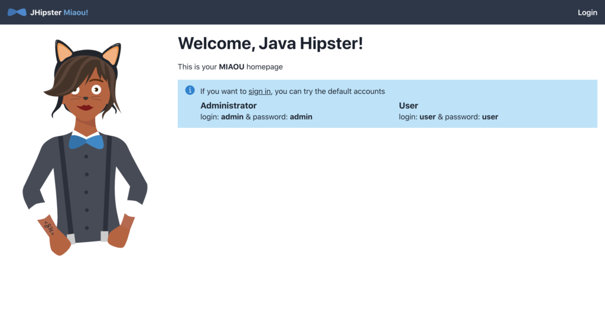

## Jhipster c’est quoi ?

[Jhipster](https://www.jhipster.tech/) est un framework **open source** de développement web. Pour les non développeurs, c’est un générateur de projet qui va faire gagner énormément de temps aux développeurs. Il pose un cadre et des bonnes pratiques qui, en plus de créer de la valeur rapidement dans un projet, évite les fantaisies de conception et d'implémentation que peuvent faire des développeurs pas assez expérimentés au démarrage...

Apprenez en plus sur Jhipster à travers [cet article](https://www.bearstudio.fr/blog/developpement/jhipster-generateur-projet-hipsters) écrit par [Nicolas Torion](https://www.bearstudio.fr/team/nicolas-torion)

## La Jhipster code c’est quoi ?

C’est une journée d**'ateliers** organisée le 14 septembre 2020 dont le but est de réunir les contributeurs de Jhipster afin de travailler ensemble sur des nouvelles fonctionnalités. C’est aussi l’occasion pour des non **contributeurs** de le devenir. C’était d'ailleurs le principal objectif du BearStudio ;)  
Depuis le début de l'aventure, nous utilisons effectivement beaucoup Jhipster sur nos projets. Naturellement, une de nos volontés depuis toujours est de réussir à y contribuer. _Spoiler alert_, après 4 ans, je ne suis pas peu fier de pouvoir dénombrer près de 8 personnes ayant apporté leur contribution à Jhipster 🍾🥂.

## Comment ça se passe ?

L’équipe organisatrice, [la core team](https://www.jhipster.tech/team/) de Jhipster (encore un grand merci à eux pour tout le boulot), a organisé des **“tracks”** sur différents sujets. Après une présentation sommaire, les participants choisissent la track qui leur plaît le plus et ils codent toute la journée pour essayer de corriger des bugs ou de développer des nouvelles features.

Si souhaitez accéder à un récap de l'événement, je vous invite a lire celui écrit par **[Deepu](https://twitter.com/deepu105)** : [https://www.jhipster.tech/jhipster-code/](https://www.jhipster.tech/jhipster-code/)

A suivre : le récap de quelques ours du BearStudio ;) Eh oui, nous étions nombreux à participer à cette journée de contributions ! Nos oursons se sont naturellement répartis sur les différents ateliers proposés. Alors que ceux pour qui c'était la première fois ont choisi la track débutant, les plus expérimentés se sont attaqués à des parties plus techniques...

## La track beginners de la Jhipster Code

Ce premier atelier était destiné aux personnes n'ayant encore jamais participé à une contribution de ce type.

### Feedback d'[Asceline Boullen](https://www.bearstudio.fr/team/asceline-boullen)

Au BearStudio, je suis régulièrement amenée à faire des **wireframes** pour des projets générés par mes collègues avec JHipster mais sans en savoir réellement plus sur l’aspect technique de ce générateur.

J'appréhendai un peu le déroulé de la journée (format de l'événement, niveau de technicité attendu...). Mais mes doutes ont rapidement disparus ! Le format workshop était cool, les gens rapidement à l’aise. La track Beginners m’a permis de faire mes premiers pas avec JHipster et de comprendre le fonctionnement du générateur. Durant cette track on devait prendre en mains l’outil afin de pouvoir **corriger certaines issues** de la communauté.  
Pour me lancer, j’ai choisi une [issue](https://github.com/jhipster/generator-jhipster/issues/12457) qui m'a semblé accessible malgré mes compétences limitées en dev : modifier les icônes du menu d’administration de Jhipster. La tâche semblait plutôt simple, mais j’ai rapidement compris l’enjeux du générateur : proposer une génération en Vue, en Angular et en React.

Au final j’ai réussi à fix cette issue front en faisant les imports des icônes Font Awesome voulues et en changeant aux bons endroits, les références des icônes appelés. J'ai aussi proposé une **ré-organisation du fichier**, ce qui a été apprécié par [Pascal](https://twitter.com/pascalgrimaud) qui a merge mon travail et **m’a récompensé avec un bug bounty de 100$**. Je ne connaissais pas ce principe mais j’ai trouvé ça super cool et encourageant !  
Ensuite, je suis passée sur la **création d’un nouveau personnage** pour l'ajouter à ce qu’ils appellent la _Jhipster family_. J'ai même poursuivi cette [issue](https://github.com/jhipster/generator-jhipster/issues/12487) sur mon temps libre et proposer plusieurs créations. C’est cool de voir que **peu importe le niveau technique, chacun peut apporter quelque chose à la communauté.**

<figure>

<figcaption>

_Aperçu des personnages que j'ai proposés_

</figcaption>

</figure>

C’était pour moi la première contribution de ma vie, mes premiers pas dans l’open source et c’est cool ! Merci le billet diversité, qui m’a permis de participer à cette journée et m’encourager à y aller 😊

### Feedback de [Fabien Essid](https://www.bearstudio.fr/team/fabien-essid)

On utilise JHipster quasiment tous les jours au [BearStudio](https://www.bearstudio.fr/) mais au final je n’avais jamais généré un projet. La track _Beginners_ m’a permis de faire mes premiers pas avec JHipster et de découvrir le fonctionnement du générateur. Les participants de cette track avaient pour objectif de corriger des issues. Elles étaient bien **ciblées pour des débutants**, ce qui m’a permis de rapidement être à l’aise avec le générateur.

Au final **j’ai réussi à fix une issue front** (passer le personnage de JHipster de la droite vers la gauche sur les apps [React](https://fr.reactjs.org/) pour être raccord avec les autres technos) et à bien avancer sur une seconde (que je poursuis d'ailleurs sur mon temps libre). Elle consiste à ajouter un bouton de _refresh_ sur les listings des entités et des utilisateurs. C'est pas mal de boulot car il faut reporter la modification sur chaque techno : React, Angular et VueJS.

En prime, la génération de projets JHipster n’a plus de secrets pour moi ! J’avais un peu d’appréhension en début de journée, mais au final **c’était vraiment très intéressant** et pertinent à mon sens.

**Première contribution de ma vie** aussi, et ça c’est cool.

### Feedback d'[Ivan Dalmet](https://www.bearstudio.fr/team/ivan-dalmet)

Adepte de l’open source, c’était avec plaisir de découvrir la partie maintainer de JHipster :) Comme c’était la première fois que j’allais jouer avec le générateur, j’ai assisté à la track _Beginners_ en début de journée. Après avoir compris comment le générateur fonctionne j’ai voulu m’attaquer à un sujet qui me tient à coeur : **un nouveau front-end pour JHipster avec Chakra UI** 

Pour cela il a fallu se plonger dans le concept de blueprint. Je dois avouer que les premiers pas ont été hasardeux... Mais en **fin de matinée et avec l’aide de** [**Deepu**](https://twitter.com/deepu105) (core maintainer de JHipster), j’ai réussi à faire tourner **mon premier blueprint** qui permet de choisir un nouveau frontend ! Bon malheureusement, jusque là, rien de bien palpitant car le frontend généré était un simple fichier vide 😅

L’**après midi a donc été consacrée à vraiment setup le code généré** par ce nouveau blueprint. En plus de ⚡️ [Chakra UI](https://chakra-ui.com/), j’ai installé une stack frontend moderne avec ⚛️ [React Query](https://react-query.tanstack.com/), ⚛️ [React Router](https://reactrouter.com/) et 🐜 [Formiz](https://formiz-react.com/) Setup du layout, du routing public, et authentifié du formulaire de login et de la homepage. Le tout pour avoir une démo fonctionnelle en fin de journée.

<figure>

<figcaption>

_Vous pouvez admirer la nouvelle illustration créée par Asceline._

</figcaption>

</figure>

Mais pour avoir une vraie démo, il faut un nom pour ce nouveau blueprint. Et là, seule une bonne private joke pouvait faire l’affaire. **Je vous présente donc le Blueprint JHipster Miaou 🐈**

Comme vous pouvez vous en doutez **il reste encore pas mal de développement** avant de pouvoir avoir un blueprint complet. Cette journée a été un bon point de départ. On **espère donc pouvoir bientôt publier ce nouveau blueprint pour la communauté** 😊

_Update :_ le projet a été renommé mais voici le [lien du résultat](https://github.com/ivan-dalmet/start-ui) (toujours en cours de travail) !

## La track API rest de la Jhipster Code

Celle-ci visait principalement à améliorer les standards de JHipster en optimisant le [caractère Restful](https://www.bearstudio.fr/blog/developpement/votre-api-est-elle-vraiment-restful) de son API.

### Feedback de [Quentin Lerebours](https://www.bearstudio.fr/team/quentin-lerebours)

**On a commencé par de la théorie** sur les APIs Restful et les conventions d'une telle API. J'ai appris qu'une vraie API REST se développait sur 4 niveaux de conventions (URI, verbes, code de retour et HATEOAS), et que plus de 99% des APIs ne respectent pas la dernière convention. On a donc décidé de discuter de la meilleure manière d'**améliorer le respect des convention**s de REST sur JHipster.

Notre première idée a été d'améliorer certaines URI qui n'ont pas des noms de ressources mais d'actions, ce qu'on a commencé à faire avant de se rendre compte des problèmes que ça poserait en terme de migrations. On s'est donc arrêté là sur cette tâche, mais ça nous a permis de bien **comprendre le fonctionnement du générateur de code**.

On est donc passés sur la deuxième tâche de la journée : ajouter des _endpoints_ PATCH dans les Contrôleurs lors de la génération d'entités, tout ça accompagnés par Christophe Bornet.

En fin de journée, on avait accompli environ 50% du travail, la [PR](https://github.com/jhipster/generator-jhipster/pull/12727) était ouverte sur GitHub et on était tous très satisfait d'avoir travaillé là-dessus. C'était très intéressant de comprendre en profondeur le fonctionnement du générateur et d'être initiés à la contribution sur ce projet, **ce qui simplifiera les prochaines corrections d'issue ou développement de features**.

### Feedback de [Jessy Baer](https://www.bearstudio.fr/team/jessy-baer)

On a commencé avec une **présentation de la future version de Jhipster**, la version 7, ce qui nous à permis de voir les nouvelles features qui arriveront prochainement

Après j’ai travaillé sur la track API, avec pour objectif de rendre Jhipster plus Restful, c’est à dire un peu plus respectueux des conventions. L’atelier m’a permis de voir comment on peut contribuer sur le générateur **à l’aide d’un exemple concret**. L'expérience est super intéressante et permet de faire un **premier pas dans l’univers de l’open source**.

## La track JDL de la Jhipster Code

Ici, le but était de travailler à l'amélioration du **JDL Studio**, un outil qui permet de visualiser son schéma d'entités pendant sa rédaction.

### Feedback de [Renan Decamps](https://www.bearstudio.fr/team/renan-decamps)

La première track que j'ai suivi consistait à **améliorer le langage jdl utilisé** dans [jdl-studio](https://www.jhipster.tech/jdl/). Il faut savoir que dans la version actuelle, le code n'a jamais été réadapté au fur et à mesure des nouvelles features. Nous avons donc d'abord listé toutes les incohérences au niveau des paramètres de chaque instruction. (Par exemple, pouvoir mettre `no false` à un paramètre mais n'avoir que `no` sur un autre). Puis nous avons réfléchi à une solution qui permettrait d'unifier le langage et de le rendre plus clair. La solution sur laquelle nous somme tous tombés d'accord permet de résoudre l'ensemble de ces problèmes.

J'ai ensuite laissé mon groupe pour travailler sur l'intégration du nouveau jdl-studio avec JHipster online. Pour cela j'ai d'abord échangé avec **Deepu**, le créateur du jdl-studio, pour comprendre comment fonctionnait l'app. **J'ai commencé à coder l'intégration**. Une [PR](http://github.com/jhipster/jdl-studio/pull/105\(ouvre un nouvel onglet\)) a d'ailleurs été ouverte à ce sujet, qui a été merged entre-temps.

### Feedback de [Nicolas Torion](https://www.bearstudio.fr/team/nicolas-torion)

Journée très sympa durant laquelle on a pu échanger avec la core team de jHipster sur de multiples sujets.

J’ai passé du temps sur l’**amélioration de la syntaxe JDL** du générateur avec :

- [Renan](https://www.bearstudio.fr/team/renan-decamps)
- [Mathieu ABOU-AICHI](https://github.com/MathieuAA), membre de la core team
- [Arnaud Freismuth](https://twitter.com/arnaudfreismuth), membre de la core team  

C’était extrêmement intéressant comme session de travail. D'abord sur l’apprentissage du fonctionnement de la partie gestion du JDL du générateur. Mais aussi sur la conception d’un nouveau mot clé pour simplifier l’application d’options sur les entités dans le JDL.

## La fin de journée 

Bien entendu la journée s’est terminée avec un repas tous ensemble, très sympa pour créer du lien entre les contributeurs.

- 
- 
- 
- 
- 
- 

## Mon bilan

Une réussite sur tous les plans ! La team est non seulement formée pour pouvoir contribuer à Jhipster mais aussi motivée ! Les contributions ont continué bien après la conférence comme vous pouvez le voir à travers ces liens :

| [https://github.com/jhipster/generator-jhipster/pull/12727](https://github.com/jhipster/generator-jhipster/pull/12727) |
| ---------------------------------------------------------------------------------------------------------------------- |
| [https://github.com/jhipster/jhipster.github.io/pull/1020](https://github.com/jhipster/jhipster.github.io/pull/1020)   |
| [https://github.com/hipster-labs/jhipster-terraform-poc](https://github.com/hipster-labs/jhipster-terraform-poc)       |
| [https://github.com/jhipster/generator-jhipster/pull/12507](https://github.com/jhipster/generator-jhipster/pull/12507) |

Le format de conférence était également super motivant : **un hackathon de contributeurs open source sans compétition**, avec juste l'envie et la motivation du partage. Ça m'a donné des idées pour un futur évènement [Codeurs En Seine](https://www.codeursenseine.com/2020)… (wait & see)

D’un point de vue **team building**, on a commencé le week-end par une visite de Bordeaux sous 30°, avec de la nourriture, du vin… Comme nous sommes des gens simples, ils ne nous en faut pas plus pour être heureux :D

Pour la communauté, 8 nouveaux contributeurs c’est pas mal. Même si forcément la motivation va peut-être baisser un peu, c’est déjà ça de pris ! De toute façon je vais continuer à forcer  motiver la team à s'impliquer. Jusqu’à la fin d’année 2020, tous les développeurs (au sens large, je ne vous oublie pas les UX Designer) ont eu une journée par semaine dédiée à de la contribution pour des [projets open source](https://www.bearstudio.fr/blog/developpement/linux-logiciels-libres-et-open-source-retrouvez-votre-liberte).
