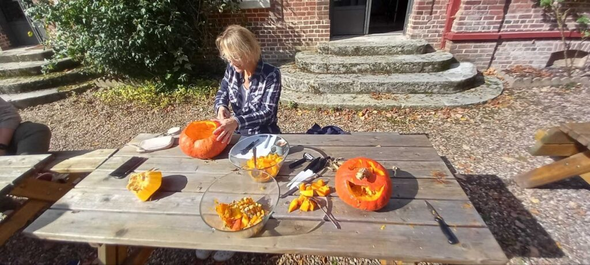
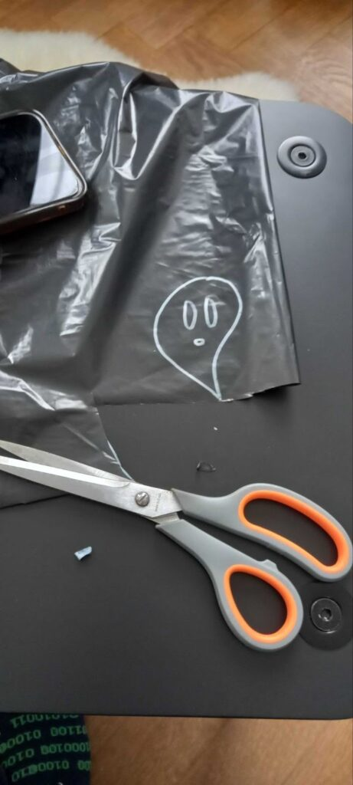
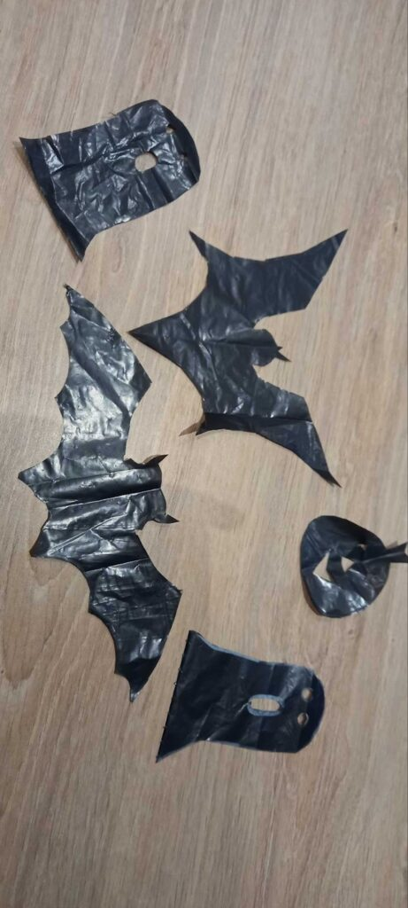
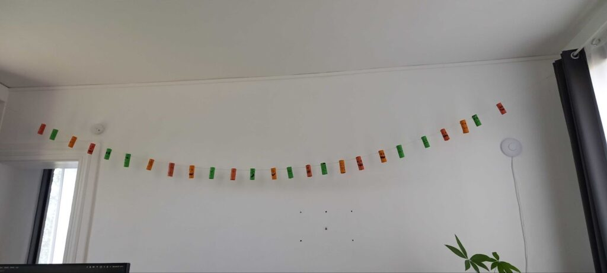
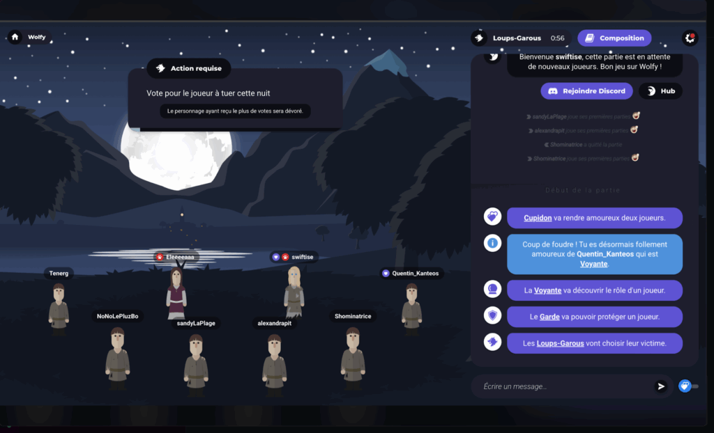
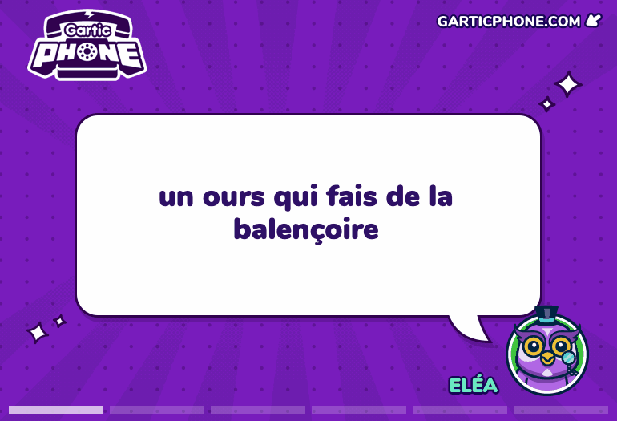

L’automne s’installe, les jours raccourcissent et la nuit s’invite un peu plus tôt derrière nos écrans. 🌒 Le froid se glisse entre deux commits, et les premiers frissons se font sentir. Difficile de dire s’ils viennent du vent glacial ou d’un bug en production. 👀

Entre les lignes fantômes (celles qui déclenchent une erreur à la ligne 45 alors que cette ligne n’existe même pas), et les bugs farceurs qui nous jouent des tours… le décor était déjà planté. 

Voici donc un bref retour sur le mois d’octobre au [BearStudio](https://www.bearstudio.fr/). Où l’ambiance d’Halloween a pris le contrôle de la tanière de l’équipe. Mais comme on n’est pas du genre à se laisser hanter, on en a aussi profité pour entretenir la bonne humeur, la créativité et une petite touche d’écolo-décoration en matériaux de récup. 🎃

## 1. Atelier découpe de citrouilles

##### Semaine du 6 au 13 octobre

Première étape : la traditionnelle **découpe de citrouilles !**
Sous les derniers rayons de soleil d’octobre, on s’est installés dehors, armés de couteaux, de cuillères et d’un courage variable selon les participants.
Certaines citrouilles sont devenues de véritables œuvres d’art… d’autres, des exceptions non gérées. 😅

“Rien ne se perd, rien ne se crée, tout se transforme”: les restes ont été recyclés — pas en carrosse (on n’a pas trouvé le bon _framework_ pour ça) — mais en un délicieux **velouté de citrouille** pour nous réchauffer.
Et pour les plus gourmands : **petits gâteaux citrouille-cranberry**. Comme Rust, ça a divisé : certains ont adoré, d’autres ont préféré ne pas relancer le script. Pour les curieux, vous pouvez aller voir l’article de Yoann [ici](https://www.bearstudio.fr/blog/developpement/rust).

  

  

## 2. Atelier décoration

##### Semaine du 13 au 20 octobre

Deuxième phase : la **déco d’Halloween.**
Après une brève _inspiration Instagram_ (et quelques échecs critiques), on a finalement pris le coup de main.
Astuce du jour : coller avec de l’eau, c’est écolo… mais ça a son caractère et ça demande un peu de patience pour que ça tienne ! Un peu comme quand on teste un nouveau snippet de code : parfois ça prend au premier essai. Et parfois il faut ajuster quelques détails pour que tout s’imbrique parfaitement. 😬

  

  

  

### 3. Atelier guirlandes

##### Semaine du 20 au 27 octobre

Place au **recyclage créatif !**
Rouleaux de papier toilette, chutes de papier coloré, un marqueur et un bout de ficelle plus tard. Et voilà une armée de petits fantômes, citrouilles, chauves-souris, autres créatures étranges prêtes à envahir le bureau.
Certains personnages avaient l’air terrifiants, d’autres… un peu trop mignons pour faire peur.
Mais l’ambiance spooky était au rendez-vous entre deux cafés et trois commits sur _Lea English_ (dont vous pouvez lire l’étude de cas UX [ici](https://www.bearstudio.fr/blog/design-css/lea-english-etude-de-cas)) !

## 4. Soirée Loup-Garou

##### Le 30 octobre

Pas de pleine lune sans **Loup-Garou** !
Chacun sous son plaid avec un chocolat chaud ou son dîner. Connectés sur le site [Wolfy](https://wolfy.net/fr) pour une soirée pleine de trahisons numériques et de débats intenses sur “qui est le loup garou ?”, “qui sera le maire” ou encore “qui est cupidon ? on a des comptes à régler...”.🐺

Et un petit GarticPhone qui n’avait plus rien à voir avec Halloween pour finir en beauté (des dessins fait au pad et un talent incertain qui nous a encore plus fait rire ! ).

Bref, un mois d’octobre bien rempli au BearStudio : des citrouilles, du code, des rires et quelques frayeurs… mais surtout, une équipe d’ours qui sait transformer les _bugs_ en bonbons 🍬 et les _pull requests_ sur [Start UI](https://www.bearstudio.fr/blog/actualites-web-numerique/start-ui) en moments de partage.

