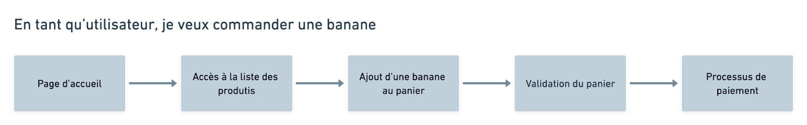
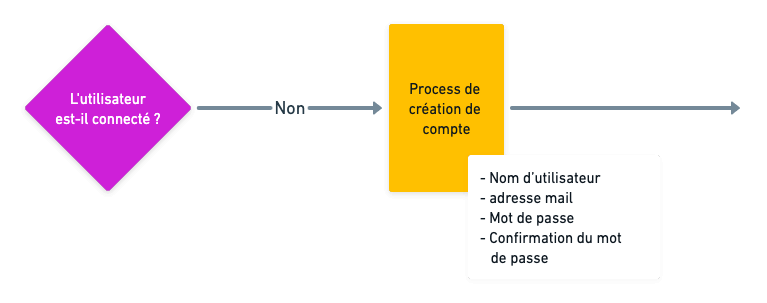

Le parcours utilisateur est défini par les différents chemins et interactions que l’utilisateur va rencontrer dans une application, un site web, un logiciel métier, etc.

Bien comprendre le parcours utilisateur est essentiel pour créer un chemin fluide et cohérent. Il va permettre d’optimiser l’expérience de l’utilisateur au fur et à mesure de son utilisation d’un produit numérique. Le but est de permettre à l’utilisateur d’atteindre efficacement son objectif. 

La définition d’un parcours utilisateur fait donc partie des étapes essentielles dans l’optimisation de l’[UX design](https://www.bearstudio.fr/prestations/ux-design) (UX = expérience utilisateur).

En utilisant la bonne méthode et les bons outils, on s’offre la possibilité d’optimiser au maximum l’expérience utilisateur en se mettant à sa place afin de retracer l’ensemble de son parcours. Il en existe de nombreuses (comme l’user journey qui prend en compte les émotions des utilisateurs). Au BearStudio nous avons choisi, à force d’expérience, d’utiliser les **User Flows**.

Bien sûr, l’utilisation des User Flows ne permettra pas automatiquement de créer un parcours utilisateur parfait. D’autant qu’il existe plusieurs manières d’utiliser cette méthode. Avec le temps, nous avons affiné notre processus de création d’User Flows afin d’être toujours plus pertinent et de s’assurer que la conception de ces différents parcours utilisateur soit efficace et intuitive.

Une autre utilité des Users flows est de préparer les [maquettes](https://www.bearstudio.fr/prestations/ux-design/maquettes) et les [wireframes](https://www.bearstudio.fr/prestations/ux-design/wireframes). En effet, il s’agit d’une étape préliminaire à la réalisation de maquettes. Plus les User flows sont détaillés, le plus clair seront les maquettes ou les wireframes.

Dans cet article nous allons vous présenter sommairement quelle est notre procédure pour réaliser des User flows qui permettent de s’assurer que le parcours utilisateur soit bien défini par tous les acteurs du projet (client, designer, équipe de développeurs etc.).

## 1 - Comprendre le besoin des utilisateurs

Pour créer un User Flow pertinent, il est nécessaire de prédire le comportement des utilisateurs. Pour analyser le parcours des utilisateurs, il faut organiser un certain nombre d’ateliers avec les porteurs de projet. Ce qui permet de poser le plus de questions possible sur les utilisateurs, leurs besoins etc. 

Connaître ce dont ont besoin les utilisateurs est la base pour être sûr que le produit que l’on va créer (application mobile ou web, logiciel, site internet…) correspondra au besoin. Il est possible, dans certains cas, de faire des ateliers avec des utilisateurs finaux (dans le cas d’une application métier déjà existante par exemple).

Le meilleur moyen de comprendre et d’analyser l’utilisateur, c’est d’essayer de se mettre à sa place. Pour ce faire, il faut poser un maximum de questions, comprendre le contexte, les contraintes, les besoins, la démarche etc. C’est une étape **indispensable et primordiale** si l’on veut s’assurer d’avoir des bonnes bases dans le cadre de la création d’un bon parcours utilisateur.

## 2 - Réaliser des Task Flows

Les taskflows sont une représentation schématique (souvent en utilisant des couleurs neutres et peu de détail textuel) très simple d’une action qu’un utilisateur voudrait accomplir en partant de son point de départ jusqu’à sa résolution, sans passer par tous les chemins possibles. Ils servent notamment à lister toutes les actions qu’un utilisateur voudrait effectuer au sein d’un produit numérique.

Un exemple valant mille mots, voici à quoi pourrait ressembler le taskflow typique d’une mise au panier sur un site de vente de bananes en ligne. 

Ce taskflow reprend toutes les étapes que doivent suivre les clients de l’entreprise pour réaliser un achat sur le site web.

C’est une première étape très importante puisque les taskflows permettent d’organiser les éléments les plus importants avant de commencer à réaliser les userflows. Aussi, cela permet de se mettre d’accord avec le/les clients. Il faudra donc réitérer cette manœuvre pour chaque fonctionnalité, action du produit. 

## 3 - Réaliser des Userflows

### 3.1 Choisir son outil 

Pour créer un Userflow ou des taskflows il faut choisir un outil de création de diagrammes qui permet de réaliser des schémas efficacement. Il vaut mieux privilégier un outil simple mais efficace qu’un outil aux multiples fonctionnalités pas forcément pertinentes qui risquent seulement de vous faire perdre du temps. 

Au BearStudio, nous utilisons [Figjam](https://www.figma.com/fr/figjam/) ou [Whimsical](https://whimsical.com/) qui sont des outils simples et efficaces et qui permettent de travailler à plusieurs sur un même diagramme.  
[Excalidraw](https://excalidraw.com/) est une alternative complètement gratuite mais non collaborative qui permet de faire des schémas plus “originaux”.

### 3.2 Comment ça marche les userflows ?

En une image un userflow qu’est-ce c’est ? Et bien c’est ça ⬇️

Dans cet exemple il s’agit d’un petit userflow qui montre toutes les étapes que doivent accomplir l’utilisateur pour accomplir une action spécifique. 

Donc, un userflow, c’est un ensemble de taskflows que l’on aurait légendé, détaillé et regroupé dans un seul grand schéma. D'où l’importance de l’étape préliminaire des taskflows, cela fait gagner beaucoup de temps.

Ils peuvent aller du plus simple comme dans l’exemple ci dessus, au plus complexe ⬇️

## Du coup, quelles sont les différentes étapes pour réaliser son userflow ? 

### 1\. Légender

Votre userflow sera composé de nombreux éléments. Il est donc très important de donner la possibilité à n’importe qui de pouvoir lire correctement ce schéma. Une légende est indispensable. Elle peut aller du plus simple à la plus complexe. Cependant vous devriez toujours avoir dans vos userflows ces trois éléments. 

**Les actions** : cliquer sur un bouton, ouvrir un formulaire, accéder à une page, bref autant d'actions que l’utilisateur peut accomplir.

**Les conditions** : qui représentent une séparation du parcours de l’utilisateur en deux (oui ou non) 

**Les pages** : qui sont les éléments figés du produit (page d’accueil, page d’un produit, page du panier, page de profil etc.)

Une fois votre légende réalisée, vous devez regrouper les taskflows et les associer par des connecteurs (généralement des flèches allant du point d’origine à gauche jusqu’au point d’arrivée à droite). Par exemple : 

Dans ce cas assez simple, nous avons plusieurs actions possibles depuis la page des produits. Elles montrent les différents chemins que l’utilisateur peut emprunter et les conditions qu’il doit remplir pour continuer le processus.

### 2\. Détailler

Dans des cas plus complexes, il est possible d’indiquer des détails sur les userflows. Par exemple, dans le cas d’une inscription, nous pouvons indiquer quelles données sont demandées pour créer son compte. 

Un userflow peut donc être dans les cas les plus simple un simple schéma des différentes actions que peut effectuer un utilisateur sur un produit. Mais ils peuvent être aussi une carte complète et détaillée de l’ensemble des différents parcours utilisateur et leurs informations. 

## Et ensuite ? 

Une fois les userflows faits et validés, la suite peut commencer. Réalisation de maquettes, chiffrage projet complet, [développement](https://www.bearstudio.fr/prestations/dev-front) etc.

Permettre de définir le parcours utilisateur au plus tôt dans le projet, est un excellent moyen de se donner une vision globale sur le travail à accomplir à tous moments du projet. Il est utilisable par tous les membres du projet (designers, développeurs front et back, commerciaux et clients). Il sera la clé d’une bonne expérience utilisateur et client sur toute conception, du site internet, ou encore de l’application web ou mobile. 

Si vous vous intéressez à l’UX design, on vous conseille de lire notre [article sur la loi de proximité](/blog/posts/la-loi-de-proximite).
