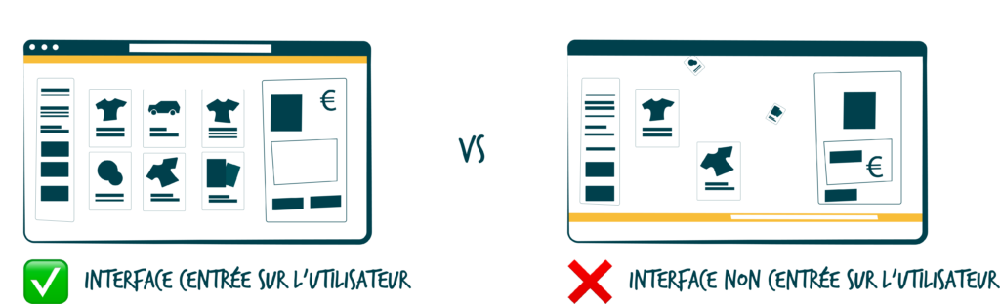
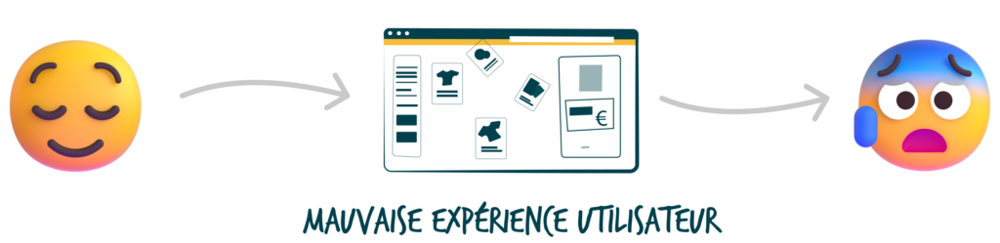
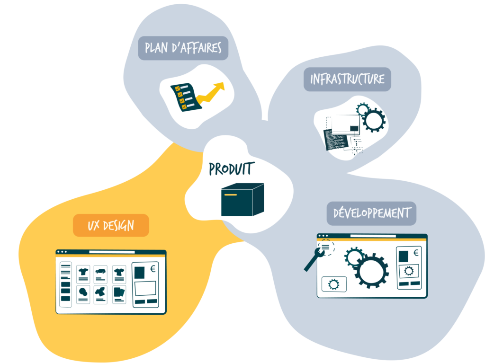

## Comprendre le contexte

Dans le monde numérique d'aujourd'hui, le succès d'une application mobile/web dépend non seulement de son apparence, de ses fonctionnalités, mais aussi de la **qualité de l'expérience utilisateur**. Une expérience utilisateur fluide et intuitive est décisive pour **attirer** les utilisateurs, les **fidéliser** et en fin de compte, assurer un **succès commercial**.

## Clarifions les enjeux

Contrairement à la conception graphique, la conception de l'UX design **ne** **peut pas** être une réflexion après coup, ou une couche esthétique ajoutée une fois le projet terminé. Un projet réussi va au-delà de ses fonctionnalités - **il nécessite des [user flow (flux utilisateurs)](https://www.bearstudio.fr/blog/design-css/parcours-utilisateur-ux) bien pensés** dès le départ.

## "La forme suit la fonction" - Comment appliquer cela de nos jours au design d’interface ?

Il est aujourd’hui acté qu'un **design** devrait être principalement **pensé** par rapport à son **objectif ou sa fonction prévue.** Ce principe a démontré son efficacité depuis le XIXe siècle. L'architecte [Louis Sullivan](https://fr.wikipedia.org/wiki/Louis_Sullivan), une figure influente de l'architecture moderne, a énoncé l'une des phrases les plus emblématiques de l'histoire du design : **« La forme suit la fonction »**.

Dans le contexte de la conception UX (Expérience Utilisateur) pour les applications, ce principe souligne que la conception de **l'interface utilisateur** (forme) doit être guidée par les **tâches et la fonctionnalité** prévues par l'application (fonction).

On peut résumer en disant que les **principes** de la conception UX soulignent l'importance **d'aligner design et fonctionnalité** pour créer une expérience utilisateur optimale.

##### Une conception centrée sur l’utilisateur

Le design de l'application doit être **intuitif** et **user-friendly**. Cela garantit que les utilisateurs peuvent comprendre et interagir facilement avec l'interface pour **accomplir leurs tâches** de manière efficace.

##### L’alignement des tâches

Les éléments de design (**boutons**, **menus**, **navigation**...) doivent être alignés sur les **tâches** et les **objectifs** des utilisateurs. Ils doivent être organisés et présentés de manière à suivre le **flux ou parcours** naturel de l'utilisateur afin d'aider à atteindre leurs objectifs **sans complexité inutile.**

##### La clarté et la simplicité

Le design visuel ne devrait **pas** prendre le pas sur la fonctionnalité. Garder un design simple et clair aide les utilisateurs à **se concentrer** sur les éléments essentiels et les actions nécessaires pour **accomplir leurs tâches**. Une ornementation ou complexité inutiles peuvent **entraver** l'expérience utilisateur.

##### La cohérence

La cohérence dans les éléments de design et les patterns présents à travers l'application améliore la compréhension des utilisateurs et **réduit la charge cognitive.** Ainsi, les utilisateurs devraient être en mesure de prévoir le comportement de certaines fonctionnalités ou interactions en se basant sur leurs **expériences antérieures** au sein de l'application.

##### Un design responsive

Le design devrait **s'adapter** à différents appareils et tailles d'écran sans compromettre les fonctionnalités. Un **design responsive** garantit que les utilisateurs puissent interagir avec l'application quel que soit le dispositif qu'ils utilisent.

##### L’accessibilité

Le design devrait prendre en compte les **principes d'accessibilité**, et ce, afin de garantir que tous les utilisateurs, y compris ceux ayant des handicaps, puissent utiliser l'application de manière efficace. Cela confirme l'aspect fonctionnel de rendre l'application utilisable à un **public diversifié**.

## “Pourquoi cela m'intéresserait en tant qu'entrepreneur ?”

Eh bien, cela peut se résumer par "utilisateur satisfait = **entreprise prospère".** Mais creusons un peu plus le sujet.

Voici quelques raisons clé pour lesquelles un mauvais design UX ou l'absence de design UX peuvent avoir une influence négative sur une entreprise :

##### Satisfaction client à la baisse

Les utilisateurs s'attendent à ce que les sites web, les applications ou les produits utilisés soient intuitifs, faciles à naviguer et réactifs. Une mauvaise UX entraîne donc de la **frustration** et du **mécontentement de la part des utilisateurs.**

##### Taux de rebond élevé

Les utilisateurs qui ont **du mal à navigue**r, à comprendre un site web ou une application sont plus susceptibles de **partir** sans accomplir leurs actions prévues. Cela entraîne des **taux de rebond** plus élevés, impactant les taux de conversion et les revenus.

##### Faible fidélisation client

Les utilisateurs ayant une expérience négative sont **moins susceptibles de revenir** sur un site web. Une mauvaise UX peut **réduire** la fidélité client.

##### Mauvaise réputation

Les utilisateurs mécontents sont plus enclins à **partager leurs mauvaises expériences**, que ce soit de bouche à oreille ou par le biais d'avis en ligne ce qui peut conduire, à terme, à une **mauvaise réputation**.

##### Impact sur les taux de conversions

Une interface utilisateur **confuse ou compliquée** peut entraver l'entonnoir de conversion. Les utilisateurs peuvent **abandonner** des paniers d'achat, ne pas remplir de formulaires ou éviter de faire des transactions en ligne, ce qui **affecte** les résultats financiers de l'entreprise.

##### Désavantage concurrentiel

Dans le **marché concurrentiel** d'aujourd'hui, les utilisateurs ont l'embarras du choix. Une mauvaise UX peut conduire les utilisateurs à aller chez les concurrents, qui offrent une expérience plus fluide et user-friendly.

##### Augmentation des coûts de support client

Les utilisateurs rencontrant des difficultés sont plus susceptibles de solliciter le support client, **augmentant la charge de travail** pour l'équipe de support. Cela peut entraîner des **coûts de support plus élevés**.

##### Perte de confiance

Une expérience utilisateur frustrante ou déroutante peut **entacher la confiance en une marque**. Les utilisateurs peuvent remettre en question la fiabilité et la crédibilité d'une entreprise s'ils rencontrent **des difficultés** dans l'utilisation de ses produits ou services.

##### Préoccupations en matière d’accessibilité

Ignorer les principes d'accessibilité peut **exclure une partie de la population** ayant des handicaps. Cela limite non seulement la base de clients potentiels, mais peut également entraîner des **problèmes juridiques** dans certaines juridictions. Notamment en France, où la conformité en matière d'accessibilité est requise.

## Conclusion

Tout comme les ingénieurs civils veillent à ce qu'un bâtiment puisse résister à la gravité, les architectes adaptent la maison pour répondre aux besoins du propriétaire. De manière similaire, dans notre scénario actuel, tandis que les **développeurs** offrent un **support** **technique** et veillent à ce que l'application **fonctionne** **sans** **faille**, les **concepteurs** **UX** jouent le rôle **d'architectes** **des** **applications**. Leur rôle est de s'assurer que l**es utilisateurs interagissent facilement avec l'application et atteignent leurs objectifs sans effort.**

Si vous souhaitez créer un produit adapté aux **besoins** et aux **demandes** de vos utilisateurs, BearStudio propose des [services d’UX Design](https://www.bearstudio.fr/prestations/ux-design) pour **améliorer l'expérience utilisateur** de votre produit.

**Négliger l'UX** peut sembler économique, mais cela entraîne des **dépenses supplémentaires à long terme**. Corriger ultérieurement l'une des problématiques mentionnées ci-dessus nécessite un **développement supplémentaire, du temps et des ressources**. Cela a pour conséquence d’augmenter les coûts de manière significative. **Investir dans une bonne expérience utilisateur** dès le départ **permet d'économiser de l'argent** en évitant ces dépenses futures.

Pour avoir une perception **mature** d'un produit, il doit être compris comme un **organisme systémique** qui, pour fonctionner au mieux, ne peut manquer d'aucun composant, parmi lesquels le design UX.

Toutefois, si votre produit est déjà développé et **manque de logique** UX, nous proposons un [audit UX](https://www.bearstudio.fr/prestations/ux-design/audit-ux) de votre projet. Vous pourrez ainsi connaître ses **points faibles** ainsi que nos recommandations d’action pour **l’optimiser** !

