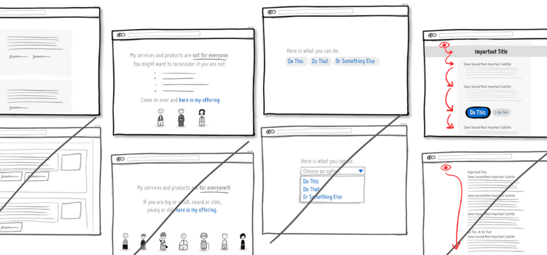

Vous ne le savez peut-être pas mais au BearStudio, nous vous proposons des **mini audits UX gratuitement** pour votre plateforme web ou votre application mobile. 

## En quoi consiste un mini audit UX ?

Vous avez une application web ou mobile, un produit déjà développé, un POC (Preuve de concept en français), un prototype ? Nous faisons intervenir un de nos experts pour qu’il réalise un **mini audit UX de votre produit**, et ce gratuitement ! L’audit nous permettra d’analyser votre projet et de **mettre en exergue les incohérences** qui peuvent pâtir à l’expérience utilisateur et donc à votre taux d’utilisation. 

## De quoi avons-nous besoin ?

Pour réaliser ce mini audit UX, l’équipe BearStudio a besoin d’un accès à une plateforme de tests ou de démonstration. Nous planifions également un brief rapide ensemble pour la présentation de votre projet à un UX Designer.

## C’est gratuit donc où est l'arnaque ?

On a l'habitude de se dire que ce qui est gratuit n'est pas forcément qualitatif ou que côté entreprise, c'est du temps-homme jété par les fenêtres... Rassurez-vous ce n'est pas le cas au BearStudio !

Il est certain que si nous avions 150 demandes d’audit par jour, nous ne pourrions pas les traiter ! Nous nous gardons le droit de refuser et avons une **limite de 2 mini audits UX maximum par semaine**. On ne va pas vous mentir, nous faisons ça dans un but commercial afin de générer des leads puis **vendre des** **prestation**s. L’idée étant de prouver que nous sommes compétents et que nous savons de quoi nous parlons. 

Ensuite, il y a un intérêt formateur en interne : un UX designer travaille généralement sur plusieurs produits en parallèle mais son travail demande une veille constante sur les bonnes pratiques et les [règles d’ergonomie](/blog/posts/la-loi-de-proximite). Du coup, travailler sur des cas concrets lui permet d’**acquérir de l’expérience**. Surtout que les développeurs ont un don pour inventer des patterns ou des design WTF, avoir de bons exemples de choses à ne pas faire est très formateur pour expliquer les bonnes pratiques.

<figure>

<figcaption>

_Ce qu'il faut retenir et ce qu'il ne faut pas_

</figcaption>

</figure>

## Combien de temps pour un mini audit UX ?

Nous faisons en sorte que nos UI/UX designer passent 1h à 2h maximum sur la réalisation de l’audit. En terme de délais de réalisation, cela va dépendre des plannings de l’équipe. Et comme le mini audit UX est gratuit, nous donnons au **maximum 2 semaines pour le réaliser**, à partir du moment où nous vous avons indiqué que nous pouvions le faire pour vous. 

## A quoi ressemble le livrable ?

Enfin, une fois l’audit terminé, nous vous envoyons des **slides en PDF avec les points positifs ou négatifs** que nous avons relevé, ainsi que des explications pour mettre en avant ce qui ne va pas. Généralement, nous faisons une visioconférence avec vous pour présenter et expliquer les résultats.

## Après le mini audit, quelle est la prochaine étape ?

Autant prévenir, la prochaine étape ne sera pas gratuite 😉

Il y a [plusieurs possibilités](https://www.bearstudio.fr/prestations) qui dépendent un peu du contexte :

1. Un audit plus poussé avec des préconisations
2. Une prestation de réalisation de [wireframes](https://www.bearstudio.fr/prestations/ux-design/wireframes) ou [maquettes](https://www.bearstudio.fr/prestations/ux-design/maquettes) 
3. Une prestation de réalisation de styleguide ou storybook
4. Une formation de vos développeurs sur les bonnes pratiques en ergonomie

## Comment faire pour bénéficier d’un mini audit UX ?

- Nous suivre sur au minima 2 de nos réseaux sociaux ([Twitter](https://twitter.com/_BearStudio) ou [LinkedIn](https://www.linkedin.com/company/bearstudio/) par exemple).
- Faire une demande via le [formulaire de contact](https://www.bearstudio.fr/contact).
- Optionnel : si vous êtes contents, nous recommander à votre réseau.😉

---

PS : N’hésitez pas à nous interpeller pour des produits que vous utilisez et qui auraient vraiment besoin de nos services #troll. (Par contre les institutions ou les trucs publics ce n’est pas la peine de penser à nous, nous ne voulons pas nous faire chier avec les appels d’offres pipeautés 😜 )
