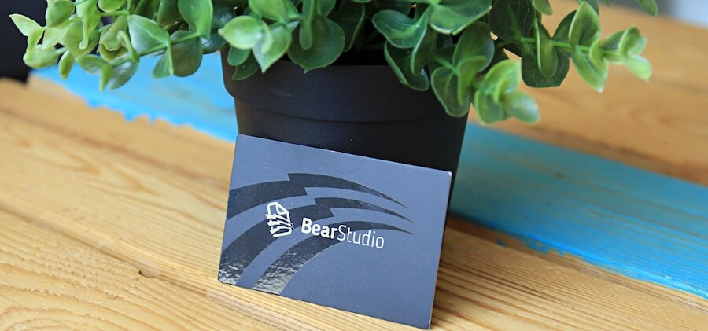
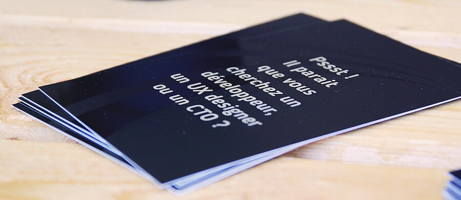

Un jour, je me suis dit que ça pourrait être cool de faire un petit article de **retour d’expérience sur l’entrepreneuriat en tant que développeur**. J’ai donc commencé à écrire un article retour d’expérience après 1 an d'entrepreneuriat… Je n’ai jamais eu le temps de le finir et j’ai perdu la première version… Du coup voici la version 4.0 !

## Pourquoi j’ai monté ma boite ?

Rien d’extraordinaire, j’ai commencé ma carrière en tant que **développeur Java dans une ESN** (SSII à l’époque), ensuite j’ai eu l’opportunité d’entrer dans une startup appelée **SmartPanda Network**. Je suis passé de développeur à CTO : le produit ne trouve pas son marché, trop de cash dépensé, du coup l’équipe technique passe de 5 à 1. Je monte alors une nouvelle équipe moins coûteuse et plus efficace. Quelques années plus tard, l’entreprise reçoit une proposition de rachat par **Docaposte**. C’est cool, mais par contre je suis de plus en plus en désaccord sur le [management](https://www.bearstudio.fr/blog/actualites-web-numerique/9-trucs-abstraction-quand-on-manage) avec mon CEO.

2 choix s’offrent à moi : 

- continuer à être en mode grincheux, me plaindre et dire que ce n’est pas comme ça que l’on fait, mais ne rien faire pour que ça change réellement,
- ou partir et monter ma boite pour prouver que l’on peut faire les choses comme je le pense !

Ouai, en gros, je suis parti à cause d’un problème d’égo 😜  
Mais bon, je me suis dit que dans la foulée, j’allais essayer de créer la boite dans laquelle **j’aurai rêvé de travailler** en commençant ma carrière. 😉

---

## Année 0 d'entrepreneuriat

**Effectifs :** 

- 0 salarié
- 1 prestataire (moi)
- 0 actionnaire

Dans la mesure où ce que j’allais proposer était du service, je me suis dit que le plus simple serait de créer l’entreprise UNE FOIS que j’aurais des clients à facturer. J’ai donc commencé en **freelance**. Ça m’a permis également de parler de mon projet et de chercher du monde pour me rejoindre dans l’aventure. Contrairement à d’autres secteurs d’activités, personne n’a essayé de me décourager ou de me dire que c’était une mauvaise idée. En revanche, j’ai eu quelques personnes enthousiastes qui souhaitaient me rejoindre mais n’étaient jamais disponibles au moment où il fallait faire des choses… Du coup, j’ai fait sans eux 😉 J’ai quand même réussi à trouver 7 personnes pour suivre. Une partie en conseil et une autre en production.

Pour l’anecdote, je leur ai dit : “_Donnez moi votre argent pour être actionnaire, par contre vous ne le reverrez jamais._” Et ils ont dit OK.

Nous commençons à 3 freelances et 1 freelance présent un jour par semaine uniquement.

Nous trouvons nos premiers clients sans trop de problème.

---

## Année 1 d'entrepreneuriat

**Effectifs** : 

- 1 salarié (moi-même)
- 4 prestataires
- 7 actionnaires

Ça y est la boite est officiellement créée. Nous avons plusieurs clients et il faut **augmenter la capacité de production**… Le problème est que les développeurs sont hyper sollicités et les salaires trop élevés pour être compatibles avec notre typologie de client, surtout sur une boite qui cherche sa cible de client. Du coup, je me suis dit, plutôt que d'essayer de me battre avec toutes les autres boites pour avoir les seuls bons développeurs qui valent le coup… Je vais plutôt essayer de créer moi-même ces perles rares, à partir de zéro : “**les stagiaires**”.

Pas trop compliqué pour moi de trouver et surtout de motiver des stagiaires à venir chez nous :

> *“Vas-y viens bosser sur les dernières technologies dans une boite qui se monte en mode startup. J’en ai rien à foutre que tu sois stagiaire et moi Président de mon cul… si t’as un truc à dire tu le dis tant que le boulot est fait et que tu acceptes mes critiques assez bourrines “conseils”. Si tu es motivé c’est tout ce qui compte. Au pire, si ça te plait pas dans 6 mois, tu auras un super CV et je te trouverai moi-même du travail si on ne peut pas t’embaucher”.* 

Ils ont dit OK.

Ça avance tranquillement, par contre nous rencontrons nos premiers “clients” compliqués. Quand tu commences une **boite de développement**, tu trouves toujours des gens qui ont un projet et 0 budget (ou presque), mais qui paradoxalement sont les plus “exigeants” pour rester poli. Je me suis rendu compte qu’ils étaient **chronophages** et que les autres clients, qui eux ne se plaignent pas car ils nous font confiance, passent après eux. Ce n’est pas logique !

Nous leur avons donc fait une proposition :

> *“Voilà ce que l’on a produit, voilà ce que ça vaut selon nous. Soit vous payez et on continue sur des bases saines, soit on vous donne le code, vous ne payez rien puisque vous n’êtes pas satisfaits et on vous laisse trouver un autre prestataire. Bien entendu, pas de soucis pour briefer celui qui va reprendre, le but n’est pas de vous mettre dans la merde mais d’arrêter une relation de travail qui ne satisfait aucun des 2 partis.”* 

Ils ont choisi de partir.

Mis à part quelques petits soucis d’organisation avec un de mes associés, le reste se passe bien. Ma seule erreur c’est le choix du PUTAIN de comptable mais ça je ne le sais pas encore à ce moment là…

L’équipe tourne bien, j’ai entendu que certains entrepreneurs ne partent pas en vacances et ne se paient pas les premières années… Sauf que nous, nous faisons du service donc si je ne peux pas me payer ni partir en vacances c’est que ce n’est pas viable. Je me paye donc un salaire (du même niveau qu'à mon début de carrière mais un salaire décent quand même) et j’ai décidé de **tester la résilience de ma boite** en partant 1 mois en vacances en Asie.

En gros, j’ai dit à l’équipe _“Bon je pars, la boite elle tourne. Je reviens, la boite elle doit toujours tourner…”._ Bien sûr, j’étais joignable sur Slack pour répondre aux questions et débloquer les situations si besoin mais globalement c’était simplement rassurer des juniors qui voulaient bien faire et avaient besoin d’une “validation” sur des décisions qui leur semblaient risquées..

Nous clôturons notre **premier bilan comptable positif**.

---

## Année 2 d'entrepreneuriat : Ah merde

**Effectifs** : 

- 2 salariés 
- 3 prestataires
- 7 actionnaires

**Embauche de mon premier associé** (qui était jusqu’ici en freelance).  
Les vrais problèmes ont commencé :

Les problèmes d’organisation avec un de mes associés ont été plus compliqués, de mon côté j’avais besoin d’augmenter le niveau d’exigence et la vitesse de production donc j’ai mis plus de pression… Nous nous sommes rendus compte que c’était contre productif pour lui et qu’il valait mieux se séparer en bon terme plutôt que d’aller dans le mur.

Le vrai gros problème de l’année : à la base je pensais prendre des stagiaires, en voir un sortir du lot, l’embaucher puis recommencer l’année suivante et augmenter tranquillement… Malheureusement pour moi (ou pas) j’en ai eu 4 en même temps…

Dans une [société de service](/prestations), généralement, tu trouves les clients, de plus en plus de projets donc tu recrutes quand tu as besoin de capacité de production… Le problème c’est que généralement les bons profils sont déjà partis. C’est comme ça que des SSII (ESN je sais mais je suis vieux 😜) te font miroiter une embauche pendant des semaines sans forcément te le dire. Personnellement, ça me faisait chier de les voir partir. Clairement, ils avaient et ils incarnaient tout ce que je voulais faire, en tant que personne, avec le BearStudio. Nous avons donc pris une décision ensemble : ils commencent en **freelance** puis l’entreprise les embauche dans 6 mois environ et nous allons nous démerder pour trouver le business qui **permet d’alimenter tout le monde**. Ça n’a pas été simple mais nous avons réussi. 😉

**Nous avons doublé le chiffre d'affaires de l’année précédente.**

Par contre, malheureusement pour la profession, les clichés sur les experts comptables se sont révélés vrais pour moi… Beaucoup trop procéduriers (pour moi), avec une mentalité trop différente de la mienne… La séparation nous a coûté financièrement, mais **vaut mieux payer que rester coincé avec un comptable au mauvais “mindset”**.

Il y a de plus en plus d’administratif, j’ai de plus en plus de choses à gérer… Du coup, nous décidons de trouver quelqu’un sur l’administratif en freelance. Plutôt quelqu’un d'expérimenté qui saura où aller et pourra me débarrasser de ça. Par un concours de circonstances étranges, nous avons trouvé une junior de 23 ans...

---

## Année 3 d'entrepreneuriat : les recrutements

**Effectifs** : 

- 5 salariés 
- 0 prestataire
- 7 actionnaires 

Un de mes associés décide d'arrêter sa boite en fin d’année… De notre côté, nous avons besoin de quelqu’un pour **trouver du commerce** mais nous ne voulons pas d’un commercial “bullshit” qui vend de la viande. Lui, il a été entrepreneur, il est tech à la base… Du coup, nous le recrutons.

Les 6 mois de freelance sont terminés pour les anciens stagiaires, nous les recrutons également. Dont au passage un étranger.

Notre assistante freelance a fini son CDD, du coup nous la recrutons également. Un bon profil junior en UX design passe dans le coin, du coup nous recrutons.

Le problème de tous ces recrutements, c’est qu’il faut faire le chiffre d’affaires qui va avec… Ça a été dur mais nous avons réussi.

Nous avons encore **doublé le chiffre d'affaires de l’année précédente**.

---

## Année 4 d'entrepreneuriat

**Effectifs** : 

- 10 [salariés](/team)
- 2 prestataires
- 7 actionnaires 

Il parait qu’il faut 3 ans pour stabiliser une boite, **mission accomplie** !

Ça ne veut pas dire que la bataille est gagnée. Nous restons vigilants mais nous savons qu’il est possible de **concilier business, travail de qualité et environnement de travail agréable**.

Et pour les besoins de mon égo : _lalala\*_, j’avais raison C’EST POSSIBLE !

_\*Le lalala dit avec un petit air chantonnant est une phrase visant à narguer son interlocuteur au BearStudio._

<figure>

<figcaption>

Image humoristique illustrant à la perfection le "lalala" pour narguer son interlocuteur.

</figcaption>

</figure>

---

Note de l'auteur : l’article sort avec un an de retard, j’aurai pu faire une version 5.0 mais je n’ai pas trop le temps !

Si vous voulez savoir comment ça se passe actuellement, suivez l’activité de [notre chaine youtube](https://www.youtube.com/channel/UC-2hpnhKgU2C_OFucjEN0IA). 🤓
