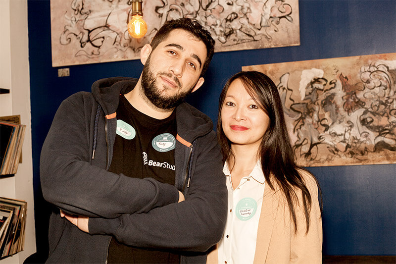
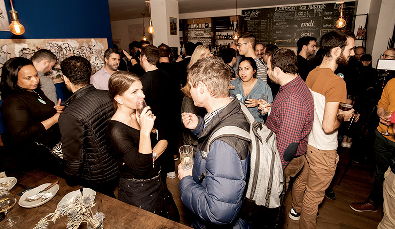
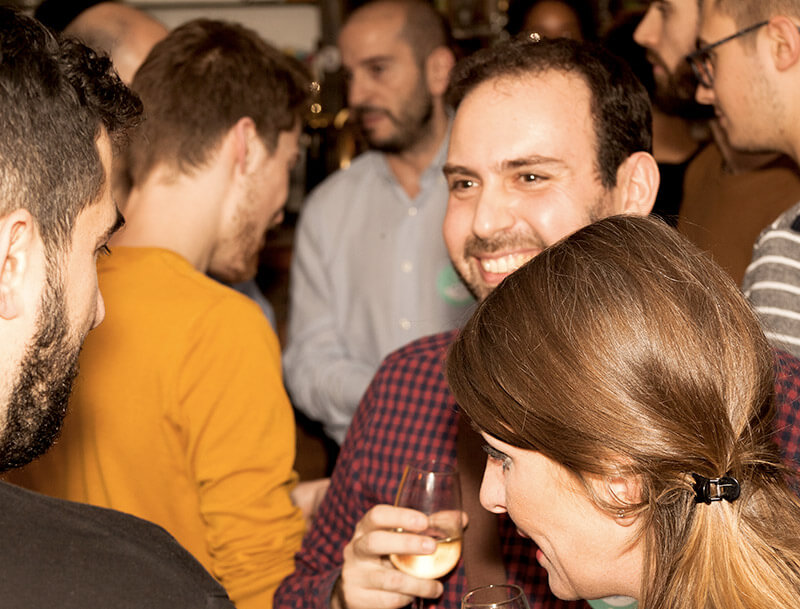

Le mardi 26 novembre 2019, au [Perlouse](http://perlousepigalle.fr/), s’est tenue la première édition de l’**afterwork** “[Startup, Lost In Tech](https://www.meetup.com/fr-FR/Startup-lost-in-tech/)”. Cet événement a été créé à l’initiative de deux entrepreneurs, Carène Tchong de [Twosday](https://twosday.app/), réseau de mise en relation professionnel et Rudy Baer du BearStudio.

<figure>

<figcaption>

Rudy Baer et Carène Tchong - Copyright Halimé Taboye

</figcaption>

</figure>

## Des **développeurs**, des **porteurs de projet** et un bon resto !

L’objectif de cet événement était d'organiser la rencontre entre les porteurs de projet et les développeurs. Le but n’était pas de promettre des CTO (Chief Technical Officer) aux porteurs de projet directement après l’afterwork mais de les aider à prendre conscience de la difficulté que peut représenter le développement d’un projet numérique. En effet, il est important de réfléchir aux ressources humaines nécessaires en interne, la capacité à gérer une équipe technique et les ressources financières dont la startup dispose.

Un profil CTO, dans le contexte actuel, représente un véritable [coût](https://www.tech.rocks/blog/quel-salaire-pour-les-cto-et-tech-leaders-en-france-en-2019) pour une entreprise ; c’est donc une décision à prendre de façon réfléchie. Les développeurs ont ainsi pu aider les porteurs de projet à y voir plus clair sur la partie technique de leur projet. 

Afin d'éviter certaines déconvenues ; perte de temps ou d’argent, les startupers doivent donc être plus avertis sur les enjeux techniques et financiers que représentent leur projet afin de faire le bon choix entre [agence digitale](https://www.bearstudio.fr/blog/entrepreneuriat/arretez-de-vous-faire-avoir-par-votre-agence-digitale), studio de développement et compétences internes. 

<figure>

<figcaption>

Afterwork entre CTO et Startupers - Copyright Halimé Taboye

</figcaption>

</figure>

Pour cet événement, les organisateurs ont choisi le restaurant [Perlouse](https://www.facebook.com/PerlousePigalle/), au 49 Rue de Douai à Paris. L’histoire de deux amis normands, l’un est ostréiculteur sur les côtes du Mont Saint Michel et l’autre restaurateur. C’est ainsi qu’Alexis nous a reçu avec de jolis plateaux d’huîtres et de saumon fumé durant toute la soirée. 

[Carène Tchong](https://www.linkedin.com/in/carene/) a répondu à quelques questions afin de nous expliquer d’où est parti le projet et ce qui ressort de cette première édition.

## De l’idée à la réalisation d’un tel événement, il n’y a qu’un pas !

### D'où te vient l’idée de mettre les gens en relation ?

_“Je le faisais déjà naturellement à titre professionnel comme personnel. Je me suis vite rendue compte que c'était une vraie appétence. Quitte à aimer ce que l'on fait, autant lancer une activité qui soit complètement liée à ce qui nous épanouit le plus,_ **_connecter_** _des personnes en vrai.”_

### Comment a commencé ta démarche avec Rudy ?

_“Nous étions inscrits sur des_ **_Meetup Entrepreneurs_** _et_ **_Développeurs_**_. Trois mois de suite le rendez-vous mensuel s'est annulé. Pour le dernier, Rudy avait déjà fait 1 heure de route avant que je lui annonce. De là, l'idée a germé. Je recherchais un_ **_développeur_**_, lui des_ **_porteurs de projet_**_. Je savais organiser des événements sur Paris alors pourquoi ne pas créer notre propre événement ensemble. Au moins on saura que rien ne sera annulé à la dernière minute.”_

<figure>

<figcaption>

Capucine Abrysch - Nathalie Granchon - Carène Tchong
Accueil des participants - Copyright Halimé Taboye

</figcaption>

</figure>

### Quel est l'objectif premier dans ce type d'événement ?

_“L'objectif numéro 1 est de créer une grande et belle_ **_communauté_**_. Plus il y aura de personnes aux profils diversifiés, plus chacun pourra y trouver son compte.”_

## Un afterwork réussi et des organisateurs en quête d’améliorations

### Quelle analyse fais-tu de cette première édition ?

_“Objectif plus que rempli avec 60 invités. Du monde, de la bienveillance et des retours positifs de la part des invités sur place. Il faudra veiller à trouver les deux profils pour chaque événement afin d'en préserver le concept.”_

<figure>

<figcaption>

Vue d'ensemble de l'événement - Copyright Halimé Taboye

</figcaption>

</figure>

En effet, cette première édition a permis aux participants de se présenter, pour certains sous forme de **pitch** et pour d’autres grâce à l’activité mise en place pendant la soirée. Ce franc succès, mis en images par [Halimé Taboye](https://www.linkedin.com/in/taboyehalim%C3%A9), fondatrice de [Born to Create](https://www.instagram.com/borntocreate_agency/), est donc un bon début pour les éditions prochaines.

### As-tu des idées pour la prochaine édition ?

_“Proposer une pitch session en bonne et due forme avec micro en demandant aux personnes de s'inscrire pour pouvoir pitcher (développeurs et startupers). Proposer davantage d'animations et intégrer les_ **_recommandations_** _des invités.”_

<figure>

<figcaption>

Bonne humeur et partage de connaissances - Copyright Halimé Taboye

</figcaption>

</figure>

Cet **afterwork** a donc donné l’élan à d’autres projets et d’autres formats d’**événements** qui seront organisés durant l’année 2020. Des conférences, des débats, du contenu en ligne sur les différentes plateformes d’échanges… L’objectif est de tisser un réel réseau de partage des connaissances et d’entraide. 

Vous pouvez également [nous contacter](https://www.bearstudio.fr/contact) pour plus de renseignements ou tout simplement pour parler de votre projet. Le [BearStudio](https://www.facebook.com/allyouneedisbear/) a ainsi été créé : pour répondre à vos questions !  

En attendant de fêter la nouvelle année et d’avoir le programme des réjouissances, nous vous invitons à vous inscrire aux groupes [Meetup](https://www.meetup.com/fr-FR/Startup-lost-in-tech/) et [Facebook](https://www.facebook.com/groups/521992361896607/) afin d’avoir toutes les informations nécessaires sur nos prochains **événements**.

### Auteur

Marlène Ziapkoff
