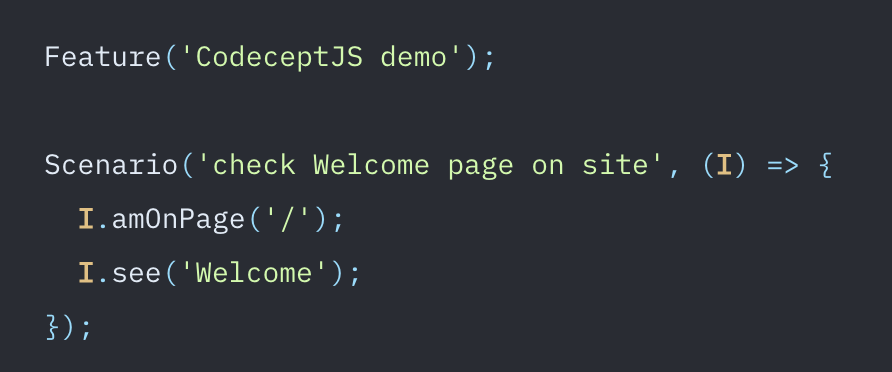

## **Qu’est-ce qu’un test end-to-end déjà ?**

Le système de test **end-to-end** est un principe de test utilisé pour vérifier si une application ou un morceau d’application se comporte comme prévu “de bout en bout”. Ces tests sont souvent détaillés en **scénarios de tests**, qui définissent le comportement de l’application et qui prévoit donc les différents clicks, remplissages de champs, pages sur lesquelles nous sommes redirigées etc…

Pour vérifier qu’une application possède le comportement attendu, des **tests manuels** sont possibles mais peuvent aussi être automatisés via certains outils.

## **La solution : CodeceptJS !**

[CodeceptJS](https://codecept.io/), c’est l’outil le plus simple qu’on ait trouvé pour mettre en place des tests end-to-end et il a plusieurs **avantages**. Il permet de créer des scénarios de tests très lisibles, de définir simplement ses règles, ses actions et de préciser simplement ce qu’on va voir, la page sur laquelle on est censé naviguer etc. Il va aussi permettre de lancer ses système de tests sur un vrai navigateur et faire le test devant vous. Vous serez alors capable de voir en temps réel vos tests s'exécuter (et c’est bien satisfaisant ! 🤩)

<figure>

<figcaption>

_Exemple de code de test via CodeceptJS_

</figcaption>

</figure>

Côté technique, CodeceptJS fonctionne avec plusieurs moteurs de test (c'est ce qui lance un navigateur et exécute les tests automatiquement...). Vous aurez donc le **choix entre plusieurs navigateurs** Web, Mobile ou API en fonction de ce que vous voulez tester ! À noter que bien sûr, CodeceptJS utilise Javascript, et fonctionne à 100% avec React, Vue ou Angular ! 😉

## **Et bien plus encore !** 

CodeceptJS propose encore d’autres features très intéressantes ! C’est un outil complet, avec une **documentation** détaillée et une **communauté** disponible en cas de besoin (GitHub, Slack, réseaux sociaux…). À noter aussi que CodeceptJS a lancé en beta une interface permettant de faire ces tests, qui s’appelle CodeceptUI. N’hésitez donc pas à suivre le projet et à tester cet outil qui peut-être, vous permettra d’éviter quelques bugs en prod sur [votre projet](https://www.bearstudio.fr/prestations) 😎

Cet article vous a plu ? Alors vous aimerez sans doute [celui-ci qui vous explique comment simplifier l'utilisation de React JS.](https://www.bearstudio.fr/blog/developpement/simplifier-ecriture-interface-utilisateur-react-js)
