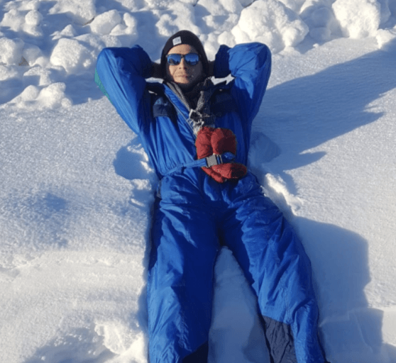
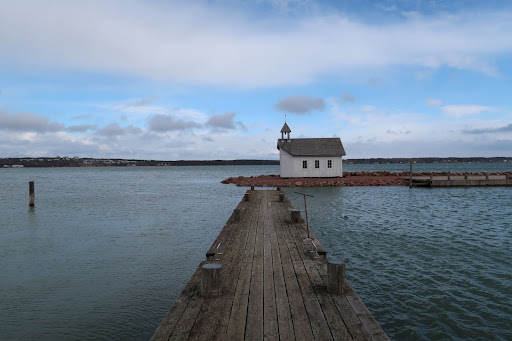

La parole est à Nathan : jeune recrue intrépide qui ne recule devant aucune frontière pour ouvrir les horizons de la tanière!

## Le pourquoi du comment

“Dans le cadre de mes études en école de commerce je devais effectuer un premier stage de 3 mois. Mes critères : ni dans la finance, ni pour des missions d’audit et idéalement sur Rouen. J’ai repéré l’annonce parfaite : un stage de 3 mois chez YOOME (startup foodtech) pour du marketing.

Mon stage s’étant très bien passé, j’ai directement intégré le BearStudio, partenaire de YOOME pour un stage de 6 mois. Le stage finissant en février alors que mon bail d'appartement, lui prenait fin - avant - en décembre. J’ai donc pensé au remote pour ne pas avoir à payer un appart pour deux mois (money money money)

Mieux que retourner chez mes parents, j’ai décidé de suivre ma copine qui partait en échange erasmus en Finlande. En résumé: faire du remote/nomadisme digital... en profitant de son erasmus à elle (win-win non ?) le temps de finir mon stage. 

FYI : Le distanciel n’étant pas une nouveauté pour l’[équipe du BearStudio](https://www.bearstudio.fr/team) qui [compte dans ses rangs des tunisiens](https://www.bearstudio.fr/blog/actualites-web-numerique/on-a-des-developpeurs-tunisiens) mais aussi un auvergnat (à vous de voir ce qui est le plus dépaysant).

Comme le BearStudio est une boîte ouverte où la confiance règne, j’ai pu m’arranger avec l’équipe en leur proposant d’essayer d’en profiter pour développer notre activité à l’international… Bref, mon aventure de 4 mois en Finlande pouvait enfin commencer !”

## La vie en Finlande

“A l’arrivée, il a fallu que je m’adapte aux différences entre la France et la Finlande, notamment au très léger décalage horaire. Je commençais et terminais ma journée 1 heure plus tard (pas non plus la mer à boire). 

Ce qu’il faut retenir, au delà des différences cuturelles et de style de vie, c’est que cette expérience était vraiment idéale. J’ai pu vivre avec les étudiants en Erasmus à Helsinki et j’ai donc pu découvrir la ville et la voir changer. Je l’ai vu quitter son manteau blanc (#poésie) pour laisser la place au soleil.

C’est là aussi qu’on se rend compte qu’une ville peut être très différente en fonction des températures. Je suis aussi allé en excursion en Laponie pendant 2 semaines avec un groupe d’une dizaine d’étudiants (et hop un peu de ski quand même ce serait dommage de se priver !).

À partir d'avril, j’ai multiplié les expériences de remote tout en faisant le tour des villes importantes, en passant 1 semaine à Turku, en explorant les Îles d’Aland (je travaillais dans le bateau en partant là-bas et de temps en temps sur place) pour finir par rester une semaine à Tampere : que des purs moments de bonheur à bouger et voir du pays!”

Je recommande l’expérience: pouvoir travailler dans des endroits paradisiaques et prendre quelques jours de vacances tout en étant avec une personne chère (#canard)

## Comment s’organiser quand on travaille à distance ?

À la fin de mon stage, en février, je suis passé en freelance. Ce qui m’a permis d’organiser librement mon emploi du temps, de partir en vacances quand je voulais sur les 4 mois passés en Finlande (j'ai même pris 1 mois de vacances!).

Comme je pensais aussi à l’équipe, je me suis organisé avec tout le monde pour prendre des vacances au bon moment. Toujours connecté sur slack avec au moins mon téléphone et même en vacances je restais disponible en cas d’urgence…

## Quels sont les avantages de télétravailler en voyageant ?

En étant dans une boîte qui te fait confiance, tu peux cumuler liberté et sécurité. Tu peux bouger partout, organiser ton temps libre comme tu veux.

Tu as l’occasion de découvrir une nouvelle culture et un nouveau climat (par exemple j’avais la neige et le froid mine de rien, ça suffit pour être dépaysé).

Ça permet aussi de casser la fameuse routine du métro-boulot-dodo et de la remplacer par boulot-temps libre-vacances. Tu peux être avec qui tu veux où tu veux, au lieu d’être chez toi ou au bureau. 

Là-bas mon quotidien c’était de visiter des endroits magnifiques et d'assister à des aurores boréales en Laponie...

J’ai eu aussi la chance de partir dans un pays où les cas de covid étaient bien plus faibles qu’en France. Donc la vie nocturne était normale (pas de couvre feu, bars ouverts…) ce qui a rendu l’expérience incroyable en cette période si particulière.

## Et les inconvénients ?

Le problème quand tu es loin de ton équipe c’est que les relations sont différentes. C’est “chiant” de ne pas pouvoir voir ses collègues et c’est beaucoup moins simple de tout demander par message. Tu es obligé de faire une visio pour un petit truc que tu aurais pu aborder à la pause dej ou en te retournant sur ta chaise. 

Au BearStudio il y a une très bonne ambiance et on aime bien troller. A distance ce n’est pas pareil, tu as l’impression de moins faire partie intégrante de l'équipe. Tu gardes le côté sérieux du boulot et tu perds de la fantaisie (bon on arrive quand même à passer des bons moments avec les soirées teambuilding par visio ou certains trolls dans slack). 

Je pense qu’il est important de bien connaître le mindset d’une boîte avant de partir en remote. On peut prendre un exemple : si tu prends un coup de pression en présentiel, tu peux t’apercevoir rapidement qu’il n’y a pas de rancoeur derrière. La personne va continuer de déconner avec toi, alors qu’en remote la conversation va s’arrêter là et tu resteras sur une mauvaise ambiance.

## Quels conseils donnerais-tu à quelqu’un qui voudrait partir travailler à l’étranger ?

Il faut vraiment avoir envie de voyager et ne pas avoir peur. Il ne faut pas hésiter à poser des questions idiotes et bien se renseigner avant de partir.

Imagine : tu arrives à Dubaï sans connaître le climat. Tu vas vite être choqué quand tu vas sortir sous 45 degrés. C’est pareil pour les autres différences qu’elles soient culturelles ou autre. 

Prépare toi à t’adapter à l’écosystème dans lequel tu vas atterrir. Soit prêt à faire des sacrifices, joue la team, n’aie pas peur d’être seul et surtout n’oublie pas ta boîte. Si tu peux faire tout ça, c’est grâce à elle, donc rends lui la pareille en te donnant pour elle. 

## Quels outils utilises-tu pour le remote ?

[Slack](https://slack.com/intl/fr-fr/), application de messagerie très pratique pour optimiser la communication au sein de l’entreprise. Ça permet de classer les conversations et ça intègre plusieurs outils bien utiles. 

[La suite Google](https://workspace.google.com/) qui inclut beaucoup d’outils très pratiques pour être connecté avec son équipe. Par exemple meet, c’est très simple d’utilisation, tu peux faire des partages d’écran en 1 clic etc.

Une connexion internet stable, je pense que c’est le plus important. Il vaut mieux ne pas lésiner sur le prix de sa box ou de son forfait. Sans une bonne connexion, le remote n’est pas possible.

Un bon casque/micro pour pouvoir taffer n’importe où en entendant bien et en étant bien audible. Pour le choix du pc le même principe s’applique. C’est important de choisir un pc avec un bon micro et une bonne caméra.

Un téléphone qui tient la route, le téléphone t’accompagne partout, et en cas d’urgence tu n’auras pas forcément ton pc. Il faut être capable de faire 80% de ce que tu fais sur ton pc avec ton portable pour être capable de régler un problème à tout moment (certes c’est moins pratique mais possible). 

Le mindset, tout le monde n’est pas capable de travailler de cette façon. Il faut être capable de se motiver tout seul, d’être efficace sans avoir quelqu’un derrière toi. Un mindset d’entrepreneur en soi.

## Une anecdote sur ton voyage ?

Avant d’arriver en Laponie je me suis éclaté sur du verglas, résultat : téléphone HS. C’était plutôt handicapant pour le travail. J’ai racheté un portable et quelques semaines plus tard, j’avais un call très important. Je me suis posé au bord d’un lac, et mon nouveau téléphone a glissé dans l’eau. J’ai dû allé le chercher dans un lac gelé en sachant que je ne devais pas manquer le call. Mais -heureusement- comme j’avais pris quelque chose de résistant, il fonctionnait toujours. 

## La suite ?

Aujourd’hui je suis rentré de Finlande, mais pas pour la France. Je suis actuellement à Dubaï pour une nouvelle aventure qui pourra être le sujet d’un prochain article.

Affaire à suivre…
