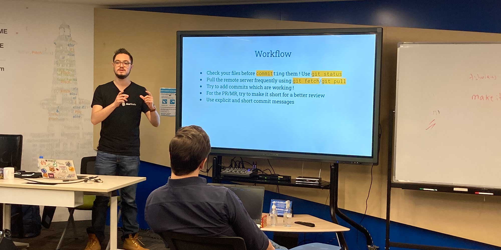

Introduction to Git. Learn the concepts and the commands of Git. This training is aimed at beginners and any kind of people willing to get more experience and learn about the principles of Git. This training is based on IT projects.

