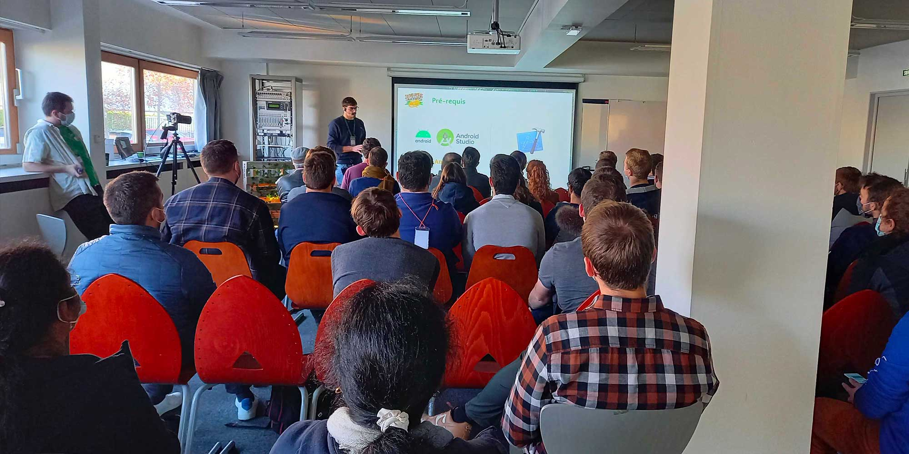

React s’est imposé depuis plusieurs années comme une référence dans le développement d’applications web dynamiques. Après le web, le projet Open-Source s’est étendu en 2015 au mobile avec React Native et avec pour objectif de simplifier le développement d’applications mobiles natives Android et iOS et de permettre aux développeurs d’avoir un unique projet fonctionnel sur les deux plateformes. Ce talk sera donc un retour d’expérience sur React Native et présentera tout ce qu’il faut connaitre pour démarrer un projet React Native :

