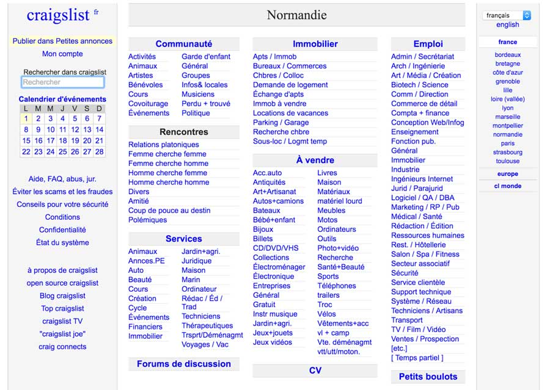

## Avant propos

_Cet article est illustré par des copies d’écran du nouveau site NWX lors de sa sortie, et ceci à la fois afin de disposer d'exemples pertinents (site tout neuf) et d'un point de vue neutre. En effet, il était initialement prévu pour cet article de paraître au sein du magazine SHOOT de NWX (mais la longueur de l’article ne le permettait pas), dont je suis moi-même membre du CA. Il ne faut donc y voir aucune charge vers tel ou tel site, l’objectif de l’article étant d’expliquer les erreurs classiques et surtout de donner à tous les outils pour analyser la qualité d’un site web._

## Digital ou numérique

Depuis quelques années, on parle beaucoup d’agence de communication digitale. Enfin... En réalité, nous parlons d’agences de communication classique (papier, télévision) qui entament leur transition numérique vers le monde de l’internet. Comme toutes les structures qui commencent leur transition, elles n’ont pas encore appris les codes de ce nouveau domaine (l’industrie numérique n'ayant que 25 ans). Ces agences vont vous facturer des sites certes jolis, mais qui oublient bien trop souvent les règles de base du monde du web. Or, en 2017, et avec la course aux meilleures places dans les résultats de recherche Google, cela ne pardonne plus.

> Pour être encore plus précis, ces agences françaises utilisent un terme anglais [“digital” qui se traduit correctement par numérique](/fr/blog/articles/digital-vs-numerique). Pour la blague, quand on parle des “métiers du digital”, un développeur va penser à une esthéticienne-manucure ou à un proctologue. Je vous laisse cette dernière image pour la prochaine fois que vous entendrez digital.

## Comic sans

Au début des années 2000, on demandait à son neveu de 14 ans de faire son site web. On était à l’époque de l’amateurisme. Le leader du web s’appelait Yahoo, on pouvait faire l’annuaire de l’ensemble des sites web à la main. Depuis, Google a repris le flambeau de grand manitou et le web a connu une croissance exponentielle.

On retrouve de moins en moins ce type de site web, sauf chez des petits artisans. Terminé les sites jaunes avec la police Comic sans MS1 & 2. Ce dernier cas était la blague récurrente au sein des communautés de développeurs web qui commençaient à se professionnaliser au travers de conférences d’experts comme Paris Web. Les années 2014 à 2016 sont aussi caractérisées par la blague du site Wordpress avec le thème Jupiter.

<figure>

<figcaption>

Bannière Anti-Comic Sans

</figcaption>

</figure>

## Wordpress

Ah… Les sites avec le thème Jupiter, l’intérêt est d’avoir un site esthétique avec peu d’efforts, cela a le goût d’un beau site web de la Silicon Valley, mais pas la saveur. Quand nous parlons de saveur, on parle pour un site web de contenir les caractéristiques nécessaires à un bon référencement, une bonne accessibilité et un bonne compatibilité sur les appareils mobiles.

<figure>

<figcaption>

Le thème Jupiter pour WordPress cela donne envie non?

</figcaption>

</figure>

La question n’est pas si Wordpress est mauvais ou non, la question est qu’il donne l’illusion que le travail s’arrête là.

Pour avoir un site moderne (c’est tout à fait possible), il faut juste travailler les 20% supplémentaires. En général, un site Wordpress + Jupiter va être mal optimisé et prendra plusieurs secondes (des dizaines ?) à être chargé, le coût de maintenance va être important (rien que pour changer une couleur) et il est mal adapté aux exigences mobiles actuelles.

Comme Drupal (son principal concurrent) Wordpress est un CMS (Content Management System), c'est à dire une plateforme permettant de déléguer la partie contenu à des personnes non-techniques. Il faut juste que la configuration de base ne soit pas faite par les stagiaires exploités par les agences digitales.

## La règle du plus gros salaire

Mais “Pourquoi tant de mauvais sites web produits ?” me demanderez-vous. C’est simple, dans le marketing et la communication classique, l’objectif est de plaire au plus gros salaire de la réunion pour remporter le budget de la campagne publicitaire. En anglais, le terme est “HIPPO” (Highest Paid Person Opinions)3. Sur votre moteur de recherche préféré, vous trouverez d'ailleurs beaucoup de méthodes sur comment gérer ce type de profil lors d’un projet.

Les pratiques de Google et du web ont commencé à changer ces modes de décision. Maintenant, avec les données issues des campagnes, on peut tester différentes configurations de site web et prioriser pratiquement en temps réel les campagnes publicitaires. Des agences comme Criteo ont même développé des sociétés entières sur un système d’enchères basées sur le coût de la publicité.

Le changement est important, on passe d’un monde avec des campagnes TV de plusieurs millions sur lesquelles le droit à l’erreur n'est pas permis, à un monde où un site moche peut battre à plate couture les plus grands (Leboncoin). C’est devenu même une manière de se différencier : des sites comme Reddit, Priceminister, Cdiscount jouent notamment sur cet axe4.

## Mesurer la qualité

La bonne nouvelle, c’est que maintenant vous pouvez mesurer la qualité d’un site web sur différents plans : performance, accessibilité, ergonomie et compatibilité mobile. Si vous couvrez bien ces quatre points, vous avez couvert 90% des critères techniques nécessaires à un bon référencement sur vos moteurs de recherche.

<figure>

<figcaption>

Craigslist : c’est moche et c’est 3 millions de visiteurs par jour

</figcaption>

</figure>

## La performance

Avec la fibre, l’ADSL et la 4G, la performance peut sembler secondaire. Erreur ! C’est une des premières sources de taux de rebond (personnes quittant le site sans action spécifique). Pire, sur les sites à gros volume, c’est une perte de visiteurs (50% au delà de 2 secondes) et de chiffre d’affaire (estimé à 7% par seconde de chargement)5conséquente et non négligeable.

Pour continuer, le taux de rebond et la performance sont 2 indicateurs clefs dans le calcul de votre placement sur Google. Pourquoi la performance ? Eh bien, analyser des sites lents a un coût pour Google et ralenti le rafraîchissement des résultats (Google est en compétition avec Twitter sur la recherche, les résultats doivent donc être le plus à jour possible).

Enfin, mettre de belles [images](/fr/blog/articles/optimiser-images-site-web) ou de belles vidéos, cela peut plaire au directeur marketing. Mais gardez à l'esprit que si cela met 4 secondes à charger, quasiment personne ne les verra.

Comment s’y retrouver ? Évaluer le site web réalisé par votre potentiel fournisseur ! Pour cela, voici 2 outils : [https://gtmetrix.com](https://gtmetrix.com/)et [https://testmysite.thinkwithgoogle.com](https://testmysite.thinkwithgoogle.com/).

Revenons à Wordpress et avec le thème Parallax (un autre thème beaucoup utilisé). [Si vous prenez la démo](https://themify.me/demo/themes/parallax/), les performances sont presque acceptables (hors le temps de chargement de 4 secondes) et comparables au thème Jupiter. Si vous prenez un site rapidement mis sur Parallax, les performances se dégradent fortement et deviennent juste inacceptables, surtout sur un mobile doté d'une connexion moyenne.

<figure>

<figcaption>

GTMetrix : Les performances du thème de démo de Parallax

</figcaption>

</figure>

<figure>

<figcaption>

GTMetrix : Ouch, l’intégration a été un peu trop rapide.

</figcaption>

</figure>

Attention, le diable est dans les détails, ne vous limitez pas à la page d’accueil ! Exemple avec le nouveau site de NWX utilisant le thème Jupiter de Wordpress, la page d’accueil a été travaillée, nous avons donc des performances acceptables. Mais si vous allez dans les autres pages du site, vous pourrez avoir des surprises, exemple, les fiches de membres.

<figure>

<figcaption>

Page d'accueil de nwx.fr avec thinkwithgoogle.com

</figcaption>

</figure>

Lorsque vous testez et réalisez un site web, vous êtes dans des conditions quasi optimales ! Mais testez-le avec ces outils afin de tester dans des conditions plus difficiles : votre téléphone dans une zone à deux barres en 3G par exemple.

<figure>

<figcaption>

Page d'un de nos membres avec thinkwithgoogle.com (certaines tombent à 23/100)

</figcaption>

</figure>

## Android, iPhone et tablettes

En parlant de conditions réelles, vous avez maintenant plus d’une chance sur deux6 que votre visiteur arrive via son mobile sur votre site (via un email, Twitter, Facebook ou une recherche sur Google). Votre site doit s’afficher de manière adaptée à votre smartphone, ce n’est plus une option.

Ce n’est pas chose facile, en effet, vous devez adapter votre contenu éditorial et le prioriser pour pouvoir l’adapter aux petits écrans. Vous devrez choisir ce que vous voulez mettre en avant et, comme “choisir c’est renoncer”7, la tâche ne sera effectivement pas facile.

Comment mesurer la qualité de votre fournisseur potentiel ? Toujours avec [https://testmysite.thinkwithgoogle.com/](https://testmysite.thinkwithgoogle.com/) et le livre blanc de Google/Answer Labs8.

<figure>

<figcaption>

Thinkwithgoogle zoome sur 2 indicateurs clefs pour mobile et pour ordinateur

</figcaption>

</figure>

## Ergonomie

Un site rapide et avec un bon contenu ne suffit malheureusement pas. Si l’internaute arrive rapidement sur une page, mais est dans l'incapacité de naviguer jusqu’au contenu souhaité, cela ne sert à rien.

Une bonne ergonomie est plus importante que le rendu esthétique. Cela ne veut pas dire que ce dernier est négligeable, mais seulement que son impact dans la réussite d’un site est moindre. Et surtout, qu’un beau site non utilisable le restera, surtout une fois l’effet “Wahou” des 2 premières secondes passé.

Faire rentrer un site classique au chausse-pied dans un écran mobile ne veut pas dire qu’il en deviendra utilisable pour autant. Comme on a pu le voir précédemment, le trafic web se fait autant sur mobile que sur ordinateur. Peut-être que l’**approche “Mobile First”**9 pourrait enfin devenir la norme dans les agences mais surtout pour vous ! Cette approche permet de partir de la réflexion sur un mobile pour ensuite enrichir l’expérience sur tablette, puis sur ordinateur. Ce n’est pas parce que vous ou votre patron aime voir le rendu sur ordinateur que ce doit être la première version pour les maquettes et l’élaboration de votre site.

<figure>

<figcaption>

Image tirée du blog de Stéphanie Walter10

</figcaption>

</figure>

Mais comment savoir si votre agence respecte bien les règles de base de l’ergonomie web ?

Dans un premier temps, vous pouvez regarder les conseils donnés sur **GoodUI.org**11 qui regroupe des dizaines de bonnes pratiques, et voir si votre site ou les maquettes proposées les respectent.

Mais surtout, **testez votre site sur différents appareils** ! Prenez votre smartphone et naviguez VRAIMENT sur votre site. En effet, si même vous qui connaissez votre site n’arrivez pas à naviguer confortablement, alors imaginez un internaute pour qui ce dernier est complètement inconnu !

Si vous voulez voir des exemples de problèmes d’ergonomie sur des sites ou applications, vous pouvez aller sur le blog de Charles Le Prévost : [http://uxui.fr](http://uxui.fr/)12

## Accessibilité

Enfin dernier point, l’accessibilité de votre site. Les personnes aveugles consulteront votre site avec un lecteur de site audio. Si celui-ci ne respecte pas les règles basiques de construction d’une page internet, cela peut rapidement devenir un cauchemar.

Vous me direz, en tant qu’entrepreneur capitaliste, je n’ai pas l’argent pour faire un site pour un pour mille de la population française13 ! Eh bien, détrompez-vous ! Pensez aux personnes mal voyantes, à vos grands-mères ou grands-oncles qui traînent sur Facebook, à votre collègue de plus de 50 ans qui a le maximum de zoom sur son iPhone...

Il y a des points très faciles, par exemple le niveau de contraste entre le texte et le fond (si on regarde le site dans une endroit très ensoleillé, comme au bord d’une piscine, vous aurez logiquement plus de mal à percevoir le texte). Pensez également aux vieux moniteurs. Pire, le texte pourra être complètement exclus si votre lecteur parcourt trop rapidement votre page. Les principales sources de ces problèmes sont l’ignorance de ces principes, et les maquettes Photoshop des graphistes qui vont jouer sur les niveaux de gris pour privilégier l’esthétisme à la lisibilité et au confort de lecture du contenu.

Pour mesurer cela, Opquast14 propose un test gratuit, Google fournit un Accessibility Developer Tools en extension à son navigateur et vous avez aussi à votre disposition [http://wave.webaim.org](http://wave.webaim.org/).

Pour en savoir plus sur le sujet, Elie Sloïm a donné une conférence en plénière à Codeurs en Seine le 24 novembre 2016. Elie Sloïm est un des meilleurs spécialistes français sur l’accessibilité.

<figure>

<figcaption>

L’extension google Accessibility Developer Tool

</figcaption>

</figure>

<figure>

<figcaption>

Codeurs en Seine avec Wave

</figcaption>

</figure>

## Ce n’est que le début

Pour conclure cet article, ne tombez pas dans le piège de rester sur votre budget initial de création de site. En effet, vous allez payer entre 2 000 € et 30 000 € pour la première parution de votre site. Vous pensez avoir terminé ? Et non ! Ce n’est que le début des festivités !

Vous aurez encore des choses à améliorer sur les différents points abordés dans ce document, et surtout, vous devrez faire vivre votre site. Avoir un contenu frais est une des variables prépondérantes à l’algorithme de Google. **Prévoyez dès maintenant votre budget pour faire vivre le site tout au long de votre activité !**

Vous pouvez même faire encore mieux : au lieu de vous enfermer dans un effet tunnel, vous pouvez **faire produire votre site web de manière itérative !** En terme de suivi comme en terme de diffusion, vous n’êtes pas obligé de livrer un site complet dès le premier jour. Livrez une première version pour ensuite compléter au fur et à mesure le contenu du site web. En bonus, vous en apprendrez beaucoup plus à propos du comportement de vos utilisateurs via Google Analytics.

Enfin, n’oubliez pas que même si vous faites faire votre site web, vous devez demander la **cession des droits d’auteurs du code constituant votre site ainsi que la cession à titre exclusif du droit d'exploitation des éléments graphiques** (logos, illustrations, maquettes)15. Demandez dans les livrables le code du site ainsi que les sources des images (un fichier photoshop - .psd - ou illustrator - .ai - ). Si c’est un CMS comme Wordpress ou Drupal, demandez les identifiants et mots de passe d’administration. Enfin, le nom de domaine doit être déclaré au nom de votre société : **ne laissez pas votre prestataire déclarer votre nom de domaine en son nom.**

Nous espérons que cet article vous aura aidé à y voir plus clair sur comment différencier un bon site web d’un mauvais site web et bien choisir votre prestataire ou évaluer le résultat de votre équipe technique au delà de la qualité des photos, des formulations et des choix de couleurs !

### Sources

- 1[http://www.etaletaculture.fr/geekeries/letonnante-histoire-du-comis-sans-ms/](http://www.etaletaculture.fr/geekeries/letonnante-histoire-du-comis-sans-ms/)
- 2[http://whatis.techtarget.com/definition/HiPPOs-highest-paid-persons-opinions](http://whatis.techtarget.com/definition/HiPPOs-highest-paid-persons-opinions)
- 3[http://www.presse-citron.net/10-sites-moches-qui-cartonnent/](http://www.presse-citron.net/10-sites-moches-qui-cartonnent/)
- 4[http://tribes.no/2013/10/28/how-website-speeds-affects-online-sales/](http://tribes.no/2013/10/28/how-website-speeds-affects-online-sales/)
- 5[http://searchengineland.com/half-of-google-search-is-mobile-232994](http://searchengineland.com/half-of-google-search-is-mobile-232994)
- 6[https://lescastcodeurs.com/2016/07/27/lcc-152-interview-sur-la-productivite-personnelle-avec-guillaume-lours/](https://lescastcodeurs.com/2016/07/27/lcc-152-interview-sur-la-productivite-personnelle-avec-guillaume-lours/)
- 7[http://static.googleusercontent.com/media/www.google.com/en//intl/ALL_ALL/think/multiscreen/pdf/multi-screen-moblie-whitepaper_research-studies.pdf](http://static.googleusercontent.com/media/www.google.com/en//intl/ALL_ALL/think/multiscreen/pdf/multi-screen-moblie-whitepaper_research-studies.pdf)
- 8[http://www.lukew.com/resources/mobile_first.asp](http://www.lukew.com/resources/mobile_first.asp)
- 9[https://blog.stephaniewalter.fr/en/freebies-responsive-retrofitting-vs-mobile-first-responsive-strategy-illustration/](https://blog.stephaniewalter.fr/en/freebies-responsive-retrofitting-vs-mobile-first-responsive-strategy-illustration/)
- 10[https://goodui.org/](https://goodui.org/)
- 11[http://uxui.fr/](http://uxui.fr/)
- 12[http://www.avh.asso.fr/fr/sante-des-yeux](http://www.avh.asso.fr/fr/sante-des-yeux)
- 13[https://reporting.opquast.com/fr/](https://reporting.opquast.com/fr/)
- 14[http://www.village-justice.com/articles/Developpement-contrat-droit-auteur,12450.html](http://www.village-justice.com/articles/Developpement-contrat-droit-auteur,12450.html)

Image : © Dr. House / Une création de Fox et NBC Universal

### Auteurs

Youen Chéné et Ivan Dalmet  
[https://twitter.com/youen_chene](https://twitter.com/youen_chene)  
[https://twitter.com/IvanDalmet](https://twitter.com/IvanDalmet)
