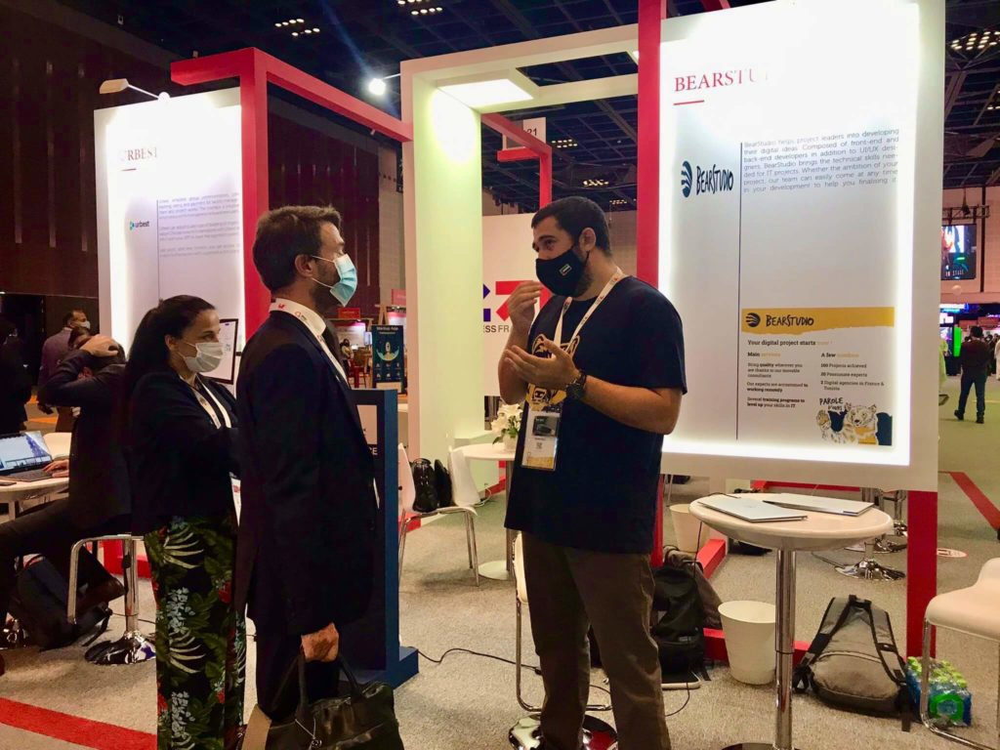

## Intro...

Le 22 octobre, notre CEO/CTO [Rudy Baer](/fr/equipe/rudy-baer) s'est rendu à Dubaï pour voir un client sur place. Après quelques échanges, il a eu vent d’**un événement autour de la tech : le salon [Gitex Future Stars](https://www.gitexfuturestars.com) !** L’ambiance cosmopolite était au rendez-vous, avec beaucoup de nationalités différentes. Ça faisait vraiment plaisir de peser l’attractivité de ce salon. Il n'en a pas fallu plus pour planifier la venue d’une partie de [l’équipe](/fr/equipe) à l'occasion de cet événement du 6 au 10 décembre 2020...

Pendant un mois, tout le monde au bureau était sur le pont ! Il fallait produire les contenus nécessaires en prévision du salon, tels que la plaquette commerciale ou encore la version anglaise de notre site web. De plus, comme cet événement n’était pas prévu initialement, nous avons dû “rusher” pour imaginer l'ensemble des supports de communication, les goodies, etc.

**Plus de 700 startups venues du monde entier** avaient fait le déplacement pour cette **40ème édition** ! Au programme : 4 jours de rencontres, d'expositions, de conférences… Autant d’opportunités de réseauter, et surtout _“let’s do business again”_ !

## Le contexte

En plus de rendre visite à un de nos clients, nous souhaitions tester le marché sur place afin de savoir si nous pouvions démarcher d’autres prospects. Le salon nous a fourni cette aubaine, les personnes présentes voulaient toutes reprendre les affaires. 

Notre stand était installé sous le **pavillon bleu-blanc-rouge**. Grâce à [Business France](https://www.businessfrance.fr), nous bénéficiions ainsi d'une place de choix aux côtés d'autres jeunes entreprises françaises en devenir.

Il faut savoir que le Gitex était le seul événement à regrouper autant de personnes en "physique" malgré la crise sanitaire. A ce propos, les mesures de sécurité étaient impressionnantes ! Des armées d’individus désinfectaient chaque centimètre carré du salon toutes les 10 secondes.

Pour nous, **le salon a été une réelle opportunité :** les exposants proposaient pour la grande majorité des produits numériques que nous pouvions développer. C'était donc assez plaisant d’aller à la rencontre d'autres entrepreneurs pour leur présenter l'aide qu'on pourrait leur apporter en fonction de leurs problématiques propres.

On sentait une certaine concurrence avec le trust indien qui propose les mêmes services que nous (sur le papier) pour un coût dérisoire. Mais ça ne nous a pas franchement embêtés. Les clients qui sont passés nous voir connaissaient bien le _“you get what you paid for”_. 

<figure>

<figcaption>

Rudy discutant avec l'ambassadeur de France devant notre stand

</figcaption>

</figure>

## Nos projets

Par la suite, nous avons (pas mal) réfléchi à ce que nous allions faire aux EAU dans un avenir proche. Nous avons prévu d'y retourner dès que la situation sanitaire nous le permettra, pour concrétiser certains potentiels contrats. Ensuite, nous aimerions **essayer de nous implanter sur place**. Pour ce faire, nous allons envoyer deux juniors à Dubaï pour une durée d’au moins un an. D'abord un développeur, Deelan, puis un commercial, Nathan. Dans le cadre d’un Volontariat International en Entreprise (VIE). 

**Ce pays est très ouvert à l’entrepreneuriat**, il y a beaucoup de personnes qui ont des idées de projet que nous pouvons réaliser ! C’est la définition de ce qu’on appelle _“\_l_and of opportunities”_ et nous comptons bien ne pas laisser passer notre chance 😉

## Témoignages

### Nathan

J’ai passé un très bon moment à Dubaï. Je suis d'autant plus reconnaissant envers le BearStudio car j'ai eu l’occasion de participer à cet event alors que je ne suis qu’un “stagiaire”. Ça a aussi été le début de la transition entre mon stage initialement intitulé "marketing/communication" vers des missions plus axées sur la partie commerce. Je me suis donné à fond pour parler à des gens et essayer de trouver des prospects. Et j’ai vraiment hâte de pouvoir en faire plus !

### [Claire](/fr/equipe/claire-jeanne)

J’ai eu l’opportunité d’aller à Dubaï deux fois durant l’année 2020. Mon rôle de support pendant ces voyages m’a permis d’apprendre à beaucoup mieux connaître mes collègues. Dubaï est une ville hypnotisante et contradictoire par certains de ses aspects, nous y avons passé de bonnes soirées ensemble et échangé avec d’autre français présents sur place.   
Notre présence sur le GITEX nous a permis d’éprouver **notre stratégie d’expansion à l’international** et de mieux connaître les travaux de nos collègues.

### [Nicolas](/fr/equipe/nicolas-torion)

Tout d'abord, Dubaï est une ville incroyable par sa démesure et c'est une destination incontournable pour le business à l'international. Ça a été un réel plaisir de pouvoir y aller avec le BearStudio. D'autant plus que j'ai vu le studio évoluer étape par étape, passant du réseau régional Normand à l'international.  
Le salon GITEX fut une expérience très enrichissante pour nous tous car cela nous a permis de découvrir le marché numérique à l'international et de **mettre en avant notre savoir-faire.**

### Philippe (Tic)

Dubaï était une super expérience ! J’ai été très surpris du voyage : la ville est immense et agréable, tout le monde est très respectueux et gentil. Le salon GITEX était une très bonne découverte, beaucoup de relations intéressantes et un aspect commerce qu’en tant que développeur je ne connaissais pas vraiment ! J’ai beaucoup appris sur ce sujet et je pense que cela sera bénéfique pour le BearStudio comme pour nous personnellement.

## Conclusion

Bien sûr, **nous comptons y retourner pour la prochaine [tech week](https://www.gitex.com/) :** du 17 au 21 octobre 2021. Mais rassurez-vous : nous tenons à rester fidèles à notre ligne de conduite et n'allons en aucun cas privilégier le business là-bas au détriment de celui en France 🇫🇷

D'autre part, ce genre de projet est extrêmement bon pour le **Team** **Building**. Eh oui, des voyages d'affaires de ce genre nouent des liens étroits entre les membres d’une bonne équipe ! Pour retrouver tous nos déplacements, je vous invite d'ailleurs à lire [cet article](/fr/blog/articles/traveledmap-outil-indispensable-pour-vos-photos-de-voyage).

**Auteur :** [Nathan Lesouef](https://www.linkedin.com/in/nathan-lesouef/)
