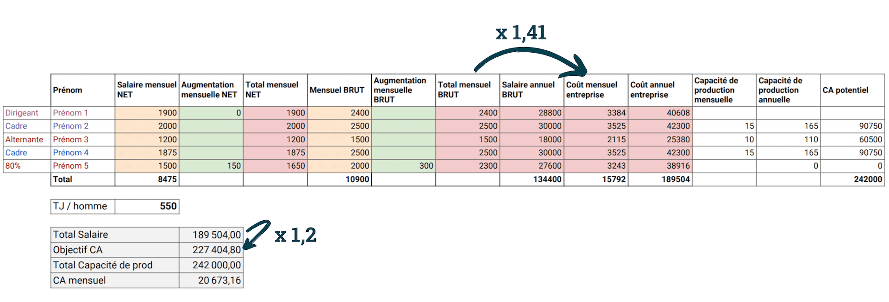
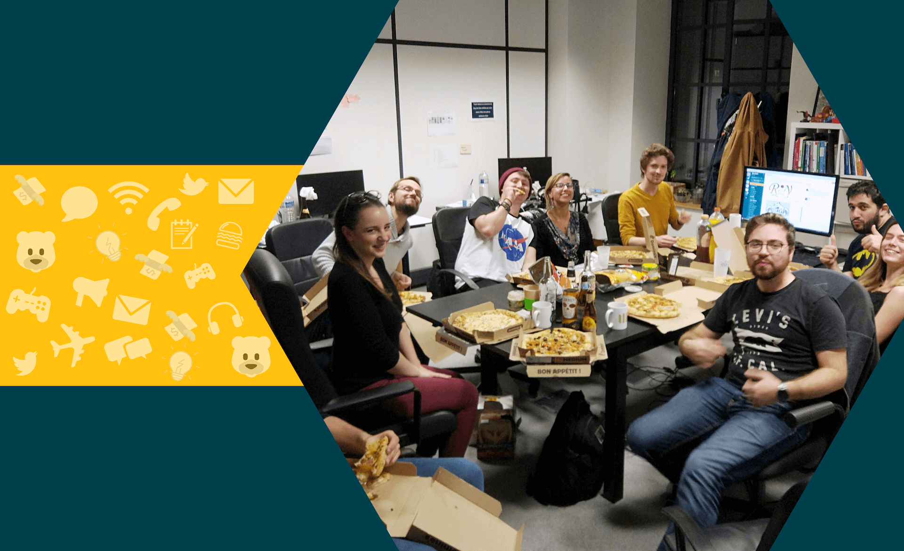

En 2018, pour la première fois, j'ai été réellement confronté à la problématique des augmentations au BearStudio.

## Le contexte de la première demande d’augmentation dans la société

Mon contexte : 

- 3ème année fiscale de la boîte.
- L'équipe s'est défoncée pour tenir les objectifs de chiffre d’affaires et de production ! Le **ratio est de x2** par rapport à l'année dernière (voir article [4 ans d'entrepreneuriat](/fr/blog/articles/rex-4-ans-entrepreneuriat-au-bearstudio)).
- Je me paie depuis le début, mais avec un salaire égal à quand j'ai commencé ma carrière il y a presque 10 ans et en tant que dirigeant, je ne cotise pas comme les autres salariés. Ce qui justifie en partie qu'un "patron" soit payé plus qu'un salarié, dans la limite du raisonnable et des possibilités de l'entreprise.
- Un des stagiaires que nous avons accueilli est vraiment bien intégré et l'équipe veut que nous l'embauchions.
- L'année a été intense. En terme de management, certains problèmes se sont révélés avec des membres de l'équipe. Mon ressenti et mon caractère rancunier m'inciteraient à ne pas augmenter ces derniers.
- Certains membres de la team sont trop gentils et n'oseraient même pas envisager demander une augmentation.
- Qui dit augmentation, dit **incidence sur les objectifs de chiffre d’affaires**.

Je dois donc prendre des décisions qui impactent toute l'équipe, sur lesquelles **je ne suis pas du tout impartial** et je suis persuadé de faire des erreurs. En discutant avec un des développeurs, je me suis rendu compte que ma rancune et mon ressenti sur le management ne tenaient pas compte de plein d'autres points et que l'équipe ne voyait pas du tout les choses de la même façon que moi.

Rien à foutre d'être CEO de la boîte, je n'avais franchement pas envie de porter la responsabilité d'une décision qui serait forcément une erreur… J'ai donc décidé de faire **porter la responsabilité à l'équipe entière** !

## Ma méthodologie pour les augmentations

Un vendredi soir, j'ai programmé une **réunion pizza** avec toute l'équipe pour décider des augmentations et de l'embauche éventuelle du stagiaire.

En amont, j'ai préparé un Google Sheet qui détaille les salaires de tout le monde _(oui je sais, ce n’est pas très RGPD tout ça…)_. Le salaire net, le salaire brut, le **coût pour l'entreprise** (qui n'est pas la même chose que le brut) : avec de simples formules et des ratios, le tout nous donne l'objectif de chiffre d’affaires en fonction des salaires.

L'idée est de pouvoir avoir en temps réel l'incidence des augmentations sur le chiffre d'affaires à réaliser. Car malheureusement dans la vraie vie d'une entreprise, si tu veux augmenter ton salaire à un moment, ça va forcément avoir une **incidence sur le chiffre d'affaires**.

Le brief pour la réunion était simple : chacun vient avec des doléances et des arguments puis nous faisons un tour de table où chacun s'exprime. Une fois toutes les demandes de chacun collectées, nous refaisons des tours de table pour savoir si tout le monde est d'accord. Y compris pour dire : _“Je suis pas d'accord moi je pense que "machin" devrait avoir une augmentation”_.  L’idée est que tout le monde arrive préparé avec de vrais arguments. Pour ce faire, je leur ai envoyé de la lecture et une fiche d'auto-évaluation du site [Outils du manager](https://www.outilsdumanager.com/).

Au final, la réunion s'est super bien passée. Nous avons décidé d'augmenter les membres qui sont là depuis le début et aussi d'**embaucher le stagiaire**. L'équipe a pris la décision et la responsabilité d'augmenter beaucoup plus que prévu les objectifs de chiffres d’affaires. 8 mois plus tard, ça semble toujours être la bonne décision.

Par contre, ils ont moins rigolé quand je leur ai dit à la fin de cette soirée : “_Je viens de faire un entretien avec une super recrue... Nous allons prendre la décision ensemble, mais il y a de grande chance que nous l'embauchions_ 😁”. Mais ça, c'est une autre histoire…

En 2019, il s’est avéré que **cette solution était la bonne**, puisque le chiffre d’affaires de la société a continué d’augmenter. Nous avons donc [renouvelé l’expérience](https://twitter.com/_BearStudio/status/1184732906176077824) de la réunion d’augmentation, et la nouvelle recrue est bien arrivée en février 2019 parmi les salariés. C’est d’ailleurs en partie de sa faute si la [stratégie de 2020 évolue](/fr/blog/articles/le-mot-du-chef-rudy-baer) vers de la communication.

