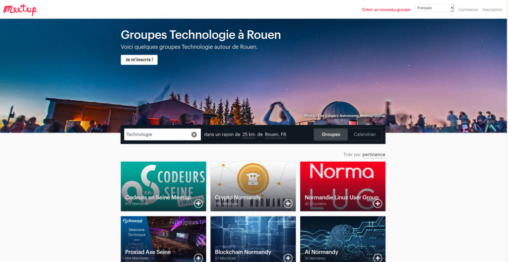

_Disclaimer : cet article a été écrit avant la crise du coronavirus_ 😷

Cela fait un moment que [Rudy](/fr/equipe/rudy-baer) voit passer des jeunes développeurs et des gens en reconversion qui galèrent à trouver des entreprises pour un stage ou une alternance. En général, il leur donne des conseils et il compte d’ailleurs continuer à le faire. Toutefois, nous allons essayer d’en synthétiser un maximum ici.

Mettons-nous en situation : Mohamed (j’utilise volontairement un prénom à consonance musulmane dans un autre contexte qu’une histoire péjorative sur BFM TV) est en reconversion professionnelle à Rouen. Il ne connaît personne qui travaille dans le milieu informatique ni dans celui des startups.

---

## Le CV

Je ne vais pas détailler le problème. Tous les gens de ma promo ont le même CV. Je vous invite à lire l’article [d’Arnaud Lemercier](https://codedesign.fr/candidature-manque-experience-alternance/) à ce sujet. Suivez donc ses conseils pour mettre en avant vos compétences ou vos expériences perso.

Quant au problème de s’appeler Mohamed et d’avoir moins de chance que Nicolas de trouver un travail je n'ai malheureusement pas de solution… Sachez que le numérique est encore relativement préservé de ce phénomène. Je ne connais pas les raisons exactes mais ça doit probablement être un mélange entre culture, mentalité bienveillante et partage, propre à l’Information Technology ( IT ) depuis le début du web (open source, conférence etc.). C'est peut-être également une réalité business due à la pénurie de développeurs sur le marché du travail.

Une fois qu’il a son CV et sa lettre de motivation, que doit faire Mohamed ?

En général, les écoles ont des listes d’entreprises à contacter. Elles invitent généralement les étudiants à aller à des salons. Parfois, elle font aussi venir des entreprises qui galèrent à recruter, à faire des présentations dans les écoles. Je ne vais pas m’étendre là-dessus.

Voyons d’autres pistes...

---

## Les intervenants extérieurs dans les écoles

Dans les formations, il y a deux types de prof. Les salariés de l’école ou du centre de formation et les intervenants extérieurs. Ce sont ces derniers qui vont nous intéresser.

En général, ils travaillent dans le privé. Même s’il n’ont pas tous le réflexe d’en parler lorsqu’ils se présentent (au BearStudio c'est le cas 😛 ), **leurs boîtes cherchent généralement des stagiaires ou des alternants.** N’hésitez pas à les solliciter ou à leur demander les coordonnées de la personne qui gère ça.

Vous pouvez également, juste à partir du nom de la boîte, essayer de trouver le contact.

---

## Les communautés chaudes de ta région

La plupart des villes de France ont une communauté IT plus ou moins active. Dans le cas de Mohamed, il y a au moins une fois par mois un [meetup Codeurs en seine](https://www.codeursenseine.com/meetups/) qui a lieu généralement à Seine Innopolis, en plus de la [grande messe annuelle de **Codeurs en seine**](/fr/blog/articles/codeurs-en-seine-2019-des-devs-de-lux-et-de-lagilite) au mois de novembre !

C’est un bon moyen de **rencontrer des gens en activité**, qui sont dans une démarche de partage et de bienveillance. Voir même pour certains, en galère pour recruter.

**Quelques tips :**

- N’hésitez pas à **engager la conversation** sur ce que vous venez de voir avant de demander : _"KIKOO TA BOITE CHERCHE DES STAGIAIRES ?!"_.
- Si vous voyez ou sentez que la personne en face n’a pas envie de vous parler, **ne faites pas le relou** à lui tenir la conversation pendant une heure.
- **Demandez des tuyaux**, genre : _"Je cherche un stage, t’aurais pas des tips ou des boîtes qui cherchent ?"_.
- Je n'ai pas d’avis sur le CV papier. Le CV en ligne est pratique à partager et ça permet de récupérer un contact.

### Comment trouver ces communautés ?

Demandez aux écoles, regardez sur les réseaux sociaux. Le site : [Meetup](https://www.meetup.com/fr-FR/) est un bon moyen de trouver également (perso je l’utilise pour trouver des communautés quand je suis à l’étranger).

Toutes ces communautés ont généralement au moins un **Twitter / Facebook / LinkedIn / Youtube et un site**. N’hésitez pas à suivre leurs réseaux et surtout à regarder les précédents posts pour trouver des pistes.

### Une piste assez simple : les sponsors !

Généralement, ces communautés sont gérées par des bénévoles et font appel à ce que l'on appelle des **sponsors** pour payer leurs frais. La contrepartie c’est de leur faire de la com à des fins de recrutement ou de mise en avant de leurs produits.

Donc vous vous débrouillez pour trouver cette liste de sponsors, qui se trouve généralement sur le site + sur les réseau + les orgas en parlent pendant les confs, voire même ils ont des stands aux évènements. Trouvez donc la liste des sponsors et contactez-les !

---

## Slack

Une tendance de ces dernières années, c’est la fédération de ces communautés autour d’un Slack.

Dans le cas de Mohamed à Rouen il y a le Slack de codeurs en seine ([En voici le lien](https://codeursenseine.slack.com/join/shared_invite/enQtNjQ3MDEyMzY3MjY0LTE1MWY0MGM1ODgwYzZlZjY4MDk1NzgyYWYxNzQ5NjU3YjZjYzQyY2U1YzlhZWRkNGEyMTUwYzZiMmMyMGY0OTg)).

En général l’un des premiers channel qui est créé est le #CV / #Jobs. L’idée est de permettre aux recruteurs de poster leurs offres et aux candidats de poster leur CV.

Ces Slacks vous permettent d’avoir **un contact plus humain** que le traditionnel formulaire de [candidature](/fr/contact/processus-candidature-bearstudio).

---

## Les façons atypiques de candidater

- **Tag ou MP quelqu’un sur Twitter.** Utilisez les réseaux sociaux de manière intelligente pour avoir un contact plus direct.
- **Les bars** (notamment à bière). Je n'ai pas essayé mais je suis prêt à parier qu'il y a forcément des développeurs dans les bars le vendredi soir. À Rouen par exemple, chez "Papa boit de la bière" [vous croiserez souvent des devs du BearStudio](<https://www.rouennormandyinvest.com/webtv/interview-guillaume-vassault-houlliere-ceo-yes-we-hack/)>)
- **Visez les CTO, les Lead dev ou les VP engineering etc.** En gros, les gens qui gèrent une équipe. Il y en a bien un qui doit se dire : "_Ah ouais, un stagiaire ou un alternant pourrait s'occuper de ça_.".

J'aurais tendance à vous inciter à éviter les RH. Surtout dans les grosses boîtes. Cependant je n'ai jamais travaillé ni eu affaire à eux. Je sais que dans certaines confs business et/ou IT les gens s'en plaignent.

---

## Les events business

Dans **toutes les villes** il y aussi des événements “digital” plutôt orientés business, startup, entrepreneur, souvent boycottés par les développeurs car trop de Bullshit. N’hésitez pas à y aller pour trouver des contacts.

Un conseil : si c’est un event “digital”, et non numérique, dites-vous que la plupart des gens n’y connaissent rien au dev, donc vous êtes forcement plus expert qu’eux. Ça vous donnera un peu de confiance en vous mais faites gaffe à ne pas tomber sur le dev obligé de venir à cause de son patron et passer pour un con :p

Dans le cas de Mohamed à Rouen il y a des events organisés par **NWX** par exemple, ou la **french tech Rouen**.

Il y a aussi des Slack business dans certaines villes. Malheureusement, à Rouen je crois que Slack est un peu trop "digital du futur". On n'a pas de communauté business... 😢

---

## Le feedback après un entretien

Demandez systématiquement un retour par mail après un entretien. Si vous sentez que vous n’avez pas été pris parce qu’ils ont choisi quelqu’un de meilleur (en gros si vous n’avez pas juste été un gros boulet), demandez s’ls connaissent des boîtes qui pourraient être intéressées par votre profil. Soyez sincère, genre : _« je galère à trouver, mais j’en ai vraiment envie blabla… »_.

---

Voila ! Si je devais troller je dirai qu’il faut juste **se sortir les doigts**… :p 

En vérité, je sais que c’est difficile de commencer quand on a aucun réseau. Cependant, il faut juste **essayer et faire pas mal d’efforts** au début. On trouve souvent par chance la première fois, et puis au fur et à mesure des rencontres ça se développe et l'on apprend.

Ma mère étant femme de ménage, mon père ouvrier en bâtiment, j’ai commencé sans réseau ni même un seul contact dans le secteur tertiaire. Je me souviens que j’osais à peine prendre le téléphone pour appeler et demander s’il prenait des stagiaires. Je passais une heure pour envoyer un mail de candidature. Par un heureux hasard j’ai trouvé un stage à la Région Normandie. J’ai fais du Java et une fois cette expérience sur mon CV c’était beaucoup plus simple… (en gros la première fois est toujours un peu stressante 😅 )

On a la chance d’être dans un secteur d’activité avec **beaucoup de demande.** Passé un certain stade, envoyer un profil LinkedIn suffit pour trouver un job ;).
