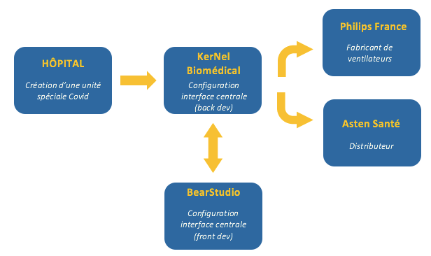

## Sur les traces d'un projet au coeur de l'actualité...

Nous sommes Nathan et Emma, étudiants en école de commerce, actuellement en stage au BearStudio. Voilà maintenant quelques semaines que nous avons intégré l'équipe ! Notre première mission : retracer le développement d’une interface de monitoring pour les patients atteints du Covid-19. En effet, aucun de nous deux n’est familier avec l’univers de la tech, d'où notre regard de néophytes.

D'abord, nous nous sommes immiscés dans les _“channels”_ de discussion instantanée [Slack](/fr/blog/articles/outils-incontournables-pour-un-entrepreneur) utilisés par l’entreprise pour suivre l’avancement des projets. Ensuite, nous avons pris le temps d’échanger avec les porteurs du projet du côté de **KerNel Biomedical**. De même, nous avons interrogé les développeurs du Bearstudio sur le coup : [Ivan](https://www.bearstudio.fr/team/ivan-dalmet) et [Philippe](https://www.bearstudio.fr/team/philippe-chevreul) (a.k.a Tic). Cela nous a permis d’avoir une vision globale et d’en apprendre davantage sur le processus de création. 

---

## A l’origine du projet

À la demande d’un hôpital de région parisienne en manque de ventilateurs de réanimation, **[KerNel Biomedical](https://kernelbiomedical.com)** s’est vu adresser une commande urgente. Pour faire simple, les services de réanimation leur ont demandé de développer un système électronique capable de centraliser les constantes vitales de plusieurs patients au même endroit. L’idée était donc de récupérer les données transmises par des respirateurs dans chaque chambre pour les retransmettre vers un PC central afin de faciliter le travail des soignants. De cette façon, le personnel médical pourra les analyser plus facilement et même déclencher des alertes en fonction de seuils préalablement paramétrés par le médecin. En plus de faciliter le suivi des malades atteints du Coronavirus, ce dispositif contribue également à améliorer les conditions de travail des infirmières en limitant les contacts non nécessaires avec les patients contagieux. 

Si la start-up a fait appel à notre cher studio de développement, c’est notamment parce qu’ils avaient déjà travaillé ensemble pour la mise au point de _[Dotter](https://dotter.science)_. C'est une plateforme en ligne permettant d’optimiser la gestion électronique des données de recherche clinique. Dans le cadre du projet _Monitoring Ventilation Covid_ (MOVECO), KerNel a donc fait confiance à l’expertise du Bearstudio dans le domaine de l'UX design pour les aider à créer une interface lisible et facile d’utilisation par le corps médical, en très peu de temps.

### Schéma processus **MOVECO**

## L'équipe

Quand [Rudy](https://www.bearstudio.fr/team/rudy-baer), le “chef” du **BearStudio**, a reçu l’appel d’Emeline fin mars, il a compris qu’il s’agissait d’un projet urgent. Avant même d’avoir signé le contrat, il réfléchissait à qui il pouvait confier la mission. Finalement, il a missionné Ivan ainsi que Tic, alors en train de finir son alternance. Pour la petite anecdote, cet épisode s’est déroulé quelques jours avant l’arrivée officielle d’Ivan dans les locaux du BearStudio, pour lequel il a longtemps opéré en tant qu'advisor UX (Consultant expérience utilisateur).

Le fait de placer un nombre très réduit de personnes sur la création de l’interface est un choix stratégique : pour être efficace dans ce domaine, il faut à tout prix éviter de se marcher dessus. D’ailleurs, un duo parvient souvent à fournir des résultats étonnants. Et le partenariat junior/expérimenté est une combinaison qui fonctionne très bien ; d’autant que nos 2 acolytes avaient l’habitude de travailler ensemble. En ce qui concerne la répartition des tâches, Ivan s’est davantage positionné sur la partie exploitation des données, tandis que Tic s’est chargé de la mise en forme des graphiques. 

Malgré l’atmosphère un peu tendue et les exigences liées à ce projet, Tic s’est senti vraiment fier d'en faire partie. De son côté, la vaste expérience d’Ivan en tant qu’UX designer est un atout dans ce genre de projet. 

L’équipe était aussi composée d’Emeline et d’Adrien, deux chercheurs de chez KerNel. Davantage tournés vers la recherche médicale, ils ont bossé main dans la main avec leurs homologues du BearStudio, restant disponibles pour répondre à la moindre question à propos des “features”. 

> _**“Dans ce genre de rush, il n’y a pas de place pour le doute, l’important c’est d’être en communication permanente avec le client”**_
>
> Ivan, UX designer au BS

## Le rush : atouts et défauts

### Comment se manifeste le rush?

Ivan a un point de vue intéressant : il trouve très formateur de travailler dans le rush. Pour lui, il est tout à fait possible de combiner des projets dans le "rush", et d’autres qui prennent plus de temps. Lorsqu'on est moins pressé, il est possible d’explorer plusieurs options en jonglant avec différents codes pour trouver le plus efficace. Dans les périodes de rush, toute cette expérience acquise s’avère très utile pour aller à l’essentiel. Il n’est alors pas question de passer du temps sur un codage “intelligent & joli” : le plus efficace fera amplement l’affaire. 

C’est là que Rudy nous a parlé de “quick & dirty” : il s’agit de travailler au brouillon pour avoir une idée approximative du résultat final. Pour coder rapidement, ils ont utilisé _[Chakra UI](https://chakra-ui.com)_, une bibliothèque de code avec beaucoup de composants prêts à l’emploi, qui leur a permis d’aboutir à un écran fonctionnel dès le premier jour. Le lendemain, ils se sont lancés dans du “refactoring”, un processus qui consiste à changer le système d’un logiciel de façon à ce que cela n’altère pas le comportement externe du code, mais améliore sa structure interne. Le but n’était bien sûr pas d’aller trop vite en faisant du “buggy”, dans le jargon cela signifie rempli de bugs. Par la suite, ils ont opté pour du “quick & dumb”, qui consiste à faire simple, minimisant ainsi les bugs. L’objectif étant toujours de tirer un maximum de valeur, même dans un délai très court.

### Les particularités de ce projet

Même s’ils avaient déjà été amenés à travailler pour le domaine médical, les circonstances actuelles ont rendu leur tâche encore plus importante puisqu'il s'agissait d'aider, indirectement, à sauver des vies. En témoigne le dévouement de l’équipe, loin de rechigner à l'idée de travailler tard le soir ou le week-end.

> **_"L_**_e BearStudio a été très réactif, ils ont été supers, donnant des updates jusqu’à tard le soir”_
>
> Emeline, co-fondatrice de KerNel Biomedical

Nous avons demandé à l’équipe s’ils avaient l’habitude de travailler dans ces conditions. Selon Rudy, c’est un peu le propre du métier de devoir se surpasser au BearStudio. Dans ce genre de configuration, précise-t-il, on ne compte plus ses heures, on avance au gré de multiples petites itérations. Ce type de progression permet d’éviter qu’il ne manque des choses à la fin du projet. Il faut donc savoir développer de façon agile et réagir rapidement. Le rendu final n’a pas besoin d’être parfait mais fonctionnel. 

De son côté, KerNel, qui ne compte que 4 salariés au total, a davantage l’habitude de ce genre de rush. Il arrive en effet que leurs commandes doivent être livrées dans des temps impartis assez courts. A la différence du BearStudio qui dispose d’un effectif plus important, ils ont donc tendance à travailler sur beaucoup de projets à la fois. Par ailleurs, ils ont moins de rushs car ils s'organisent pour éviter les rushs non nécessaires.

Cependant, il est important de rappeler que des projets réalisés dans le rush revêtent souvent un aspect délicat dans la mesure où ils engagent la responsabilité et l’image du **BearStudio**. C’est pour cette raison que l’entreprise préfère parfois décliner certaines demandes de clients plutôt que de compromettre la qualité du travail. En effet, si la quantité de “features” à intégrer ne paraît pas réalisable par rapport au temps imparti par exemple. En outre, nous avons été surpris d’apprendre que le BearStudio ne facture pas forcément le “rush” plus cher. N'ayant pas de contrat ni d'accord commercial au démarrage du projet, ils étaient conscient qu'ils travaillaient potentiellement gratuitement (pas les salariés).

---

## Les principales étapes du développement de ce projet

### 1) Le besoin du client

Les développeurs se sont attelés à la tâche sans délai, prenant sur leurs jours de congés et leurs autres disponibilités. Grâce aux données qu’Emeline leur a fournies dès la première réunion, ils ont pu effectuer les premières simulations. Les maquettes ci-dessous ont permis à nos développeurs de cerner précisément l'exigence du client. Vous pouvez voir [ici](https://www.youtube.com/watch?v=7mSr_H_Dpjg) une vidéo du BearStudio qui traite de l'importance des maquettes.

<figure>

- <figure>
    
    
    
    <figcaption>
    
    La maquette de la première interface
    
    </figcaption>
    
    </figure>

- <figure>
    
    
    
    <figcaption>
    
    La maquette de la deuxième interface
    
    </figcaption>
    
    </figure>

</figure>

### 2) Le travail des développeurs

Une des premières tâches à exécuter consistait à détailler ce à quoi l’interface ressemblerait, en voici les premières ébauches. Au fur et à mesure, la mise en forme a bien évolué… D’autant que le choix des couleurs et des graphiques revêt un caractère important, notamment pour des questions de cohérence (les graphiques de la SpO2 -saturation en oxygène, comme leur retransmission doivent être en bleu par exemple).

<figure>

- <figure>
    
    
    
    <figcaption>
    
    L'interface le premier jour ...
    
    </figcaption>
    
    </figure>

- <figure>
    
    
    
    <figcaption>
    
    ... et au bout du sixième
    
    </figcaption>
    
    </figure>

</figure>

Le fameux Adrien qui travaille aux côtés d’Emeline se révèle finalement être de mèche avec Ivan et Philippe, avec qui il semble partager une langue étrange…

Au total, le développement du projet peut se résumer en trois étapes :

1. Mettre en place le layout, le squelette;
2. Lancer la navigation pour éviter de tout casser;
3. Mettre rapidement en place le “dashboard” et l’écran de détail, puis les paramètres avant de repasser sur le dashboard, ainsi de suite ...

Pour Ivan, la meilleure solution repose sur un avancement en mode incrémental. D'habitude, ils passent la journée à étudier différentes possibilités pour donner la meilleure version d'un point précis. Ici, le timing imposé ne permet pas de tester différentes approches simultanément ; il s'agit plutôt d'allier rapidité et concision. Et pour progresser encore plus rapidement, les développeurs allaient même jusqu'à faire un point sur l'avancement toutes les heures !

L'équipe du **Bearstudio** a surtout travaillé sur l’interface, la récupération de données étant directement assurée par Adrien. Selon Emeline, il n’y a pas eu besoin de faire des modifications après coup. _**"Le**_ **_travail de l’interface a été très bien fait, le BearStudio a été très réactif et plus rapide que nous”_**. Après avoir travaillé d'arrache pied sur 6 jours, ils ont réussi à délivrer un résultat de qualité en un temps record. Cela a permis à Kernel de mettre en place le dispositif sur le terrain sous 10 jours.

## Le mot de la fin

Si c’était à refaire ? Il va sans dire que nos deux développeurs seraient prêts à réitérer sans problème ! Idem pour l’ensemble de [l'équipe](https://www.bearstudio.fr/team) du BearStudio.

En plus, si **KerNel Biomedical** parvient à obtenir la certification _[CE](https://aviesan.fr/aviesan/accueil/menu-header/vademecum-reglementaire/dispositif-medical-marquage-ce)_, leur dispositif pourrait être mis sur le marché et utilisé par de nombreux autres centres hospitaliers. Autrement dit, il se pourrait que cette technologie se révèle utile à plus long-terme. 

Après quelques recherches supplémentaires nous avons pu constater que cette interface a effectivement eu un réel impact sur le terrain. Par exemple, l’entreprise KerNel Biomedical a remercié, via [Twitter](https://twitter.com/KerNelBiomed/status/1247234142888132609), Philips France et Asten Santé pour leur réactivité. Dans les _[Echos](https://www.lesechos.fr/politique-societe/societe/coronavirus-criteres-durcis-en-rea-1190991)_, nous avons trouvé un article saluant l'implication de cette même société face à la crise sanitaire.

<figure>

<figcaption>

_Le tweet de KerNel Biomedical_

</figcaption>

</figure>

Nous voilà arrivés au bout de notre enquête. Cela a été l’occasion pour nous de découvrir le monde du développement numérique depuis l’intérieur. De plus, les interviews que nous avons effectuées auprès de plusieurs membres de l’équipe nous ont aidé à nous intégrer. Ecrire cet article était aussi l’occasion idéale de nous familiariser avec les outils de la communication. Grâce à cette expérience enrichissante, nous avons pu nous rendre compte du fonctionnement interne d'une start-up.

Les auteurs : [Emma Monchablon](https://www.linkedin.com/in/emma-monchablon/) & [Nathan Lesouef](https://www.linkedin.com/in/nathan-lesouef-0101b4152)
