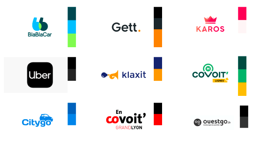
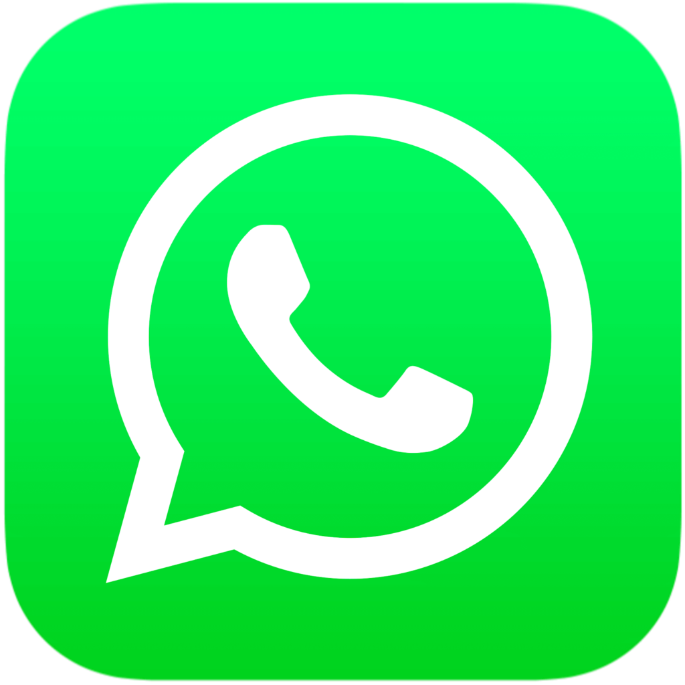

*Dans cet article, je vous parlerai de branding identity (identité de marque en français) mais plus particulièrement, comment en créer une.* 

*Vous trouverez des conseils mais aussi les fondamentaux afin de créer votre propre identité de marque.* 

## Qu’est ce qu’une identité de marque ou branding identity ?

L’identité de marque est la perception que le consommateur a de votre entreprise. Elle définit sa personnalité mais aussi son style ou encore sa façon dont elle communique sur ses produits ou services, tous ces points forment l’ADN de votre marque. C’est ce qui vous permet de transmettre un message à votre public cible. 

Votre objectif sera donc de créer une identité visuelle qui marquera votre audience, de par les points cités précédemment mais aussi de par l’histoire que vous voulez leur raconter. C’est pourquoi, nous évoquerons l’exemple de l’une des plus grandes marques du monde, Apple, reconnue pour sa notoriété forte et son image qui renvoie un message de qualité auprès de ses clients.

Depuis sa création en 1976, Apple a su se démarquer par sa direction artistique. Le designer Rob Janoff à l’origine de la pomme croquée a su tirer son inspiration de l’étude du fruit, sous toutes ses coutures. Elle est croquée pour ne pas qu’on la confonde avec un autre fruit ( comme par exemple, le nashi… )

## 1\. Trouver son inspiration

Maintenant, passons dans le vif du sujet ! Comment trouver son inspiration et par quels moyens ?

Car oui aujourd’hui, ce n’est pas facile de se démarquer des autres… car peut-être que Pierre, votre voisin, est à la tête d’une grande entreprise et que vous aimez bien l’image que dégage sa boîte. 

Votre rôle sera de vous inspirer du monde graphique sans reprendre tous ses codes à l'identique, car comme dit précédemment, il faut retrouver votre personnalité dans votre image de marque afin que celle-ci soit unique et intemporelle.

Pour cela, vous disposez de nombreux outils sur le web tels que Dribbble, Behance, Pinterest afin d’acquérir de la culture graphique de manière générale : art, sculpture, typographie, Bande Dessinée, roman. Toutes ces cultures vous serviront dans vos créations. De plus, ces outils vous permettront d’acquérir les tendances graphiques du moment, car l’idée est de créer un logo moderne et actuel.

## 2\. Faire un benchmark concurrentiel

Il vous sera intéressant de prendre connaissances de vos potentiels concurrents, vous devrez donc passer par la case Benchmark. Cette étape vous aidera à connaître les codes graphiques des entreprises exerçant le même secteur d’activité que vous, ce qui vous dirigera vers un chemin différent de vos concurrents (logotype, charte graphique, communication, marketing…) 

_Un benchmark est un document d’analyse concurrentielle comportant plusieurs critères de différenciation tels que le_ [_design_](https://www.bearstudio.fr/prestations/ux-design)_, l’ergonomie mais aussi l’architecture en présentant tous les points positifs et points d’amélioration de leurs sites web, e-commerce ou encore identité visuelle._

Nous vous partageons un exemple d’une planche benchmark de logotypes concurrents dans le domaine du covoiturage/taxi : 

Cette étape de benchmarking est à prioriser avant le moodboard et la [charte graphique](https://www.bearstudio.fr/prestations/ux-design/charte-graphique), car grâce à cette étude graphique, vous serez en mesure de vous diriger vers votre identité visuelle finale, la rendant unique.

Comment se présente cette planche benchmark ?

J’ai, dans un premier temps, recensé tous les potentiels concurrents dans le domaine du covoiturage, j’importe leurs logotypes et leurs couleurs en les mettant en évidence sur mon fichier. 

Ensuite, je reprends la gamme chromatique de chaque marque. Je constate que les couleurs les plus présentes et pertinentes sont le bleu (technologie, responsabilité, confiance) et le vert (écologie, partage, environnement.)

### Dois-je donc partir sur une de ces deux couleurs ?

La réponse est non, mais toutefois, si tel est votre choix, il n’y a rien de contraignant. L’idée de cet exercice est de pouvoir comparer vos concurrents, et vous différencier de ceux-ci. À partir du moment où vous savez expliquer, le pourquoi du comment, et vos différentes intentions graphiques en matière de couleurs, tout vous est permis.

Ensuite, je remarque que tous les logotypes importés sont différents de par leur représentation, mais ce que nous pouvons remarquer c’est que dans la globalité, les formes sont plutôt arrondies. 

Enfin, j’analyse leur typographie qui sont aussi différentes, nous retrouvons des polices plus droites tandis que d’autres sont plus arrondies. À savoir que créer un contraste entre la forme de l’icône et de la typographie est intéressant. Comme l’exemple du logo d’Uber.

### Le logo Uber contrasté :

- Carré avec des arrondies
- Typographie strict et droite

## 3\. Créer un moodboard 

Par ailleurs, avant toute création graphique, je vous invite à composer un [moodboard](https://www.bearstudio.fr/prestations/ux-design/moodboard) (planche d’ambiance), afin de réunir toutes vos inspirations graphiques/inspirationnelles et de trouver une atmosphère/ambiance homogène à votre moodboard. 

### Mais que trouvons-nous dans notre moodboard ?

- Logotypes inspirationnels
- Typographies
- Couleurs
- Interfaces / sites dans une ambiance similaire

Voici un exemple de moodboard créé pour l’[application open source Start UI](https://start-ui.vercel.app/) : 

Enfin, il faut que vous voyez cette planche comme les prémices de votre identité visuelle, c’est une étape indispensable dans la création de celle-ci.

## 4\. Le choix du logo

### L’utilisation du logo dans le marketing 

Cette partie est sans doute l’une des plus importantes dans la création de votre identité de marque. Pourquoi ? 

Le logo est la représentation graphique de votre entreprise, comme vous l’aurez compris, le logo doit attirer, séduire tout en captivant vos consommateurs.

Le logo représente l’image de votre entreprise sur tous les outils et supports incluant votre branding (réseaux sociaux, affiche, carte de visite, site internet, produits…). Il est donc logique qu’il fasse partie intégrante de votre stratégie marketing afin de véhiculer votre image à vos clients et votre public cible. 

Mais aussi, vous démarquer de la concurrence, en véhiculant vos valeurs, valorisant votre image ou encore en transmettant un message. Vous devrez connaître votre ADN de marque, votre plus-value par rapport à la concurrence mais aussi vers quelle branche de l’arbre vous voulez vous situer.

_De nos jours, le logo est un moyen de communication et d’identification indispensable à toutes les marques et entreprises. Il aide grandement à gagner notoriété et confiance et se greffe parfaitement à une bonne stratégie de création de contenu à valeur ajoutée._

### Les différents types de logo

Aujourd’hui, il existe de nombreux types de logo :

**Mascottes** : Illustration simplifiée dans un style cartoon et dessiné. On les retrouve dans la restauration rapide, mais aussi dans le domaine du sport ou e-sport.

\***\*Monogrammes** :\*\* Composé uniquement de lettres. Par exemple, les marques de luxe se sont très bien appropriées ce style de logo. Mais aussi, des entreprises internationales comme LG ou encore la marque de vêtement NY.

\***\*Pictogrammes** :\*\* Représentation du logo en iconographie, l’intérêt est que la marque soit facilement reconnaissable par ses consommateurs. À savoir que l’icône peut représenter le nom de l’entreprise, son produit, sa mission. Ce style de logo est utilisé par Apple, Whatsapp, Twitter, Snapchat…

\***\*Abstrait** :\*\* Les logos abstraits sont une sous-catégorie des logos pictographiques. On remplace l’image propre par une forme abstraite. La force de ce type de logo est qu’il permet de représenter toutes les valeurs d’une entreprise / marque en une seule image. Des grandes marques telles que Pepsi, Microsoft ou encore Airbnb utilisent ce style de logos.

**Mots-symboles** : Comme vous avez pu le remarquer, les logos mots-symboles sont très similaires aux logos monogrammes, leur différence est que l’un est simplifié et l’autre est affiché au complet. À savoir que les entreprises qui utilisent ce style de logo ont des noms courts. Par exemple : Ebay, Disney, Sony ou encore Google.

\***\*Emblème** :\*\* Pour finir, le dernier type de logo est l’emblème, on retrouve dans ces logos une apparence traditionnelle, ancienne lui donnant une certaine authenticité. Ce style est très populaire pour le domaine de l’automobile mais aussi pour les écoles supérieures ou encore les institutions gouvernementales. Nous retrouvons les marques comme Porsche, Harley Davidson, Starbucks, Harvard utilisant ce style de logo.

### Quelles sont les clés pour créer un logo pertinent et efficace ?

C’est une grande question pour une réponse courte… 

Il n’y a pas besoin d’être un Designer de renom pour créer “LE” logo de demain. Il vous suffit de prendre connaissance des bons ingrédients pour réussir votre recette. 

On doit retrouver dans votre logo de la simplicité afin qu’on puisse l’identifier et facilement le mémoriser. De plus, on doit ressentir votre ADN en le rendant authentique et unique. Mais aussi, il doit attirer les regards, notamment par ses couleurs. Enfin, votre logo doit être durable dans le temps, il doit être intemporel.

La forme du logo joue aussi un rôle clé dans sa conception. Pour aller plus loin je vous conseille [cet article](https://99designs.fr/blog/conseils-design/signification-des-differentes-formes-de-logo/#:~:text=Les%20cercles%2C%20les%20ellipses%20et,autant%20plus%20chaleureux%20et%20inclusifs) qui aborde la signification des différentes formes de logo.

Accompagné d’un slogan percutant, le logo vous permettra de véhiculer rapidement l’image de marque de votre entreprise auprès de votre audience cible.

## 5\. Choisir une typographie

Dans le monde du numérique, il existe plusieurs styles de typographies, mais le plus répandu dans le web est le “sans sérif” ou “linéales.” C’est pourquoi, on se focalisera sur celui-ci.

​​Modernes et élégantes, elles sont les polices standards de notre époque. Leurs particularités sont qu’elles ne possèdent pas d’empattement.

### Pourquoi choisir sans sérif plutôt que sérif ?

À vrai dire, c’est un choix plus économique, efficace mais aussi propre, donc on aura plus à se soucier de la lisibilité de nos lettres selon leur gamme de taille.

À savoir qu’elles sont utilisées à 90% par les marques pour leur logo ou encore leur site.

Quelques exemples de typographiques sans-sérif fonctionnant très bien : 

- Inter
- Roboto
- Rubik
- Helvetica
- Barlow

## 6\. Le choix des couleurs

Le choix des couleurs est une étape importante dans la création de votre identité visuelle, car vos couleurs soutiendront vos choix, les valeurs et l’ADN de votre marque,

Dans cette partie, nous verrons quelles couleurs correspondent à quel secteur d’activité. Car oui, des domaines se sont appropriés des couleurs pour spécifier leur activité. Après ce court chapitre, vous comprendrez mieux les choix des marques.

### Le bleu

Le bleu signifie le calme, la confiance, la responsabilité mais aussi la communication. Il est souvent approprié aux domaines de l’assurance, du médical et de la technologie.

#### Quelques exemples de marques utilisant le bleu dans leur logo

### Le rouge

Le rouge est une couleur particulière dans le monde du marketing, car elle signifie l’amour et la vie mais aussi le danger ce qui est assez paradoxal. Elle est appropriée dans les domaines de l’humanitaire, l’alimentaire, la restauration, les médias.

#### Quelques exemples de marques utilisant le rouge dans leur logo

### Le jaune

Le jaune est connu pour son dynanisme, et son énergie. C’est pourquoi il représente, la jeunesse, la joie mais aussi la tromperie et le mensonge. Dans le marketing, il peut être difficile de l’utiliser, c'est-à-dire qu'il doit être utilisé à bon escient. Cette couleur est utilisée dans les domaines de l’art & culture, du voyage, de l’automobile mais aussi dans l’imprimerie ou encore le bricolage.

#### Quelques exemples de marques utilisant le jaune dans leur logo

### Le vert

Le vert est une couleur très utilisée dans le monde de la banque mais aussi dans le monde pharmaceutique. Il représente l'évolution, la richesse, la croissance et la générosité. On retrouve cette couleur dans les domaines de la médecine, de l’économie, de l’écologie.

#### Quelques exemples de marques utilisant le vert dans leur logo

### Le violet

Le violet est une couleur qui détient à la fois la chaleur du rouge mais aussi la froideur du bleu, ce qui peut rendre son usage assez difficile. Il signifie le luxe, le mystère, la spiritualité mais aussi l’arrogance. On retrouve cette couleur dans les marques de luxe, de parfumerie, joaillerie, médias, sport, technologie haut de gamme ou encore les institutions.

#### Quelques exemples de marques utilisant le violet dans leur logo

### Le noir

Le blanc comme le noir sont deux couleurs neutres. Leur simplicité et neuralité donnent à leur logo, une élégance et sobriété implacable. Le noir signifie l’élégance, l’intemporalité et la douleur. Ainsi, les grandes marques de luxe l’utilisent pour rendre leur identité de marque intemporelle. Nous retrouvons le noir dans les marques de luxe de prestige, la mode, l’hôtelerie, l’automobile, la parfumerie, la technologie, le sport…

#### Quelques exemples de marques utilisant le noir dans leur logo

### Le blanc

Enfin pour finir cette partie, nous parlerons du blanc, considéré comme la couleur la plus pure. Elle apportera à votre identité de marque de la douceur mais aussi de la force à vos autres couleurs en les faisant contraster.

Nous retrouvons le blanc dans les secteurs du luxe, de la mode, de la santé, de l’automobile, de la communication et marketing, du mariage, de la banque ou encore dans l’événementiel.

Tous les logos de marques disposent d’une version noir & blanc car elles sont indispensables dans leur communication. Si le contraste avec un fond ne fonctionne pas, alors ces variants de logos en noir ou blanc seront utilisés.

## Conclusion sur le branding identity

C’est la fin de cet article sur la branding identity. Maintenant vous disposez de tous les conseils et astuces pour créer votre propre ADN. 

Car aujourd’hui, il est important que chaque marque possède sa propre identité, que ce soit en ligne (site internet, produit numérique et réseaux sociaux) mais aussi en physique (affiche, carte de visite et autres supports).

Nous sommes entrés dans une ère où le design/graphisme est devenu plus qu’important pour les marques. 

Les consommateurs et utilisateurs accordent une grande importance à votre image visuelle, votre façon de communiquer sur les réseaux sociaux, vos packagings etc…

Maintenant, qu’attendez-vous pour créer votre propre identité de marque ? 

Pour en apprendre plus sur le design, on vous invite à lire nos [articles sur l’UX design](/blog/posts). On vous recommande l’[article sur la loi de proximité](/blog/posts/la-loi-de-proximite) !

Pour avoir un exemple concret de branding identity, vous pouvez aussi découvrir la conception de l'identité de marque de Green Lead sur [Behance](https://www.behance.net/gallery/118561423/Green-Lead-Brand-Guidelines?tracking_source=search_projects%7Clogo%20brand).

**Auteur** : [Maxime Podgorski](https://www.linkedin.com/in/maxime-podgorski/)
