## Avant-propos

Dans le cadre d'une exploration des solutions de déploiement modernes,
j'ai testé [Upsun](https://upsun.com/), une plateforme PaaS récente proposée par les
créateurs de Platform.sh.

L'objectif était double :

- **Évaluer Upsun comme alternative à Clever Cloud**, que j'utilise déjà,
  afin de comparer l'expérience développeur, la configuration et
  l'ergonomie.
- **Tester un déploiement initial** ("from scratch") **sans connaissance
  préalable d'Upsun ni expérience en devops**. La perspective adoptée est celle d'une développeuse découvrant l'outil.

Pour ce test, j'ai choisi de déployer notre outil maison [Start UI Web](https://start-ui.com/),
un starter d'application moderne basé sur React, Vite et Node.js, que nous utilisons régulièrement comme base de projets front-end. (Pour en savoir plus, vous pouvez lire dès maintenant notre [article de présentation Start UI](/fr/blog/articles/start-ui) !)

Cet article se veut volontairement pragmatique : il mélange **tutoriel pas
à pas** et **retour d'expérience**, avec ses points forts, ses frictions et
ses limites.

---

## Étape 1 : Création d'un compte sur Upsun

Un compte doit être créé sur la plateforme Upsun via la console
officielle.  
_⚠️ Ce tutoriel a été réalisé sur Upsun v3.3.45 !_

Inscription via email ou fournisseur tiers (GitHub, Google, etc.).

Une période d'essai gratuite de 15 jours est proposée. Elle permet d'accéder à un seul projet pendant cette durée limitée,
avec les ressources suivantes : 1 organisation (avec 1 projet et 2 running environments) et un nombre de users illimités.
À la fin de l'essai, votre projet sera suspendu jusqu'à ce que vous ajoutiez un mode de paiement valide à votre compte.

Une fois connecté, il est donc nécessaire d’activer un projet afin de pouvoir procéder aux déploiements.
Jusque là, une interface prometteuse, et un début de mise en place classique !

---

## Étape 2 : Fork / Init du dépôt Start UI Web v3 et configuration locale

Le dépôt officiel Start UI Web v3 peut être forké depuis le [repository GitHub de BearStudio](https://github.com/BearStudio/start-ui-web).
Ce fork permet de disposer d’une copie du projet sous son propre compte GitHub.

Le projet forké doit ensuite être cloné en local afin de vérifier que l’installation fonctionne correctement avant tout déploiement.  
La documentation officielle de Start UI Web précise que le projet nécessite une version récente de Node.js ainsi que l’utilisation de [pnpm](https://pnpm.io/) comme gestionnaire de dépendances.  
Un fichier d’environnement local peut être généré à partir du fichier d’exemple fourni afin de permettre un démarrage en local.

Alternativement, pour initialiser un projet, on peut utiliser `pnpm create start-ui -t web myApp`. Il est ensuite impératif de pousser le projet sur un dépôt GitHub pour qu'il soit éligible au déploiement (les deux solutions ont été testées et fonctionnent aussi bien l’une que l’autre !).

---

## Étape 3 : Synchronisation d'un dépôt GitHub avec Upsun

Upsun permet de synchroniser directement un dépôt GitHub à l’aide d’une intégration native.

Il convient d’ajouter une intégration GitHub depuis les paramètres du projet Upsun, puis de sélectionner le dépôt cloné ou créer de Start UI Web.  
Cette intégration permet à Upsun de déclencher automatiquement un déploiement à chaque modification poussée sur la branche configurée.

Dans ce mode de fonctionnement, les déploiements sont pilotés par GitHub et non par un push direct vers une remote Upsun. Il est également possible de configurer le déploiement manuel et de désactiver l'automatisation.

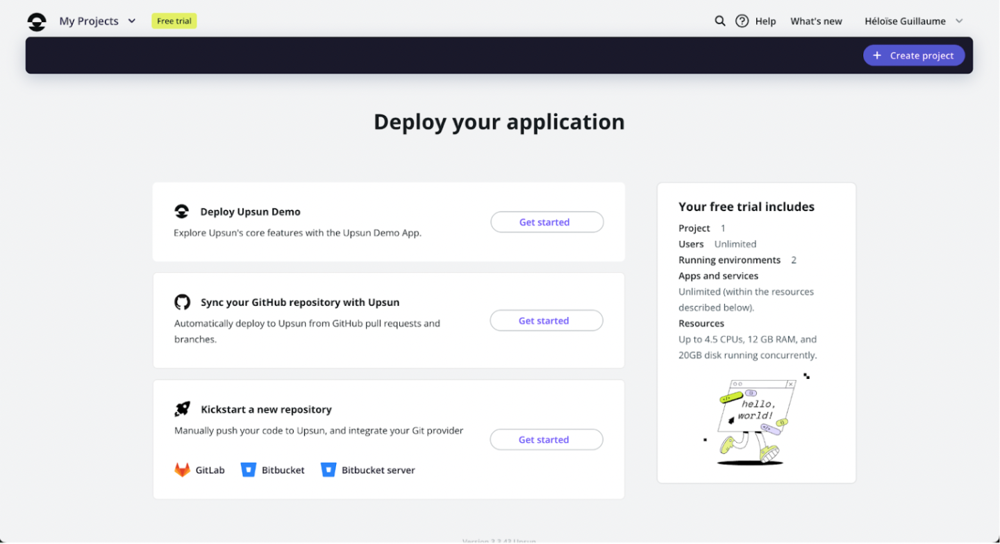


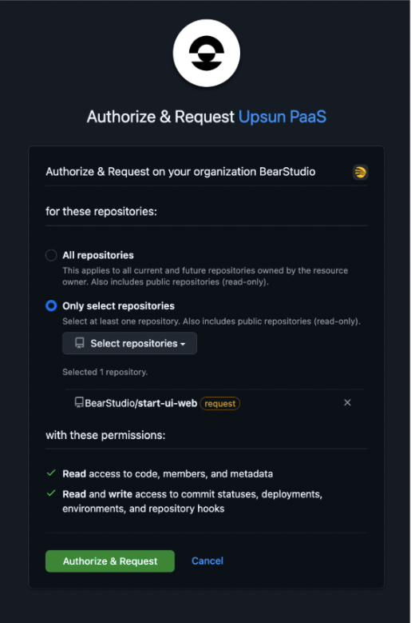

C’est à partir de cette étape que les choses se sont corsées :(

Une fois que j’ai sélectionné l’option “Sync Github repository” puis validé sur Github le choix du repo, j’ai été redirigé vers Upsun avec une erreur.
J’ai recommencé 2 fois l’étape pour y arriver, utiliser deux repos différents avant de retenter celui de Start UI, pas d’explication particulière mais c’est passé ! 🤷🏼‍♀️


---

## Étape 4 : Configuration initiale du projet Upsun

Une fois le projet lié à Upsun, une initialisation doit être effectuée afin de générer les fichiers de configuration nécessaires.

Cette étape permet de :

- définir la technologie utilisée (Node.js),
- ajouter les services nécessaires comme une base de données,
- générer automatiquement un dossier `.upsun` à la racine du projet,
- créer un fichier de configuration principal et un fichier `.environment`.

À ce stade, la configuration générée peut être conservée telle quelle.
Un premier déploiement est ensuite déclenché après un commit et un push.

J’ai supposé qu’il est normal que ce premier déploiement échoue ou ne produise aucun build fonctionnel, car les instructions spécifiques à l’application ne sont pas encore définies.


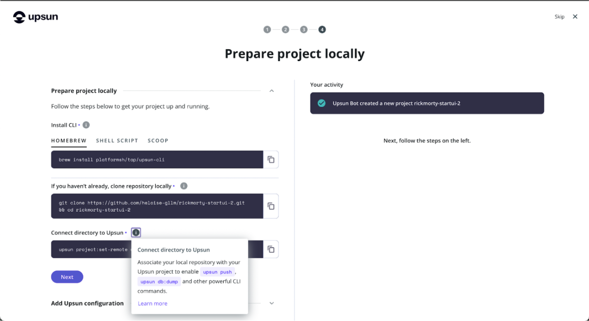


J’ai tenté d’utiliser l’option de génération assistée par IA pour l’initialisation de la configuration du projet mais ça a été un échec. J'espérais une solution miracle pour un déploiement en un clic. Cependant, ne maîtrisant ni le code, ni sa conception, ni sa raison d'être, j'ai préféré repartir d'une configuration manuelle. J'ai dû la revoir plusieurs fois avant de comprendre les champs absolument nécessaires (les hooks, la commande de start, les variables d’environnements,..).

---

## Étape 5 : Récupération des URLs de l’application et de la base de données

L’URL publique de l’application est visible directement dans l’interface Upsun, dans la section dédiée aux environnements et aux routes.

Les informations de connexion à la base de données sont accessibles via les relations Upsun.  
Ces relations permettent d’obtenir l’hôte, le port, le nom de la base, l’utilisateur et le mot de passe nécessaires à la construction de l’URL de connexion.

Ces informations sont indispensables pour compléter la configuration de l’application mais ne sont pourtant pas facilement accessibles. Il est nécessaire de chercher un peu dans la documentation pour trouver comment accéder aux paramètres d'Upsun et les vérifier.


---

## Étape 6 : Personnalisation du fichier de configuration Upsun

Le fichier de configuration situé dans le dossier `.upsun` doit être adapté aux besoins de Start UI Web.

### Variables d’environnement

Les variables sensibles ne doivent pas être stockées en clair dans le dépôt lorsque cela est évitable comme par exemple dans le fichier de configuration Upsun qui sera push sur la branche (et là je ne parle pas du tout par expérience 😇…).

Upsun permet de définir des variables par environnement directement depuis l’interface de gestion, mais elles sont à remplir une par une !

Le fichier `.environment`, quant à lui, est utilisé par Upsun pour connecter automatiquement l’application aux services déclarés.  
Il n’a pas vocation à contenir l’ensemble des variables applicatives et ce n’est pas non plus une simple copie du `.env`. Pour Start UI j’ai laissé les variables d’environnement liées à la base de données qui ont été automatiquement ajoutées.

J’ai ensuite mis les variables d’environnement suivantes dans l’interface :

- la chaîne de connexion à la base de données,
- les secrets d’authentification,
- les paramètres liés aux sessions,
- les variables utilisées par Vite pour l’interface,
- l’environnement d’exécution.

Le menu pour renseigner les variables est accessible depuis les options du menu principal (que je n’ai pas arrêté de chercher en onglet à côté de l’overview 😅).

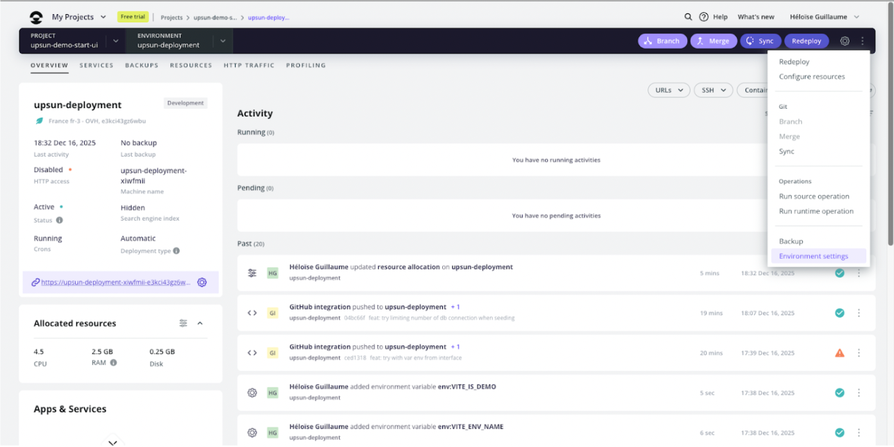


### Hook de build et de déploiement

Les hooks Upsun doivent être configurés afin d’installer les dépendances, construire l’application et exécuter les scripts nécessaires au bon fonctionnement de Start UI Web.

Le **hook de build** est utilisé pour installer les dépendances et générer le build de production.  
Le `–ignore-scripts` lors de l’installation reste important pour éviter la configuration de husky et des hooks git qui viennent polluer les logs de pleins d’erreurs.

Dans notre cas :

```bash
npm i -g pnpm npm-run-all
pnpm install --ignore-scripts
pnpm postinstall
pnpm build
```

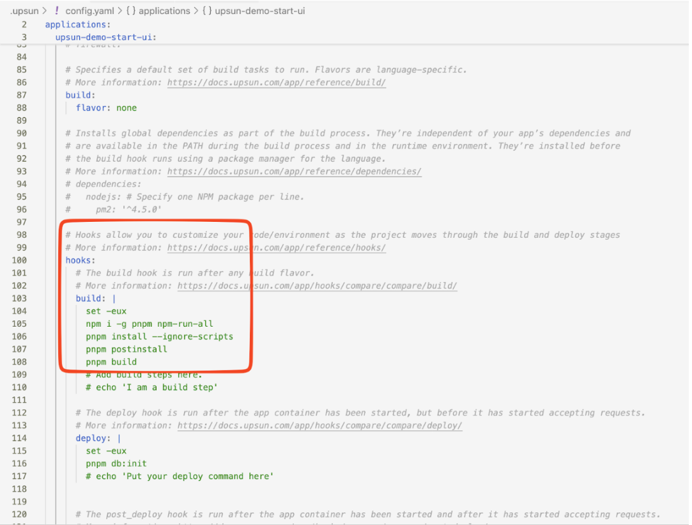

Le **hook de déploiement** permet d’exécuter les scripts liés à l’initialisation de la base de données.  
Dans notre cas : `pnpm db:init`

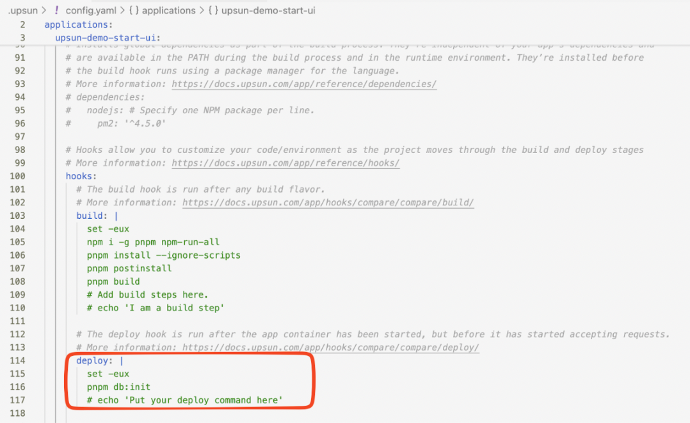

Ces hooks sont exécutés automatiquement par Upsun à chaque déploiement.

### Lancement de l’application

Ne pas oublier de modifier la commande de la partie `web > commands > start` : `pnpm start`.


Après de multiples tentatives, ce sont normalement les seules commandes nécessaires.

---

## Étape 7 : Commit, push et déploiement

Une fois la configuration finalisée, les modifications doivent être ajoutées au dépôt Git et poussées sur la branche suivie par Upsun.

Si une intégration GitHub est utilisée, le simple fait de pousser sur le dépôt distant déclenche automatiquement le déploiement sur Upsun (`git push` déploie sur Upsun, et `upsun push` pousse également sur GitHub). Sans intégration, le push doit être effectué vers la remote Upsun.

Le premier déploiement complet peut prendre plusieurs dizaines de minutes ⏱️.

---

## Étape 8 : Accès à l’application déployée

Après la fin du déploiement, l’application est accessible via l’URL fournie par Upsun.  
Un court délai supplémentaire peut être nécessaire lors du premier chargement, notamment si la base de données est en cours d’initialisation. (+3min ⏱️)

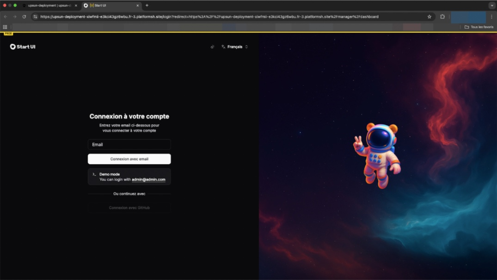
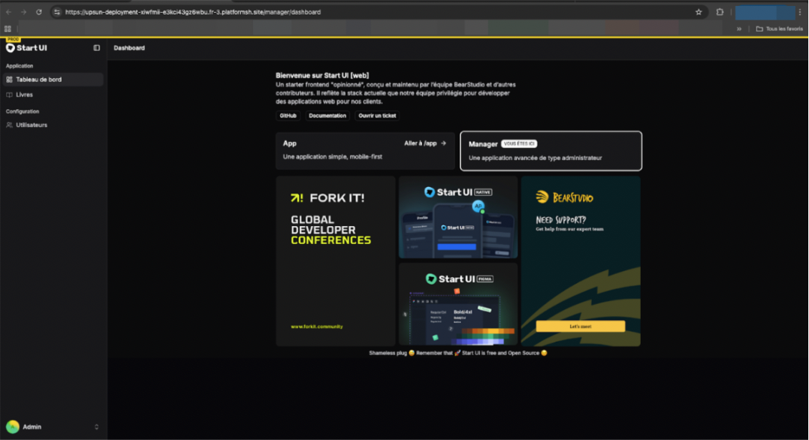

---

## Commandes, conseils et remarques complémentaires

### Consultation des logs

L’interface Upsun affiche principalement les logs liés aux phases de build et de déploiement (mais ils mériteraient un scroll automatique pour garder les logs les plus récents à l’écran).

Pour consulter les logs d’exécution de l’application, il est nécessaire d’utiliser la commande dédiée via l’outil en ligne de commande Upsun : `upsun log` (`upsun log app`, `upsun log deploy`, etc.).

Il est également possible d’accéder à la machine en SSH afin d’inspecter les fichiers de logs générés par l’application mais c’est dommage de pas pouvoir les voir depuis l’interface.

### Connexion en SSH

Upsun fournit un accès **SSH** directement depuis son interface.  
Cet accès permet de diagnostiquer les problèmes, consulter les fichiers générés ou vérifier l’état de l’application en cours d’exécution.

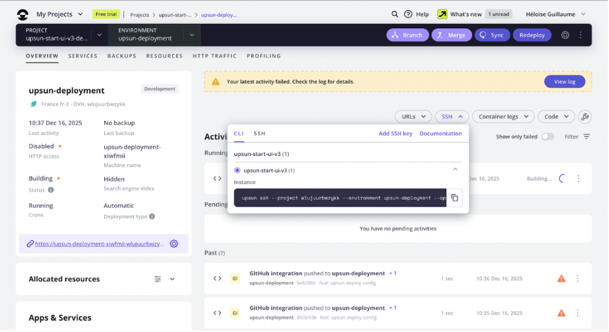

### Ports et gestion des variables d’environnement

Upsun ne permet pas l’utilisation de ports **statiques** exposés manuellement.  
Les ports sont attribués **dynamiquement** et gérés automatiquement par la plateforme.

Cela n’impacte pas le fonctionnement de Start UI Web, qui s’appuie sur les mécanismes standards de déploiement fournis par Upsun.

L’**onglet « variables d’environnement »** de l’interface Upsun permet de définir des valeurs spécifiques à un environnement donné.  
Les variables définies dans le fichier de configuration ne sont pas dupliquées automatiquement dans cette interface, car elles répondent à des usages différents mais c’est ici que je m’attendais à les retrouver.

Les variables **statiques** définies dans le fichier de configuration sont versionnées et **communes** à tous les environnements, tandis que celles définies via l’**interface** peuvent **varier** selon les **contextes** (production, staging, etc.).

---

## Retour d'expérience et pistes d'améliorations

### Problèmes d’interface et d’ergonomie

- Le temps de déploiement affiché dans l’interface est de **6 minutes**, alors qu’en réalité il dépasse souvent **20 minutes**, ce qui est un peu frustrant 😅.
- L’interface n’est pas spécialement intuitive, le bouton “Redéployer” manque de visibilité, des options sont répétitives et se retrouvent dans plusieurs sous menus, l’accès à certains onglets n’est pas clairement indiqué, et il y a pas mal de menus, boutons et tabs aux styles différents.
- Les modales sont assez peu ergonomiques et rendent l’expérience moins fluide :
  - devoir cliquer sur “Options” puis sur un bouton,
  - ou passer par le bouton de statut pour effectuer une action.
- Les **options situées dans la colonne de gauche** ne sont pas très bien mises en avant et assez peu lisibles.


- Certaines cards ou éléments ont un effet hover alors qu’elles ne sont pas cliquables, ce qui crée de la confusion.

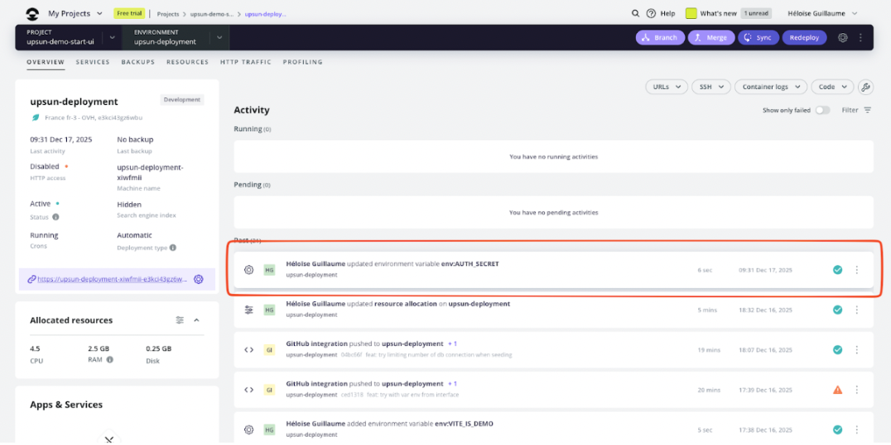

- Il y a **trop de boutons “Options”**, souvent redondants et proposant les mêmes actions à plusieurs endroits.
- La sélection de l’environnement et de la branche n’est pas intuitive, et aucune branche n’est sélectionnée par défaut.
- Tous les tooltips s’affichent en même temps sur les pages contenant des graphes, ce qui surcharge l’interface et peut nuire à la compréhension.

### Variables d'environnement

- Les variables d’environnement utilisées dans le `config.yaml` ne sont pas clairement retranscrites dans l’interface, et le menu dédié est difficile d’accès.
- L’ajout par l’interface des variables d’environnement une par une est frustrant.
- Une fois une variable d’environnement créée, il est impossible d’en modifier le nom, ce qui est contraignant.

### Déploiement & erreurs

- Le bouton permettant de créer une nouvelle branche affiche “Cannot create a new branch” sans fournir d’explication, ce qui rend le problème difficile à diagnostiquer (à ce jour je ne sais toujours pas 😅).
- En naviguant entre les onglets, il arrive qu’un problème de fetch fasse disparaître l’historique des déploiements, ce qui est perturbant parce que d’un coup il n’y a plus rien.

### Logs et observabilité

- La consultation des logs via l’interface est peu pratique :  
  La modale comporte un scroll interne en plus du scroll de la page,  
  il n’y a pas de scroll automatique lorsque de nouveaux logs apparaissent,  
  et pour consulter les logs applicatifs, il faut passer par SSH + `cat` ou utiliser `upsun log`, ce qui n’est pas vraiment l’idéal.

### Facturation et paiement

- Il est possible de ne pas renseigner de moyen de paiement, tout en recevant malgré tout une facture, ce qui est incohérent mais permet de se projeter sur les coûts.
- Le dark mode est à revoir, notamment la modale de paiement dans l’onglet Billing Details, qui fait mal aux yeux !

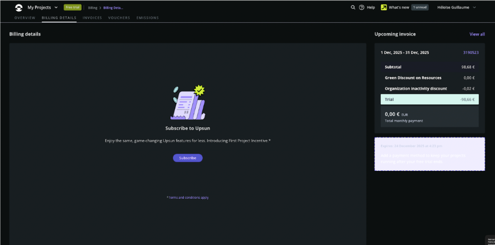

- Certains utilisateurs doivent confirmer leur identité avec une carte bancaire, tandis que d’autres non, sans logique apparente (j’ai fait parti de la seconde catégorie 😝).
- Il est impossible de consulter le moyen de paiement enregistré au moment de l’identification (à vérifier si c’est bien précisé qu’ils ne sauvegardent pas les informations).

### Autres remarques UI

- Dans l’onglet Backup, le bouton “i” situé sous le titre n’est pas clair.
- Le bouton “Manage schedule” manque de cohérence visuelle avec le reste de l’interface et n’est pas esthétique.

---

## Conclusion

Déployer Start UI Web v3 sur Upsun est tout à fait possible et fonctionne correctement une fois la configuration en place.

Cependant, **la courbe d’apprentissage est réelle**, notamment pour une développeuse junior ou quelqu’un découvrant Upsun sans accompagnement.

Upsun propose une base technique solide, mais son **ergonomie et sa DX gagneraient à être simplifiées**, en particulier sur :

- la gestion des variables
- la lisibilité des erreurs
- l’accès aux logs

En tant qu’alternative à Clever Cloud, Upsun mérite clairement d’être testé, mais demande aujourd’hui un investissement initial qui m’a semblé assez important.

Si vous souhaitez aller plus loin, vous pouvez découvrir nos librairies open-source _made-in-BearStudio_ : [UI-State](/fr/blog/articles/pourquoi-on-a-cree-ui-state) et [Ficus UI](/fr/blog/articles/ficus-ui-ui-simple-et-composable-pour-react-native).
