# Deploy Start UI Web V3 with Upsun

## Foreword

As part of exploring modern deployment solutions, I decided to try out [Upsun](https://upsun.com/), a relatively new PaaS platform built by the team behind Platform.sh.

My goals were twofold:

- **Assess Upsun as a potential alternative to Clever Cloud**, which I already use, and compare the developer experience, setup process, and overall usability.
- **Attempt a first deployment “from scratch” with no prior knowledge of Upsun and no DevOps background**. The perspective here is deliberately that of a developer discovering the tool for the first time.

For this experiment, I chose to deploy our in-house tool, [Start UI Web](https://start-ui.com/), a modern application starter built with React, Vite, and Node.js, which we regularly use as a foundation for front-end projects. (To learn more, you can already check out our [Start UI introduction article](/en/blog/posts/start-ui-opinionated-ui-starter)!)

This article is intentionally hands-on. It combines a **step-by-step tutorial** with **practical feedback**, highlighting strengths, friction points, and limitations along the way.

---

## Step 1: Creating an Upsun Account

First, you need to create an account on the Upsun platform via the official console.  
_⚠️ This tutorial was made on Upsun v3.3.45 !_

You can sign up using an email address or a third-party provider (GitHub, Google, etc.).

A 15-day free trial is available. During this period, you can access a single project with the following resources: 1 organization (with 1 project and 2 running environments) and unlimited users.  
At the end of the trial, your project will be suspended until you add a valid payment method to your account.

Once logged in, you’ll need to activate a project before you can proceed with deployments.
So far, the interface feels promising, and the setup process is fairly standard.

---

## Step 2: Fork / Initialize the Start UI Web v3 Repository and set Up Locally

The official Start UI Web v3 repository can be forked from the [BearStudio GitHub repository](https://github.com/BearStudio/start-ui-web).  
Forking it gives you your own copy of the project under your own GitHub account.

You should then clone the forked repository locally to ensure everything installs and runs correctly before attempting any deployment.  
The official Start UI Web documentation specifies that the project requires a recent version of Node.js as well as [pnpm](https://pnpm.io/) as the package manager.  
A local environment file can be generated from the provided example file to enable local development.

Alternatively, you can initialize a new project using `pnpm create start-ui -t web myApp`.
In both cases, the project must be pushed to a GitHub repository to be eligible for deployment. (Both approaches were tested and work equally well!)

---

## Step 3: Syncing a GitHub Repository with Upsun

Upsun allows you to directly sync a GitHub repository using its native integration.

From the Upsun project settings, you can add a GitHub integration and then select the cloned or newly created Start UI Web repository.  
This integration enables Upsun to automatically trigger a deployment whenever changes are pushed to the configured branch.

With this setup, deployments are driven by GitHub rather than by pushing directly to an Upsun remote. It’s also possible to configure manual deployments and disable automatic deployment if needed.


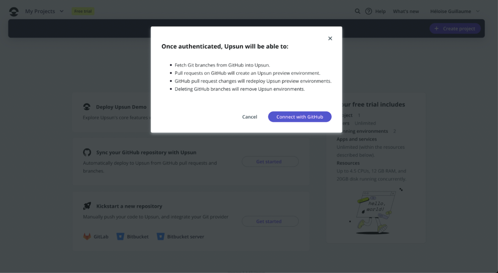
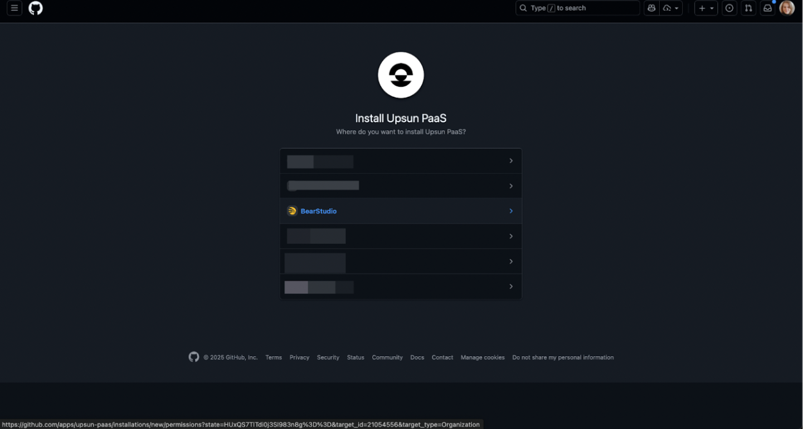


This is where things started to get a bit tricky :(

After selecting the “Sync GitHub repository” option and confirming the repository choice on GitHub, I was redirected back to Upsun with an error.
I had to repeat the process twice, even trying with two different repositories before attempting again with the Start UI one. I didn’t find any clear explanation for the issue — but eventually, it worked! 🤷🏼‍♀️

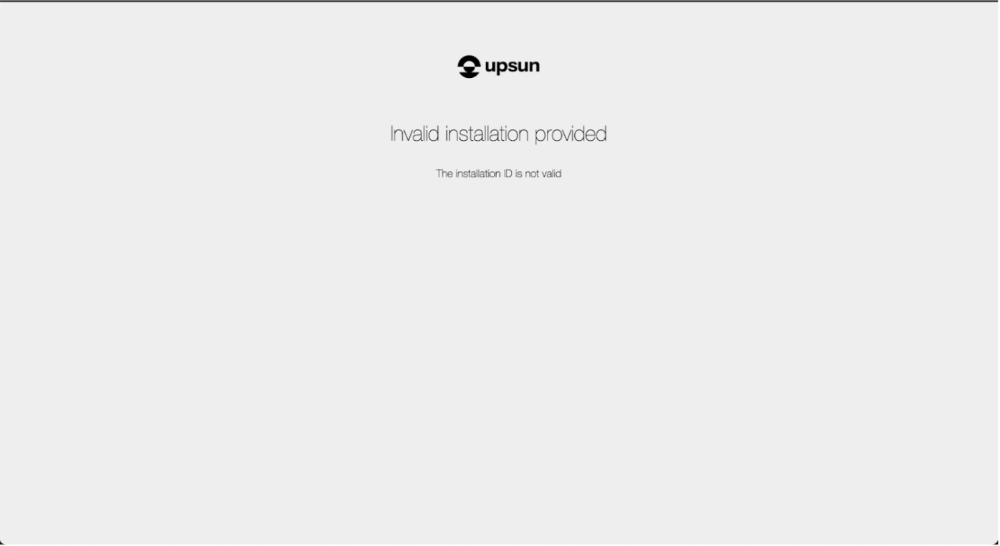

---

## Step 4: Initial Upsun Project Configuration

Once the project is linked to Upsun, an initialization step is required to generate the necessary configuration files.

This step allows you to:

- define the technology used (Node.js),
- add required services such as a database,
- automatically generate a `.upsun` folder at the root of the project,
- create a main configuration file and a `.environment` file.

At this point, the generated configuration can be kept as-is.  
A first deployment is then triggered after committing and pushing the changes.

I assumed it was normal for this initial deployment to fail or not produce a working build, since the application-specific build instructions have not yet been defined.

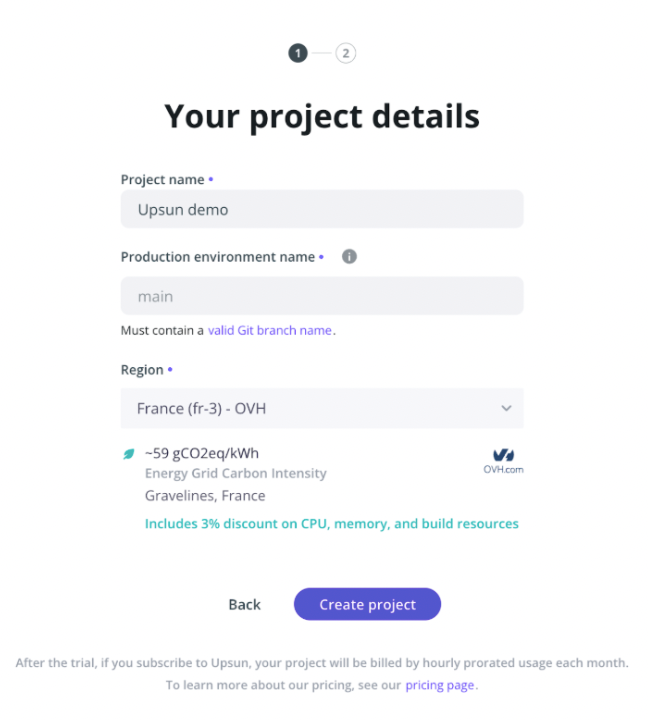

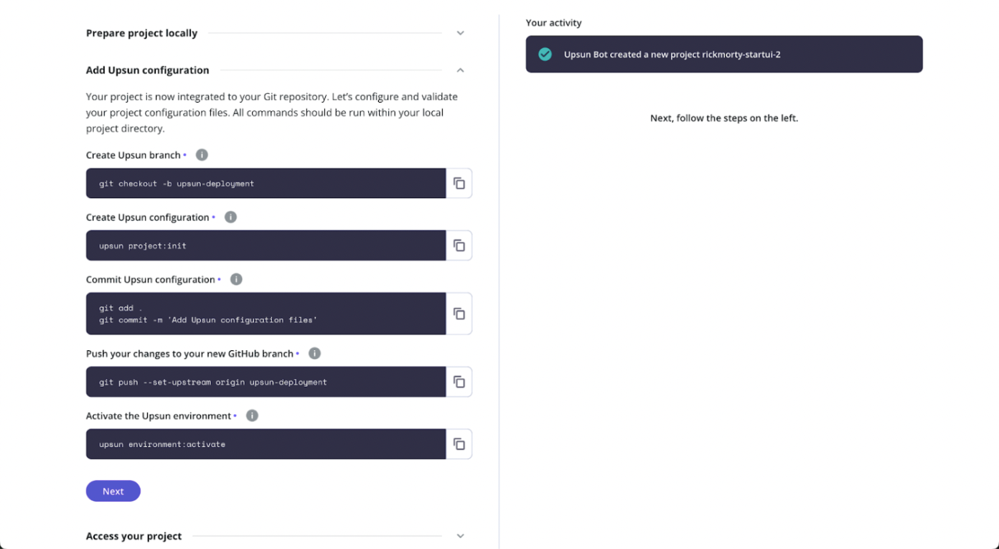
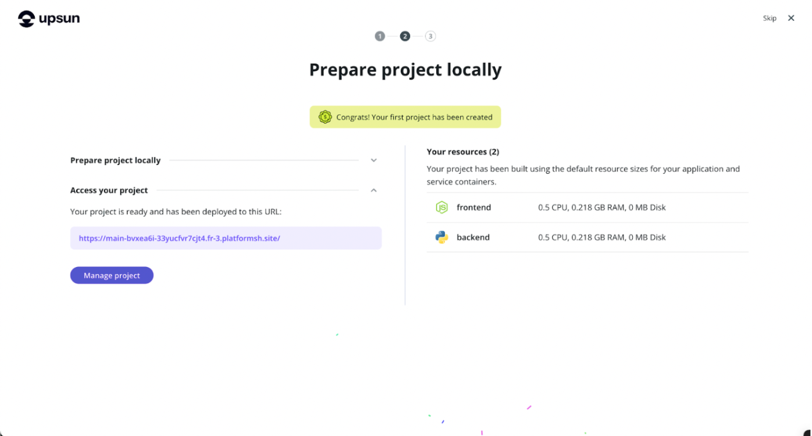

I tried using the AI-assisted configuration generation option during the project initialization, but it didn’t work out. I was hoping for a kind of one-click deployment miracle.  
However, since I didn't really understand the generated code, its architecture, or its purpose, I chose to switch back to a manual configuration. I had to revise it several times before fully understanding which fields were absolutely required (hooks, the start command, environment variables, etc.).

---

## Step 5: Retrieving the Application and Database URLs

The public URL of the application is directly available in the Upsun interface, under the environments and routes section.

The database connection details are accessible through Upsun relationships.  
These relationships provide the host, port, database name, username, and password needed to construct the connection string.

These details are essential to complete the application configuration, yet they’re not immediately obvious to find. You need to dig a bit into the documentation to understand how to access and verify Upsun’s environment settings.

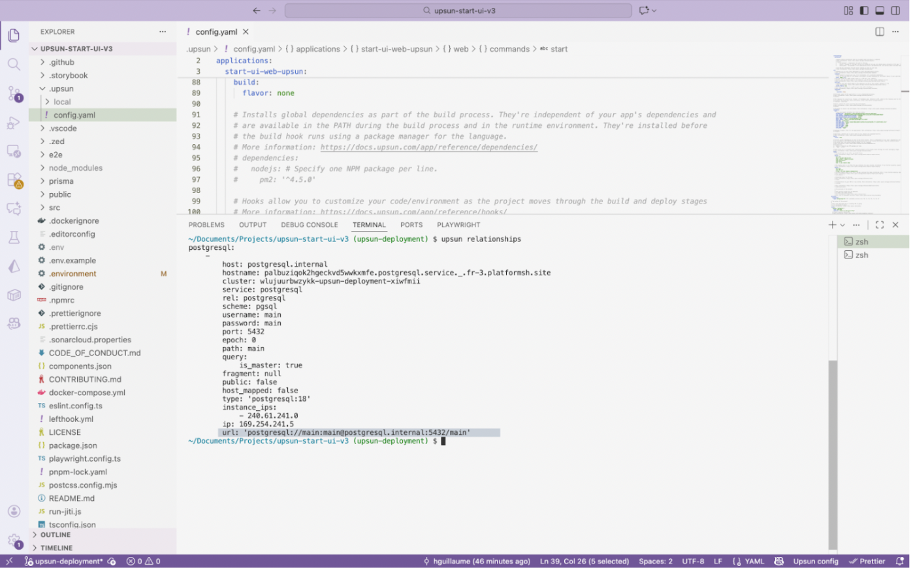

---

## Step 6: Customizing the Upsun Configuration File

The configuration file located in the `.upsun` folder needs to be adapted to match the requirements of Start UI Web.

### Environment Variables

Sensitive variables should not be stored in plain text in the repository whenever possible — for example in the Upsun configuration file that gets pushed to the branch (and no, I’m definitely not speaking from experience 😇…).

Upsun allows you to define environment-specific variables directly from the management interface, but they must be entered one by one.

The `.environment` file, on the other hand, is used by Upsun to automatically connect the application to the declared services.  
It is not meant to contain all application variables, nor is it simply a copy of your `.env` file. For Start UI, I kept the database-related environment variables that were automatically added.

I then added the following environment variables through the interface:

- the database connection string,
- authentication secrets,
- session-related settings,
- variables used by Vite for the frontend,
- the runtime environment.

The menu to configure environment variables is accessible from the main options menu (which I kept looking for as a separate tab next to the overview 😅).


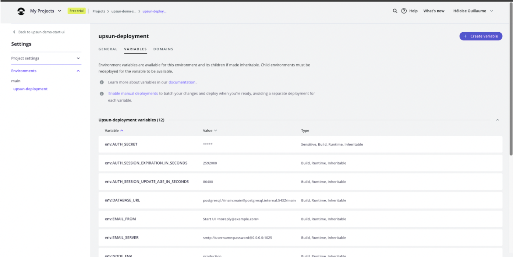
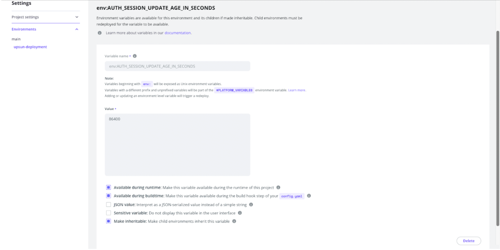

### Build and deployment hooks

Upsun hooks must be configured to install dependencies, build the application, and run the scripts required for Start UI Web to function properly.

The **build hook** is used to install dependencies and generate the production build.  
Using `--ignore-scripts` during installation is important to prevent Husky and Git hooks from being set up, which would otherwise clutter the logs with unnecessary errors.

In our case:

```bash
npm i -g pnpm npm-run-all
pnpm install --ignore-scripts
pnpm postinstall
pnpm build
```


The **deployment hook** is used to run scripts related to database initialization.  
In our case: `pnpm db:init`


These hooks are automatically executed by Upsun on each deployment.

### Starting the Application

Don’t forget to update the command in the `web > commands > start` section to: `pnpm start`.

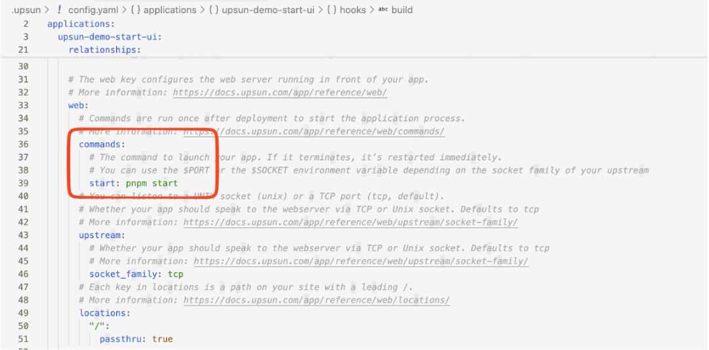

After many attempts, these should normally be the only commands required.

---

## Step 7: Commit, push, and deploy

Once the configuration is finalized, the changes need to be committed to the Git repository and pushed to the branch tracked by Upsun.

If a GitHub integration is enabled, simply pushing to the remote repository automatically triggers a deployment on Upsun (`git push` deploys to Upsun, and `upsun push` also pushes to GitHub). Without the integration, the push must be made directly to the Upsun remote.

The first full deployment can take several dozen minutes ⏱️.

---

## Step 8: Accessing the Deployed Application

Once the deployment is complete, the application is accessible via the URL provided by Upsun.  
A short additional delay may occur on the first load, especially if the database is still being initialized (around +3 minutes ⏱️).


---

## Commands, Tips, and Additional Notes

### Viewing Logs

The Upsun interface mainly displays logs related to the build and deployment phases (though an auto-scroll feature to keep the latest logs visible would be a nice improvement).

To view runtime application logs, you need to use the dedicated command via the Upsun CLI: `upsun log` (`upsun log app`, `upsun log deploy`, etc.).  
It’s also possible to access the machine via SSH to inspect the log files generated by the application. However, it’s a bit of a shame that these logs aren’t fully accessible directly from the interface.

### SSH Access

Upsun provides **SSH** access directly from its interface.  
This allows you to diagnose issues, inspect generated files, or check the state of the running application.


### Ports and Environment Variable Management

Upsun does not allow the use of manually exposed **static ports**.  
Ports are assigned **dynamically** and automatically managed by the platform.

This does not impact Start UI Web, which relies on the standard deployment mechanisms provided by Upsun.

The **“environment variables” tab** in the Upsun interface allows you to define values specific to a given environment.  
Variables defined in the configuration file are not automatically duplicated in this interface, as they serve different purposes — although this is where I initially expected to find them.

**Static variables** defined in the configuration file are version-controlled and **shared** across all environments, whereas variables defined via the **interface** can **vary** depending on the **context** (production, staging, etc.).

---

## Feedback and Areas for Improvement

### Interface and Usability Issues

- The deployment time displayed in the interface is **6 minutes**, while in reality it often exceeds **20 minutes**, which can be a bit frustrating 😅.
- The interface isn’t particularly intuitive: the “Redeploy” button lacks visibility, some options feel repetitive and appear in multiple submenus, access to certain tabs isn’t clearly indicated, and there are quite a few menus, buttons, and tabs with inconsistent styles.
- The modals are not very ergonomic and make the experience less fluid:
  - having to click on “Options” and then on another button,
  - or going through the status button to perform an action.
- The **options located in the left sidebar** are not very well highlighted and can be difficult to read.

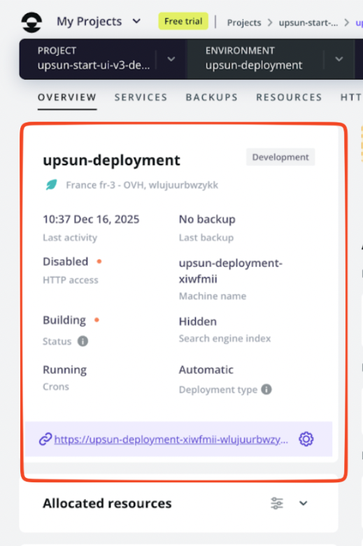

- Some cards or UI elements have a hover effect even though they are not clickable, which creates confusion.


- There are **too many “Options” buttons**, often redundant and offering the same actions in multiple places.
- Selecting the environment and branch is not intuitive, and no branch is selected by default.
- All tooltips appear at the same time on pages containing graphs, which overloads the interface and can make it harder to read.

### Environment Variables

- Environment variables used in `config.yaml` are not clearly reflected in the interface, and the dedicated menu is hard to find.
- Adding environment variables one by one through the interface is frustrating.
- Once an environment variable has been created, it’s impossible to rename it, which is quite limiting.

### Deployment & Errors

- The button used to create a new branch sometimes displays “Cannot create a new branch” without providing any explanation, making the issue difficult to diagnose (to this day, I still don’t know why 😅).
- When navigating between tabs, a fetch issue can occasionally cause the deployment history to disappear, which is quite confusing when everything suddenly looks empty.

### Logs and Observability

- Viewing logs through the interface is not very convenient:  
  the modal has its own internal scroll in addition to the page scroll,  
  there’s no auto-scroll when new logs appear,  
  and to access application logs, you need to use SSH + `cat` or run `upsun log`, which isn’t exactly ideal.

### Billing and Payments

- It’s possible to leave the payment method empty and still receive an invoice, which feels inconsistent — although it does help anticipate potential costs.
- The dark mode could use some improvement, especially the payment modal in the “Billing Details” tab, which is quite hard on the eyes.


- Some users are required to verify their identity with a credit card, while others are not, with no apparent logic (I happened to be in the second group 😝).
- It’s not possible to view the registered payment method at the time of verification (it would be worth checking whether it’s clearly stated that payment details are not stored).

### Other UI Remarks

- In the Backup tab, the “i” button located under the title is not very clear.
- The “Manage schedule” button lacks visual consistency with the rest of the interface and doesn’t look very polished.

---

## Conclusion

Deploying Start UI Web v3 on Upsun is absolutely possible and works properly once the configuration is in place.

However, **the learning curve is real**, especially for a junior developer or someone discovering Upsun without guidance.

Upsun offers a solid technical foundation, but its **usability and developer experience could benefit from simplification**, particularly when it comes to:

- environment variable management
- error readability
- log accessibility

As an alternative to Clever Cloud, Upsun is definitely worth testing, but at this stage it requires a fairly significant upfront investment in time and effort.

If you’d like to go further, you can explore our _made-in-BearStudio_ open-source libraries: [UI-State](/en/blog/posts/why-did-we-create-ui-state) and [Ficus UI](/en/blog/posts/ficus-ui-simple-and-composable-ui-for-react-native).
