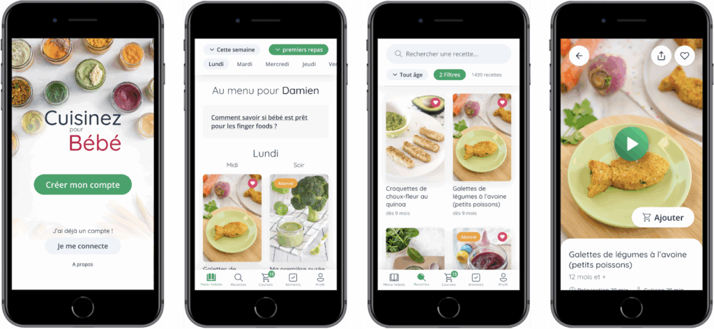
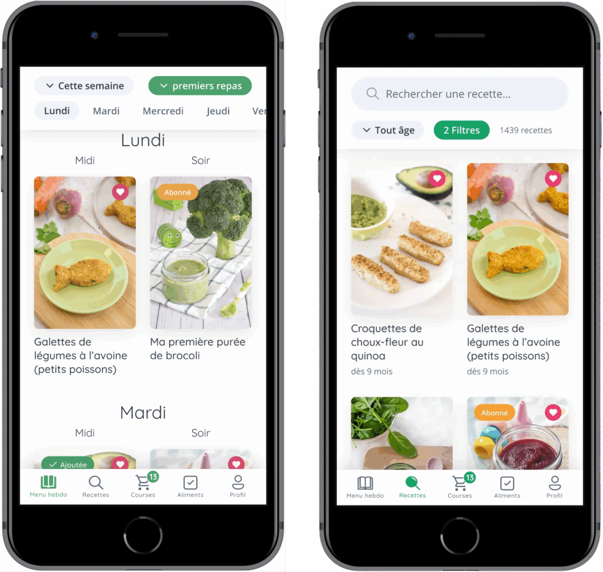
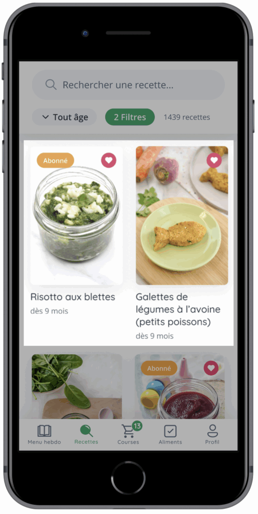
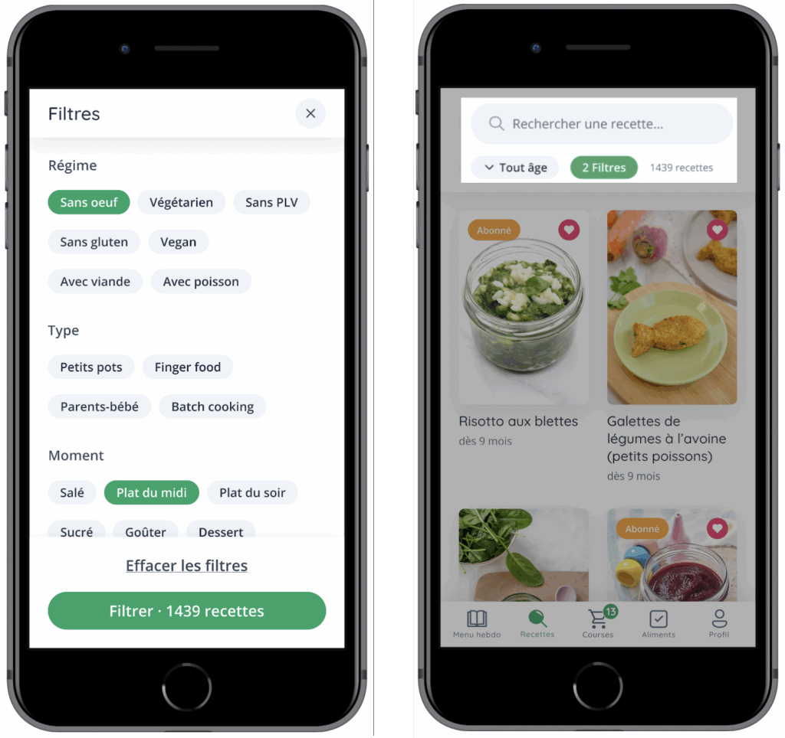
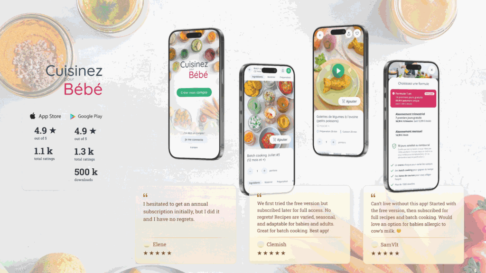

## About Cuisinez pour bébé

The story of _Cuisinez pour Bébé_ begins with Clémence, a young mother passionate about cooking who wanted to offer her child healthy, simple, and varied meals. Like many parents, she asked herself the essential questions:

##### How do you successfully introduce solid foods? How do you prepare balanced meals without spending hours in the kitchen?

To answer these questions, she started sharing her homemade recipes on a blog, which quickly grew into a structured WordPress website. The success was immediate: young parents found clear guidance, practical ideas, and a relaxed approach to cooking for babies.

Today, _Cuisinez pour Bébé_ brings together over **1,800 recipes**, sorted by **age**, **weekly meal plans** for **batch cooking**, along with a wealth of practical tips to **support** every stage of food diversification.

## The Challenge / The Need

With over **150,000 monthly visits** and a highly active community on social media, _Cuisinez pour Bébé_ has established itself as an essential resource for parents seeking simple and balanced recipes for their children.

However, this success revealed a clear need: to make the experience smoother, more mobile-friendly, and more personalized. The majority of users were already browsing the site from their phones and expressed the need to access their recipes, favorites, and weekly menus more quickly directly from an app.

The challenge was therefore to translate the website experience into an intuitive mobile format, staying true to the existing universe, while integrating key features: a freemium model, age-based navigation, and simplified access to batch cooking menus.

The app had to become a natural extension of the website, serving the same goal:
**supporting parents every day in preparing meals for their baby.**

## Our Role

On the [BearStudio](https://www.bearstudio.fr/) side, the project is driven by a dedicated team whose composition has evolved over time.

Current team:

- 1 Lead UX/UI Designer

- 1 UX/UI Designer

- 1 Lead Full-Stack Developer

Past contributions:

- 1 Front-End Developer

## Product Design (UX/UI)

Our team supported _Cuisinez pour Bébé_ in the complete design of the mobile experience, from understanding user behaviors to defining user journeys:

- Analysis of young parents' needs and identification of specific expectations on mobile

- Structuring the information architecture and designing simple journeys centered on real use cases

- Low-fidelity prototypes → high-fidelity prototypes (_interactive mockups_)

- Multiple iteration cycles carried out with the client to refine journeys and validate design decisions

## Development

On the technical side, BearStudio handled the development of the mobile application connected to the existing WordPress infrastructure:

- Mobile development in React Native (_Android & iOS_)

- Content integration via WordPress REST API (_recipes, menus, profiles_)

- Implementation of Algolia search for fast and filtered access to recipes

- Authentication management and freemium/subscriber model

- Optimization of visual and technical consistency through shared components and close collaboration between designers and developers

## Design & Iterations

### Main Screens of V1 - Laying the Foundations

The first version of the _Cuisinez pour Bébé_ app aimed to bring the key features of the existing website into a mobile environment.

This V1 served as a functional foundation, designed to address the essential use cases identified by the CPB team as a priority: **browsing recipes**, **organizing weekly meals, and understanding the value of the subscription**.

At this stage, the goal was not yet to optimize every interaction, but to validate the core journeys and the relevance of the app format.

The application was built around a few central building blocks:

1. **Access to weekly menus** right from the app's home screen

2. **Browsing a recipe catalog** sorted by age

3. **Recipe cards** with the essential information needed for preparation

4. **A favorites section** to find saved content

5. A **user profile** focused on **account management** and **subscription**

6. **A paywall** designed to present the freemium offering

7. **A sign-up flow** that was intentionally highly sequential

This first version laid the product's foundations, tested initial hypotheses against real-world usage, and provided a solid base for future improvements.

### Main Screens Today

The current screens of _Cuisinez pour Bébé_ are not the result of stacking features on top of each other. They are the result of a user-centered approach, iterated over time, with a constant goal: making a rich experience simple to use on mobile, in a real-world context (_a busy parent, phone in one hand, a child to manage, cooking in progress_).

Rather than designing screen by screen, we structured the application around "driver" journeys — those that come up most often in parents' daily routines:

- Planning the week's meals without having to think about every decision

- Quickly finding a relevant recipe _(age, texture, context)_

- Cooking without friction, maintaining a clear and continuous reading experience

- Tracking food diversification over time

- Managing a family profile and premium access without confusion

### Design Method

To turn these use cases into a mobile experience, we favored a very hands-on approach: **prototype, simulate, observe, adjust**.

We used interactive prototypes to validate:

- Understanding of screen sequences _(where to click, when, and why)_

- Navigation depth _(avoiding tunnels)_

- Readability and information hierarchy in dense lists

- Consistency across screens _(same visual cues, same patterns)_

This method allowed us to quickly test hypotheses before development and to detect common mobile issues early: visual overload, hard-to-reach gestures, overly complex filters, secondary actions that were too prominent, lack of continuity between listings and details.

### What This Approach Changed

Through iterations, several key themes emerged as structural:

- Prioritizing information rather than showing everything: photo, title, age, and a few strong cues before the rest

- Shortening the path to action: opening a recipe, adding to favorites, generating a shopping list — without multiplying screens

- Creating "hub" screens _(e.g., Weekly Menu, Recipes)_ that focus on the main need, then link to details at the right moment

- Ensuring visual continuity: if a parent understands a recipe card in the catalog, they should understand it everywhere _(menu, favorites, suggestions)_

The screens "today" embody this level of balance: an interface capable of handling dense and variable content while remaining smooth, consistent, and reassuring.

###### _Preview of the current screens: organization, exploration, execution, tracking._

### Design Zoom - Recipe Card Component

The Recipes section is one of the most demanding modules of the app. It's a space where the user needs to quickly explore a very large catalog while maintaining a sense of control.

#### Product Intent

The central goal was not to provide an advanced search engine. The goal was to enable simple decision-making based on criteria that matter to parents: **age, texture, meal type, dietary restrictions, current context**.

In other words, the recipes section had to function as:

- A source of inspiration

- A sorting tool

- A quick access point to action _(cook, save, plan)_

###### _The catalog is designed to be scanned in a few seconds: image, title, age._

#### Constraints Encountered

This section combines several complex constraints:

- **Density**: many recipes on screen and many recipes in total

- **Variability**: very long titles, different information across recipes

- **Multi-criteria**: the right choice depends on several parameters _(age, texture, type, ingredients)_

- **Mobile**: short interactions, simple gestures, immediate readability

- **Continuity**: the list must prepare for the recipe card, without disruption

The main risk was twofold:

- A catalog that's too visually "rich," where nothing stands out anymore

- Or a filter system too complex, discouraging exploration

#### Key Decision #1: The Recipe Card as a Unit of Reading

The recipe card is the component that carries the essential understanding. It must enable three very quick mental actions:

1. Recognize the idea _(via the image)_

2. Understand the content _(via the title)_

3. Validate the fit _(via the age)_

This requires a strict hierarchy:

- **Dominant image**: the eye decides first based on visuals — a deliberate choice made obvious by the richness and exceptional quality of _Cuisinez pour Bébé_'s photos, a true visual asset of the brand

- **Title optimized for length**: typography, spacing, number of lines

- **Age present but secondary**: visible, without stealing attention

#### Key Decision #2: Filters as the Main Lever (Not an "Extra")

In this app, filters are not a secondary feature. They are the mechanism that makes the catalog usable on a daily basis.

The idea was not to "add lots of filters" but to **provide a system that helps progressively narrow the search space without requiring significant mental effort**.

The choices that make the filters effective:

- **Clear categorization**: reasoning by families _(diet, type, time of day, season, special requirements)_

- **Quick selection**

- **Explicit validation**: apply when ready, rather than triggering results with every micro-choice

- **Immediate feedback**: seeing the number of recipes found prevents the feeling of "filtering into the void"

## A Collaboration Built Over Time

Since 2021, the collaboration between BearStudio and the _Cuisinez pour Bébé_ team has been ongoing. It is built on a relationship of trust, strong responsiveness, and constant dialogue around the product's evolution.

The CPB team regularly shares feedback from their community, formulates new ideas, and seeks advice to evolve the app.

These exchanges take various forms: Slack messages, regular check-ins, or Loom videos to detail expectations, suggest improvements, or ask for advice.

This dynamic has allowed the application to gradually evolve beyond its first version.

Several major features have enriched the experience over time, such as **managing multiple children** within a single account or implementing **the shopping list**, which has become a key element of daily organization.

Some existing features have also been reworked and refined, particularly around **premium content access** and conversion screens, to improve clarity and the overall experience.

This shared iteration rhythm keeps the product alive, aligned with parents' real needs, and evolving continuously — driven jointly by the CPB and BearStudio teams.

## What Users Say

Beyond mockups, features, and iterations, the most valuable indicator remains user satisfaction.

Since the app's launch, reviews left on the stores and messages sent to CPB reflect a real impact on parents' daily lives.

What comes up most often:

- Ease of use

- Clarity of recipes

- Time saved in meal planning

- Quality of the content offered

- Trust in the CPB brand

The ratings on the App Store and Google Play, along with the many positive messages, confirm that the app meets a strong need: **supporting parents in a reliable, intuitive, and caring way**.

This feedback in turn fuels the project, as every constructive comment or recurring request inspires future improvements, further reinforcing the continuous improvement cycle between CPB, its users, and our team.

## Going Further

_Cuisinez pour Bébé_ continues to support thousands of parents every day through its content ecosystem, app, and educational resources.

To discover the full universe, here's where to find the brand and follow its latest news:

**Official website**: Recipes, tips, batch cooking, and practical guides
[https://www.cuisinez-pour-bebe.fr/](https://www.cuisinez-pour-bebe.fr/)

**Mobile app**: Available on the App Store and Google Play
Access to weekly menus, filters, favorites, shopping list, and premium features

**Instagram**: Recipe sharing, tips, practical videos, community feedback
[https://www.instagram.com/cuisinezpourbebe/](https://www.instagram.com/cuisinezpourbebe/)

**Facebook**: Active community, exchanges between parents, live sessions and exclusive content
[https://www.facebook.com/cuisinezpourbebe/](https://www.facebook.com/cuisinezpourbebe/)

**YouTube**: Explainer videos, filmed recipes, workshops and masterclasses
[https://www.youtube.com/cuisinezpourbebe](https://www.youtube.com/cuisinezpourbebe)

And feel free to check out [our previous case study on Léa English](https://www.bearstudio.fr/blog/design-css/lea-english-etude-de-cas)!
