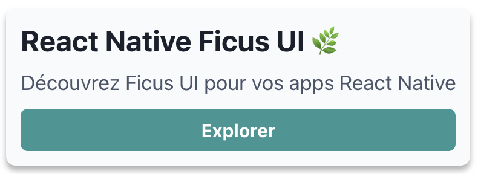
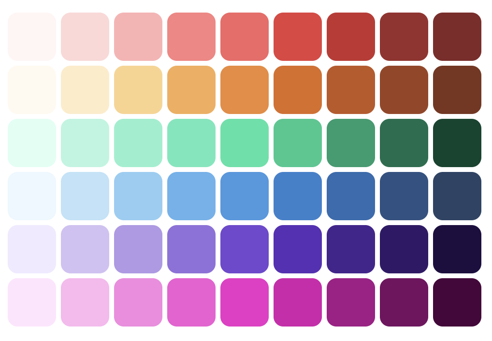
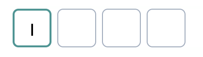
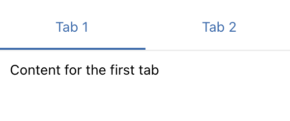

**Designing a coherent and maintainable React Native UI library** is a central challenge in modern mobile app development. For many years, we have been using React Native for its cross-platform capabilities, which allow targeting both Android and iOS while retaining the benefits of React and native mobile.
However, styling and UI management in React Native remains limited by default: the framework provides basic components for structuring views, but few tools for creating advanced, customizable, and consistent mobile interfaces at scale.
The React Native community quickly developed UI libraries to address these issues, but we couldn't find one that matched what we use on React web: [Chakra UI](https://chakra-ui.com/)
That's why we developed at [BearStudio](https://www.bearstudio.fr/) a new open-source UI library: [React Native Ficus UI 🌿](https://ficus-ui.com/)

## Why Ficus UI?

We love Chakra UI for several reasons: its simplicity, consistency, and "styled system" philosophy that allows you to quickly build elegant, accessible, and customizable interfaces.

When we started looking for a similar experience on React Native, we found that no library truly combined these qualities.

Some libraries offered rich components but were difficult to theme. Others provided flexibility, but at the cost of great complexity or lack of consistency between components.

**Ficus UI** was born from this observation: to provide a **Chakra-like experience for React Native**, with a simple, expressive API that is 100% compatible with mobile constraints.

## Comparison with "vanilla" React Native UI

Before Ficus UI, most React Native interfaces were built with native components and styles (`View`, `Text`, `StyleSheet.create`).

This works very well... but it's often verbose, not very expressive, and difficult to maintain as the application grows.

### In "classic" React Native



```
import { View, Text, TouchableOpacity, StyleSheet } from 'react-native';

export default function Card() {
  return (
    <View style={styles.card}>
      <Text style={styles.title}>React Native Ficus UI 🌿</Text>
      <Text style={styles.subtitle}>
        Discover Ficus UI for your React Native apps
      </Text>
      <TouchableOpacity style={styles.button}>
        <Text style={styles.buttonText}>Explore</Text>
      </TouchableOpacity>
    </View>
  );
}

const styles = StyleSheet.create({
  card: {
    backgroundColor: '#f7fafc',
    padding: 16,
    borderRadius: 12,
    shadowColor: '#000',
    shadowOpacity: 0.1,
    shadowRadius: 4,
  },
  title: {
    fontSize: 24,
    fontWeight: 'bold',
    color: '#2d3748',
    marginBottom: 8,
  },
  subtitle: {
    fontSize: 16,
    color: '#4a5568',
    marginBottom: 12,
  },
  button: {
    backgroundColor: '#319795',
    paddingVertical: 10,
    borderRadius: 6,
  },
  buttonText: {
    color: '#fff',
    fontWeight: '600',
    textAlign: 'center',
  },
});
```

This code is functional, but it:

- requires **a separate style block**, often redundant,
- makes reading less fluid,
- doesn't easily adapt to a theme or dark mode,
- and complicates reuse (each component manages its own styles).

### With Ficus UI

The same component, written with Ficus UI, becomes much more **declarative and composable**:

```
import { Box, Text, Button } from 'react-native-ficus-ui';

export default function Card() {
  return (
    <Box bg="gray.50" p="lg" borderRadius="lg" shadow="md">
      <Text fontSize="4xl" fontWeight="bold" color="gray.800" mb="md">
        React Native Ficus UI 🌿
      </Text>
      <Text fontSize="xl" color="gray.600" mb="lg">
        Discover Ficus UI for your React Native apps
      </Text>
      <Button colorScheme="teal" full>Explore</Button>
    </Box>
  );
}
```

**Major differences:**

- **No more StyleSheet** to maintain: styles are integrated as props.

- **Colors, spacing, and sizes** are linked to the global theme.

- The component is **self-documenting**: structure and style are read together.

- The theme handles **dark mode, responsive, and color schemes** without extra effort.

In other words:

> With "vanilla" React Native, you describe how to style.
>
> With Ficus UI, you describe _what you want to achieve_.

## A powerful and customizable theme system

Ficus UI includes a **centralized theme system**, inspired by Chakra UI, that defines colors, spacing, typography, breakpoints, and global variants of your components.

This allows you to maintain visual consistency across your entire application while making it easy to customize your design system.



```
import { AppRegistry } from 'react-native';
import { ThemeProvider } from 'react-native-ficus-ui';
import App from './src/App';

// this is our custom theme
const theme = {
  colors: {
    // Use Smart Swatch to generate colors palette <https://smart-swatch.netlify.app>
    violet: {
      50: '#f0eaff',
      100: '#d1c1f4',
      200: '#b199e7',
      300: '#9171dc',
      400: '#7248d0',
      500: '#592fb7',
      600: '#45248f',
      700: '#311968',
      800: '#1e0f40',
      900: '#0c031b',
    },
  },
  fontSizes: {
    '6xl': 32,
  },
  space: {
    'xs': 2,
    '5xl': 64,
  },
  // components defaults can also be customized
  components: {
    Text: {
      color: 'gray.100',
    },
  },
};

export default function Main() {
  return (
    <ThemeProvider theme={theme}>
      <App />
    </ThemeProvider>
  );
}
```

## Create your own components with `ficus()`

One of the most powerful aspects of Ficus UI is its `ficus()` function, which allows you to **transform any React Native or third-party component into a Ficus component**.

This makes it easy to integrate custom elements into your design system while benefiting from style props.


```
import { ficus } from 'react-native-ficus-ui';
import { View } from 'react-native';

const Circle = ficus(View, {
  baseStyle: {
    borderRadius: 'full',
    bg: 'teal.500',
  },
});

<Circle w="12" h="12" />;
```

In just a few lines, your component adopts all the power of Ficus: theme, responsive, color schemes, etc.

## Bridging React Native and Chakra UI

Ficus UI doesn't seek to replace React Native, but to **add a layer of comfort and consistency** inspired by Chakra UI.

It therefore preserves the **native components that every React Native developer already knows**, while adding the power of the style system and theme.

### The basic components you know

Rather than reinventing names, Ficus UI keeps the same components as React Native core:

- `Button` → a styled button, but based on native `Pressable`

- `Pressable`, `TouchableOpacity`, `TouchableHighlight`, etc. → still available and compatible

- `Text`, `Image`, `Input` → unchanged, but with **style props** and **theme**

- `Box` and `ScrollBox` → the only intentional exceptions, replacing `View` and `ScrollView` to match Chakra UI's API

Thus, **you keep your React Native reflexes**, while gaining the syntax and flexibility of a web-inspired system.

### Useful overlays for popular libraries

In addition to enhanced basic components, Ficus UI offers **"high-level" components** that encapsulate common use cases in modern mobile apps.

These components are built on recognized React Native libraries, but with a simplified, consistent, and themeable API.

### `PinInput`



[Try it in the docs](https://ficus-ui.com/docs/Components/Inputs/pininput)

```
const SimplePinInput = () => {
  const [pinValue, setPinValue] = React.useState(null);

  return (
    <PinInput
      value={pinValue}
      onChangeText={setPinValue}
      keyboardType="number-pad"
      colorScheme="teal"
    />
  );
}
```

Based on [https://github.com/retyui/react-native-confirmation-code-field](https://github.com/retyui/react-native-confirmation-code-field)

### `Slider`


[Try it in the docs](https://ficus-ui.com/docs/Components/Inputs/slider)

```
<Slider colorScheme="teal" defaultValue={0.2} />
```

Built on [https://github.com/callstack/react-native-slider](https://github.com/callstack/react-native-slider)

### `DraggableModal`


[Try it in the docs](https://ficus-ui.com/docs/Components/draggable-modal)

```
const SimpleModal = () => {
  const { isOpen, onOpen, onClose } = useDisclosure();

  return (
    <Box h={500} bg="gray.50" p="xl">
      <Button
        colorScheme={!isOpen ? 'green' : 'red'}
        onPress={() => {
          if (!isOpen) {
            onOpen();
          } else {
            onClose();
          }
        }}
      >
        {!isOpen ? 'Show Modal' : 'Hide Modal'}
      </Button>

      <DraggableModal
        isOpen={isOpen}
        onClose={onClose}
        p="lg"
      >
        <Text fontSize="4xl" fontWeight="bold">
          Settings
        </Text>

        <Text mt="xl">Your settings</Text>
      </DraggableModal>
    </Box>
  );
}
```

Based on [`react-native-bottom-sheet`](https://github.com/gorhom/react-native-bottom-sheet)

### `Tabs`



[Try it in the docs](https://ficus-ui.com/docs/Components/Layout/tabs)

```
<Tabs
  initialPage={0}
  onChangeTab={setIndex}
  selectedTab={index}
>
  <TabList>
    <Tab name="first">Tab 1</Tab>
    <Tab name="second">Tab 2</Tab>
  </TabList>
  <TabPanels>
    <TabPanel linkedTo="first" p="lg">
      <Text>Content for the first tab</Text>
    </TabPanel>
    <TabPanel linkedTo="second" p="lg">
      <Text>Content for the second tab</Text>
    </TabPanel>
  </TabPanels>
</Tabs>
```

- Inspired by Chakra UI Tabs

- Built on `[react-native-tab-view](https://github.com/react-navigation/react-navigation)`

In summary:

Ficus UI **doesn't hide React Native,** it **enhances it**.

You use the components you already know, with a **more fluid API**, a **consistent theme**, and **ready-to-use integrations** for modern use cases.

## Responsive and cross-platform by design

Responsive design is often a headache on React Native.

With Ficus UI, style props can accept **values by breakpoint**, just like on the web:

```
<Box bg={{ base: 'gray.100', md: 'gray.300' }} p={[2, 4, 6]}>
  <Text>Adaptive layout</Text>
</Box>
```

This makes it easy to handle differences between phones, tablets, and large screens, while maintaining a clear and declarative syntax.

## Native and intelligent dark mode

**Dark mode** is now expected in all mobile applications — it improves visual comfort, saves battery, and offers a more personalized user experience.

With Ficus UI, dark mode is **natively integrated**: no need to manually manage conditional styles or separate themes.

### An adaptive theme based on system preferences

Ficus UI automatically detects the user's preference (dark or light) and dynamically adapts the theme colors.

You can also force a mode or manually toggle between the two.

```
const { colorMode, toggleColorMode } = useColorMode();

<Button onPress={toggleColorMode}>
  {colorMode === 'light' ? '🌙 Dark mode' : '☀️ Light mode'}
</Button>
```

**Color schemes** ensure optimal contrast and automatic visual consistency.

## Comparison with other React Native UI libraries (2025)

| Library                       | Strengths                  | What Ficus UI adds                                   |
| ----------------------------- | -------------------------- | ---------------------------------------------------- |
| **NativeBase / Gluestack UI** | Complete, rich, maintained | API closer to Chakra UI                              |
| **React Native Paper**        | Based on Material Design   | Ficus UI is agnostic, not limited by Material Design |
| **UI Kitten**                 | Complete                   | Less intuitive API                                   |
| **Tamagui**                   | Cross-platform performant  | API closer to Chakra UI                              |
| **Dripsy**                    | Minimal and extensible     | Fewer ready-to-use components                        |

Ficus UI aims for the right balance: **powerful without being complex**, **lightweight without being limited**, and **familiar for web + mobile teams**.

## In conclusion

Ficus UI is our way of **making mobile development more fluid, consistent, and enjoyable**.

It's a library that reflects our philosophy: **simple, composable tools built to last**.

Discover it at [ficus-ui.com](https://ficus-ui.com/?utm_source=chatgpt.com)

Contribute on [GitHub](https://github.com/BearStudio/react-native-ficus-ui?utm_source=chatgpt.com)

And feel free to discover our other open-source projects:

- [Start UI \[Web\]](https://www.bearstudio.fr/blog/actualites-web-numerique/start-ui)

- [UI-State](https://www.bearstudio.fr/blog/developpement/pourquoi-on-a-cree-ui-state)
