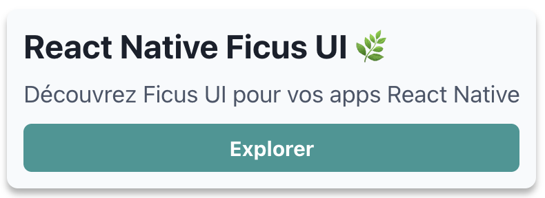
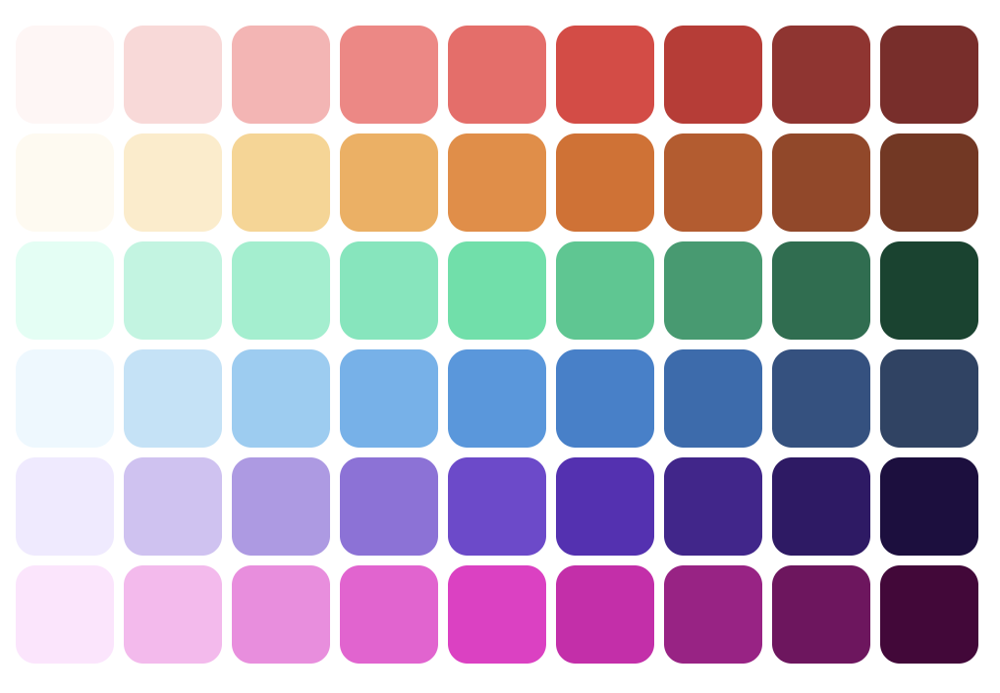
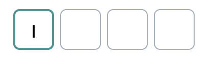
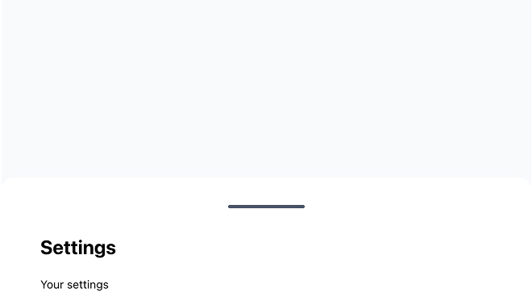
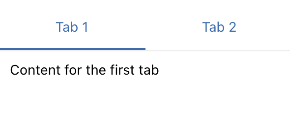

**La conception d’une librairie UI React Native cohérente et maintenable** est un enjeu central dans le développement d’applications mobiles modernes. Depuis de nombreuses années, nous utilisons React Native pour ses capacités cross-platform, qui permettent de cibler à la fois Android et iOS tout en conservant les avantages de React et du mobile natif.  
Cependant, la gestion du style et de l’UI React Native reste limitée par défaut : le framework fournit des composants de base pour structurer les vues, mais peu d’outils pour créer des interfaces mobiles avancées, personnalisables et cohérentes à grande échelle.  
La communauté React Native a rapidement développé des librairies UI pour corriger ces problèmes, mais nous n’avons pas trouvé une librairie qui corresponde à ce que nous utilisons sur React web : [Chakra UI](https://chakra-ui.com/)  
C’est pourquoi nous avons développé au [BearStudio](/fr/) une nouvelle librairie UI open source : [React Native Ficus UI 🌿](https://ficus-ui.com/)

## Pourquoi Ficus UI ?

Nous aimons Chakra UI pour plusieurs raisons : sa simplicité, sa cohérence, et sa philosophie “styled system” qui permet de construire rapidement des interfaces élégantes, accessibles et personnalisables.

Lorsque nous avons commencé à chercher une expérience similaire sur React Native, nous avons découvert qu’aucune librairie ne combinait vraiment ces qualités.

Certaines librairies proposaient des composants riches mais difficiles à thématiser. D’autres offraient de la flexibilité, mais au prix d’une grande complexité ou d’un manque de cohérence entre composants.

**Ficus UI** est née de ce constat : proposer une **expérience Chakra-like pour React Native**, avec une API simple, expressive, et 100 % compatible avec les contraintes du mobile.

## Comparaison avec l'UI React Native “de base”

Avant Ficus UI, la plupart des interfaces React Native étaient construites avec les composants et styles natifs (`View`, `Text`, `StyleSheet.create`).

Cela fonctionne très bien… mais c’est souvent verbeux, peu expressif et difficile à maintenir à mesure que l’application grandit.

### En React Native “classique”



```tsx
import { StyleSheet, Text, TouchableOpacity, View } from 'react-native';

export default function Card() {
  return (
    <View style={styles.card}>
      <Text style={styles.title}>React Native Ficus UI 🌿</Text>
      <Text style={styles.subtitle}>
        Découvrez Ficus UI pour vos apps React Native
      </Text>
      <TouchableOpacity style={styles.button}>
        <Text style={styles.buttonText}>Explorer</Text>
      </TouchableOpacity>
    </View>
  );
}

const styles = StyleSheet.create({
  card: {
    backgroundColor: '#f7fafc',
    padding: 16,
    borderRadius: 12,
    shadowColor: '#000',
    shadowOpacity: 0.1,
    shadowRadius: 4,
  },
  title: {
    fontSize: 24,
    fontWeight: 'bold',
    color: '#2d3748',
    marginBottom: 8,
  },
  subtitle: {
    fontSize: 16,
    color: '#4a5568',
    marginBottom: 12,
  },
  button: {
    backgroundColor: '#319795',
    paddingVertical: 10,
    borderRadius: 6,
  },
  buttonText: {
    color: '#fff',
    fontWeight: '600',
    textAlign: 'center',
  },
});
```

Ce code est fonctionnel, mais il :

- nécessite **un bloc de styles séparé**, souvent redondant,
- rend la lecture moins fluide,
- ne s’adapte pas facilement à un thème ou au mode sombre,
- et complexifie la réutilisation (chaque composant gère ses propres styles).

### Avec Ficus UI

Le même composant, écrit avec Ficus UI, devient beaucoup plus **déclaratif et composable** :

```tsx
import { Box, Button, Text } from 'react-native-ficus-ui';

export default function Card() {
  return (
    <Box bg="gray.50" p="lg" borderRadius="lg" shadow="md">
      <Text fontSize="4xl" fontWeight="bold" color="gray.800" mb="md">
        React Native Ficus UI 🌿
      </Text>
      <Text fontSize="xl" color="gray.600" mb="lg">
        Découvrez Ficus UI pour vos apps React Native
      </Text>
      <Button colorScheme="teal" full>
        Explorer
      </Button>
    </Box>
  );
}
```

**Différences majeures :**

- Plus **aucun StyleSheet** à maintenir : les styles sont intégrés sous forme de props.

- Les **couleurs, espacements et tailles** sont reliés au thème global.

- Le composant est **auto-documenté** : la structure et le style se lisent ensemble.

- Le thème gère **dark mode, responsive et color schemes** sans effort supplémentaire.

En d’autres termes :

> Avec React Native “vanilla”, vous décrivez comment styliser.
>
> Avec Ficus UI, vous décrivez _ce que vous voulez obtenir_.

## Un système de thème puissant et personnalisable

Ficus UI intègre un **système de thème centralisé**, inspiré de Chakra UI, qui définit les couleurs, espacements, typographies, breakpoints et variantes globales de vos composants.

Cela permet de maintenir une cohérence visuelle sur l’ensemble de votre application tout en facilitant la personnalisation de votre design system.



```tsx
import { AppRegistry } from 'react-native';
import { ThemeProvider } from 'react-native-ficus-ui';

import App from './src/App';

// this is our custom theme
const theme = {
  colors: {
    // Use Smart Swatch to generate colors palette <https://smart-swatch.netlify.app>
    violet: {
      50: '#f0eaff',
      100: '#d1c1f4',
      200: '#b199e7',
      300: '#9171dc',
      400: '#7248d0',
      500: '#592fb7',
      600: '#45248f',
      700: '#311968',
      800: '#1e0f40',
      900: '#0c031b',
    },
  },
  fontSizes: {
    '6xl': 32,
  },
  space: {
    xs: 2,
    '5xl': 64,
  },
  // components defaults can also be customized
  components: {
    Text: {
      color: 'gray.100',
    },
  },
};

export default function Main() {
  return (
    <ThemeProvider theme={theme}>
      <App />
    </ThemeProvider>
  );
}
```

## Créez vos propres composants avec `ficus()`

L’un des aspects les plus puissants de Ficus UI est sa fonction `ficus()`, qui vous permet de **transformer n’importe quel composant React Native ou tiers en composant Ficus**.

Cela facilite l’intégration d’éléments personnalisés dans votre design system, tout en bénéficiant des style props.


```tsx
import { View } from 'react-native';
import { ficus } from 'react-native-ficus-ui';

const Circle = ficus(View, {
  baseStyle: {
    borderRadius: 'full',
    bg: 'teal.500',
  },
});

<Circle w="12" h="12" />;
```

En quelques lignes, votre composant adopte toute la puissance de Ficus : thème, responsive, color schemes, etc.

## Concilier React Native et Chakra UI

Ficus UI ne cherche pas à remplacer React Native, mais à **lui ajouter une couche de confort et de cohérence** inspirée de Chakra UI.

Elle conserve donc les **composants natifs que tout développeur React Native connaît déjà**, tout en leur ajoutant la puissance du système de style et du thème.

### Les composants de base que vous connaissez

Plutôt que de réinventer des noms, Ficus UI conserve les mêmes composants que ceux du cœur de React Native :

- `Button` → un bouton stylisé, mais basé sur le `Pressable` natif

- `Pressable`, `TouchableOpacity`, `TouchableHighlight`, etc. → toujours disponibles et compatibles

- `Text`, `Image`, `Input` → inchangés, mais avec **style props** et **thème**

- `Box` et `ScrollBox` → les uniques exceptions volontaires, qui remplacent `View` et `ScrollView` pour correspondre à l’API de Chakra UI

Ainsi, **vous gardez vos réflexes de React Native**, tout en gagnant la syntaxe et la souplesse d’un système inspiré du web.

### Des surcouches utiles à des librairies populaires

En plus des composants de base enrichis, Ficus UI propose des **composants “haut niveau”** qui encapsulent des usages fréquents dans les apps mobiles modernes.

Ces composants s’appuient sur des librairies React Native reconnues, mais avec une API simplifiée, cohérente et thématique.

### `PinInput`



[Tester sur la doc](https://ficus-ui.com/docs/Components/Inputs/pininput)

```tsx
const SimplePinInput = () => {
  const [pinValue, setPinValue] = React.useState(null);

  return (
    <PinInput
      value={pinValue}
      onChangeText={setPinValue}
      keyboardType="number-pad"
      colorScheme="teal"
    />
  );
};
```

Basé sur [https://github.com/retyui/react-native-confirmation-code-field](https://github.com/retyui/react-native-confirmation-code-field)

### `Slider`


[Tester sur la doc](https://ficus-ui.com/docs/Components/Inputs/slider)

```tsx
<Slider colorScheme="teal" defaultValue={0.2} />
```

Repose sur [https://github.com/callstack/react-native-slider](https://github.com/callstack/react-native-slider)

### `DraggableModal`



[Tester sur la doc](https://ficus-ui.com/docs/Components/draggable-modal)

```tsx
const SimpleModal = () => {
  const { isOpen, onOpen, onClose } = useDisclosure();

  return (
    <Box h={500} bg="gray.50" p="xl">
      <Button
        colorScheme={!isOpen ? 'green' : 'red'}
        onPress={() => {
          if (!isOpen) {
            onOpen();
          } else {
            onClose();
          }
        }}
      >
        {!isOpen ? 'Show Modal' : 'Hide Modal'}
      </Button>

      <DraggableModal isOpen={isOpen} onClose={onClose} p="lg">
        <Text fontSize="4xl" fontWeight="bold">
          Settings
        </Text>

        <Text mt="xl">Your settings</Text>
      </DraggableModal>
    </Box>
  );
};
```

Basée sur  [`react-native-bottom-sheet`](https://github.com/gorhom/react-native-bottom-sheet)

### `Tabs`



[Tester sur la doc](https://ficus-ui.com/docs/Components/Layout/tabs)

```tsx
<Tabs initialPage={0} onChangeTab={setIndex} selectedTab={index}>
  <TabList>
    <Tab name="first">Tab 1</Tab>
    <Tab name="second">Tab 2</Tab>
  </TabList>
  <TabPanels>
    <TabPanel linkedTo="first" p="lg">
      <Text>Content for the first tab</Text>
    </TabPanel>
    <TabPanel linkedTo="second" p="lg">
      <Text>Content for the second tab</Text>
    </TabPanel>
  </TabPanels>
</Tabs>
```

- Inspiré de Chakra UI Tabs

- Basé sur `[react-native-tab-view](https://github.com/react-navigation/react-navigation)`

👉 En résumé :

Ficus UI **ne masque pas React Native,** elle **l’enrichit**.

Vous utilisez les composants que vous connaissez déjà, avec une **API plus fluide**, un **thème cohérent**, et des **intégrations prêtes à l’emploi** pour les cas d’usage modernes.

## Responsive et cross-platform par design

Le responsive est souvent un casse-tête sur React Native.

Avec Ficus UI, les style props peuvent accepter des **valeurs par breakpoint**, comme sur le web :

```tsx
<Box bg={{ base: 'gray.100', md: 'gray.300' }} p={[2, 4, 6]}>
  <Text>Layout adaptatif</Text>
</Box>
```

Cela permet de gérer facilement les différences entre téléphones, tablettes, et grands écrans, tout en conservant une syntaxe claire et déclarative.

## Dark mode natif et intelligent

Le **dark mode** est aujourd’hui attendu dans toutes les applications mobiles — il améliore le confort visuel, économise la batterie, et offre une expérience plus personnalisée à l’utilisateur.

Avec Ficus UI, le mode sombre est **intégré nativement** : inutile de gérer manuellement des styles conditionnels ou des thèmes séparés.

### Un thème adaptatif, basé sur les préférences système

Ficus UI détecte automatiquement la préférence de l’utilisateur (sombre ou clair) et adapte dynamiquement les couleurs du thème.

Vous pouvez aussi forcer un mode ou basculer manuellement entre les deux.

```tsx
const { colorMode, toggleColorMode } = useColorMode();

<Button onPress={toggleColorMode}>
  {colorMode === 'light' ? '🌙 Dark mode' : '☀️ Light mode'}
</Button>;
```

Les **color schemes** assurent un contraste optimal et une cohérence visuelle automatique.

## Comparaison avec les autres librairies UI React Native(2025)

| Librairie                     | Points forts              | Ce que Ficus UI apporte en plus                          |
| ----------------------------- | ------------------------- | -------------------------------------------------------- |
| **NativeBase / Gluestack UI** | Complet, riche, maintenu  | API plus proche de Chakra UI                             |
| **React Native Paper**        | Basée sur Material Design | Ficus UI est agnostique, pas limitée par Material Design |
| **UI Kitten**                 | Complet                   | API moins intuitive                                      |
| **Tamagui**                   | Cross-platform performant | API plus proche de Chakra UI                             |
| **Dripsy**                    | Minimal et extensible     | Moins de composants prêts à l’emploi                     |

Ficus UI vise le juste équilibre : **puissant sans être complexe**, **léger sans être limité**, et **familier pour les équipes web + mobile**.

## 🌿 En conclusion

Ficus UI, c’est notre manière de **rendre le développement mobile plus fluide, cohérent et agréable**.

C’est une librairie qui reflète notre philosophie : **des outils simples, composables, et faits pour durer**.

👉 Découvrez-la sur [ficus-ui.com](https://ficus-ui.com/?utm_source=chatgpt.com)

👉 Contribuez sur [GitHub](https://github.com/BearStudio/react-native-ficus-ui?utm_source=chatgpt.com)

Et n'hésitez pas à découvrir nos autres projets open-source :

- [Start UI \[Web\]](/fr/blog/articles/start-ui)

- [UI-State](/fr/blog/articles/pourquoi-on-a-cree-ui-state)
