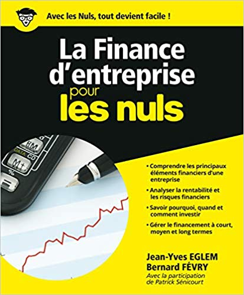

Je pense que vous l’avez tous remarqué mais en 2019 nous nous sommes mis à la communication ! C’est à dire que nous avons embauché Laurie, fucking [masse salariale](/fr/equipe). _BearStudio style_, nous avons bêta testé plein de trucs avec toujours cette touche #nobullshit et sincère qui nous caractérise.

## Pour 2020, on monte d’un cran en communication !

Maintenant, nous avons une stratégie (et surtout un nouveau site internet). De ce fait, nous avons de nombreux sujets de travail dans les tuyaux pour l’année 2020 :

- Publier plus d’articles sur notre blog : au moins 1 par mois !
- Continuer la communication sur les réseaux sociaux mais en adaptant le contenu à chaque canal :
  - De l’entrepreneuriat et du [management](/fr/blog/articles/9-trucs-abstraction-quand-on-manage) sur [LinkedIn](https://www.linkedin.com/company/bearstudio/)
  - De l’[UX](/fr/prestations/ux-design) sur [Instagram](https://www.instagram.com/_bearstudio/)
  - De la tech sur [Twitter](https://twitter.com/_BearStudio)

Choisissez le réseau qui vous convient ou suivez-nous partout pour ne rien louper 😁

Après 4 ans d’existence, nous commençons à avoir **plein de choses à dire sur les Startups** et l’[entrepreneuriat](/fr/blog/articles/rex-4-ans-entrepreneuriat-au-bearstudio). Du coup, nous nous sommes dit que nous allions prendre les plus bavards du BearStudio (Rudy, Ivan et Nicolas Grèverie) pour les faire parler devant une caméra afin de partager leurs connaissances ! Forcément, le tout sera à retrouver sur [notre chaine Youtube](https://www.youtube.com/channel/UC-2hpnhKgU2C_OFucjEN0IA).

## Dans les autres trucs importants et en cours pour 2020

Nous allons également organiser notre première conférence tech à l’international : **LA BEARCON 2020 !** Je ne vais pas trop vous en dévoiler, mais vous devriez bientôt en savoir plus sur cet événement qui sera ensoleillé.

Par ailleurs, nous avons aussi au BearStudio des projets plus ou moins vastes :

- Un produit en développement dont nous allons vous parler d’ici peu
- Et le recrutement d’une **star d’UX** : Ivan Dalmet 🎉 

Quelques idées que j’ai également en tête (et qui ne devraient pas tarder à arriver dans ma liste de tâches) :

- Une formation entrepreneur #nobullshit
- La rédaction d’un livre blanc
- La rédaction d’un livre (tout court)
- Et d’autres surprises !

Pas d’inquiétude, l’équipe va également continuer de **développer les produits de nos clients** avec des réalisations sur lesquelles nous avons déjà travaillé en 2019 mais qui vont évoluer :

- **[Prolicent](https://www.prolicent.com/)**, une plateforme en ligne pour vérifier sa conformité avec le RGPD
- [**Spiwo**](https://spiwo.fr/), une application pour les professeurs afin de gagner du temps dans la correction des copies
- **Mybop**, pour commander et payer à l’avance votre repas pour ainsi gagner du temps

## Pour ma résolution de 2020 en tant qu’entrepreneur

J’ai acheté un livre sur la compta et la finance d’entreprise 😑

D’accord, tous **nos bilans comptables sont positifs**, mais bon ce serait peut-être bien que j’arrête de dire aux comptables “_Non mais je m’en bats les couilles de ce que tu racontes… dis moi combien je dois faire de CA_ !”. Je crois que ça les vexe un peu… (Evidemment, ceci est un petit troll, mais il n’en reste pas moins vrai qu’il faut que j’apprenne à mieux les connaître)

---

P.S. : Si jamais vous n’aviez pas encore compris, 2020 sera l’année où il sera indispensable de nous suivre sur les réseaux sociaux pour votre veille technique et pour profiter de toutes nos bonnes idées. L’inscription à la newsletter sera également prochainement disponible !
