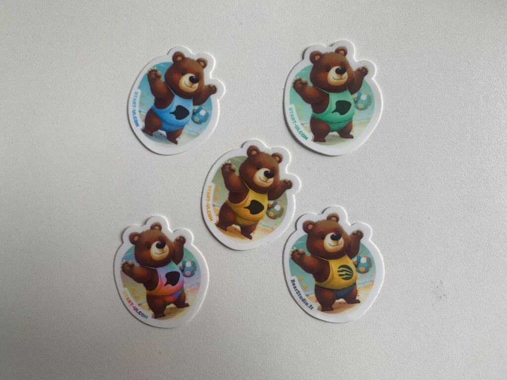
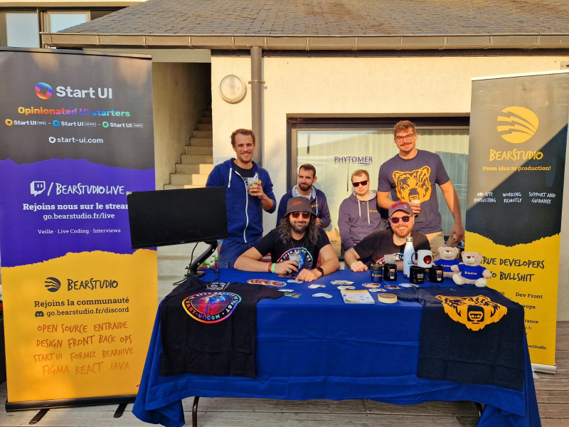
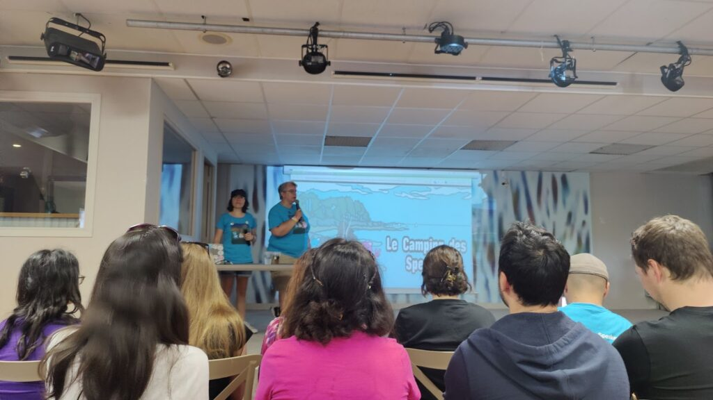
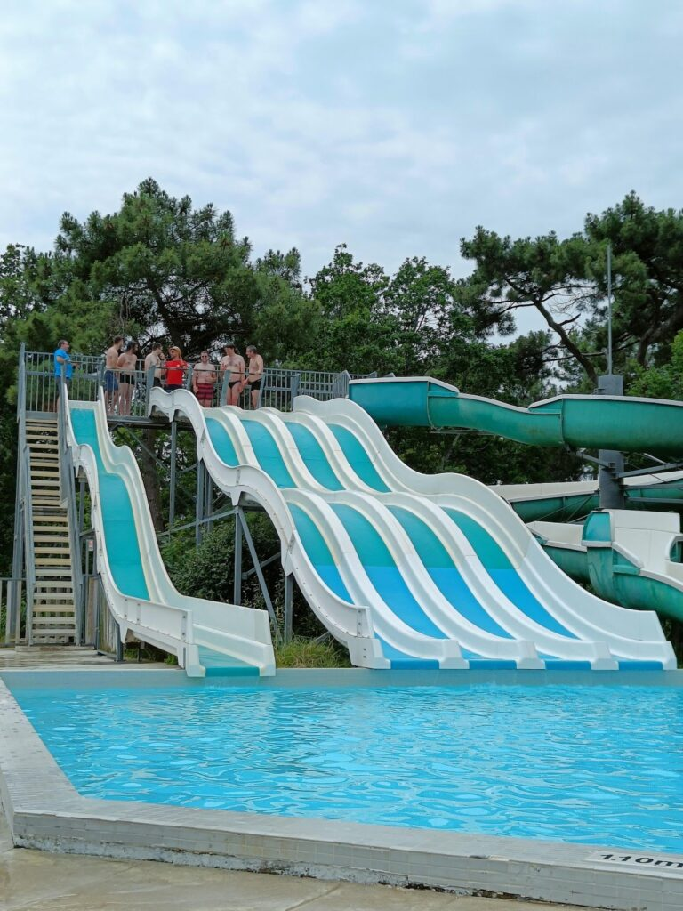
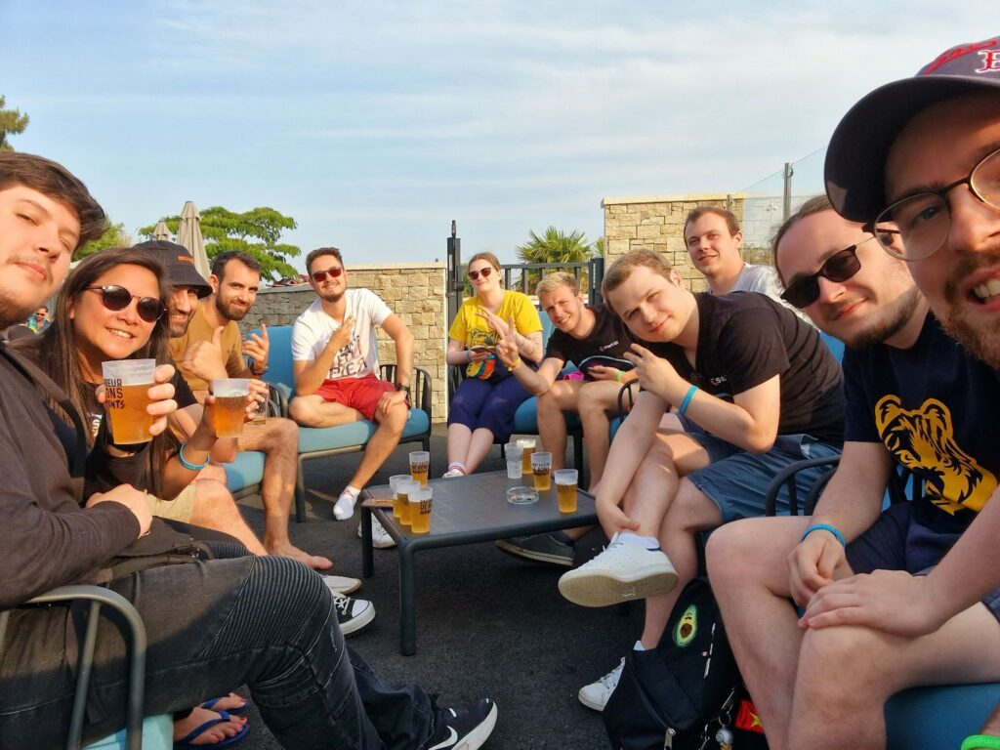

Les 15 et 16 juin derniers, l'équipe du BearStudio a eu l'occasion de participer à une expérience unique : le [Camping des Speakers](https://camping-speakers.fr/). Dans cet article, nous partageons notre expérience et les moments marquants de ces deux jours de conférences techs dans un camping en Bretagne.

## Le Camping des Speakers : Une conférence tech atypique

Le Camping des Speakers est une conférence qui se déroule, comme son nom l’indique, dans un camping, en Bretagne. Au-delà de sa localisation, elle se démarque aussi par son ambiance bon enfant poussée par les organisateurs. En effet, bien qu’on puisse y suivre des talks « classiques », on y retrouve aussi des talks plus originaux qui prennent place partout dans le camping ! On a notamment pu jouer au Möbkky, une variante « mob programming » du Mölkky, ou faire du toboggan pour schématiser des pipelines !

De plus, le BearStudio étant sponsor de l’édition 2023 du Camping des Speakers, nous avions à notre disposition un stand sur lequel nous avons pu présenter l’entreprise et faire découvrir [Start UI](https://start-ui.com/), notre starter open source de projet front.

## Le Stand : Rencontrer, échanger et partager notre passion

Qui dit stand dit goodies ! Nous avons réuni nos plus beaux goodies pour les partager avec les personnes présentes, et nous avons même concocté des stickers spécialement pour l’événement.

<figure>

<figcaption>

Les stickers des ours au camping !

</figcaption>

</figure>

Toute l’équipe était prête à accueillir les intéressés, discuter avec eux, et même leur présenter Start-UI en live.

Ce stand nous a permis de rencontrer beaucoup de gens, de revoir des personnes déjà rencontrées à d’autres événements, et tout ça dans une bonne ambiance et sous le soleil breton ! (oui oui vraiment !!)

<figure>

<figcaption>

Une partie de l'équipe derrière son stand

</figcaption>

</figure>

## Les conférences : Un kaléidoscope de sujets tech captivants

Avec plus de 50 speakers, le Camping des Speakers nous a offert une riche diversité de sujets passionnants. Des présentations sur les technologies utilisées au quotidien, comme l’IA avec une conférence sur le Speech to text ou des retours d'expérience inspirants, mais aussi des moyens originaux de faire comprendre des choses de notre quotidien dans la tech. Nous avons pu par exemple faire du minigolf avec altération de fonctions pour comprendre l’importance de l’accessibilité pour tous ou encore des descentes de toboggan dans la piscine pour illustrer les concepts de jobs et de pipeline parallèles. Les formats variés ont permis à chacun de trouver des conférences correspondant à ses intérêts, tout en favorisant le partage des connaissances et des expériences.

## L’avis des ours : Qu’en ont pensé les experts du BearStudio ?

### [Passez moins de temps à attendre la CI et plus de temps au bord de la piscine](https://camping-speakers.fr/sessions/passez_moins_de_temps_a_attendre_la_ci/) - Jean-Phi Baconnais & Guillaume Membré

“J’étais dans la piscine, j’ai fait du toboggan pour démontrer les concepts de job et pipeline parallèles et dépendants et ça c’est vraiment une très bonne manière d’apprendre de nouvelles choses !”  - [Yoann Fleury](/fr/equipe/yoann-fleury)

_“C’est la seule conf que j’ai fait de ma vie où j’ai joué le rôle d’un job d’une CI le tout dans un toboggan d’une piscine, ça n’arrive qu’au camping des speakers”_ \- [Ivan Dalmet](/fr/equipe/ivan-dalmet)

### [Corn Hole 2 Turbo : De l'arduino pour l'apéro !](https://camping-speakers.fr/sessions/corn_hole_2_turbo/) - Paul Roye

_“Super intéressant d’autant plus que pour des side projects ou des projets persos, on a les mêmes problèmes qu'en pro ! (Faire un MVP vraiment minimaliste, toujours tester, etc...). On apprend tout en jouant à un jeu d’adresse, il n’y a rien de mieux”_ \- Dorian Delorme

### [🗣️ Zut ! J'aurais dû dire ça ! 🙊 Astuces pour parler avec aisance en public 🎙️](https://camping-speakers.fr/sessions/astuces_pour_parler/) - Willy Malvault & Sylvain Coudert

_“C'est pas un sujet tech et il y a d’autres conférences appréciées et mais j'ai vraiment bien aimé leur approche et leurs explications, c'était vraiment cool !”_ - Florian Gille 

### [Vous pouvez venir à ce talk les yeux fermés](https://camping-speakers.fr/sessions/vous_pouvez_venir/) - François-Xavier Lair

_“J’ai pu découvrir l’utilisation d’un site web ou d’une app web avec un lecteur d’écran pour la 1ere fois de ma vie et j’ai pris conscience du chemin qu’il y a encore à parcourir pour faire des apps vraiment accessibles ! Et en plus j’ai appris des choses sur le HTML (l’utilisation d’un attribut alt vide sur une image par exemple, ça a une vraie utilité et je l’ignorais) donc c’était super !”_ - Fabien Essid

*“J'avais pu voir à codeurs en seine(lien) une conf similaire mais on avait l'écran du pc pour voir le site, et donc forcément on a tendance à regarder pour mieux comprendre le lecteur d'écran. La le fait que ce soit sans slides, on se rend vraiment compte de ce que représente l'utilisation d'un lecteur d'écran et à quel point c'est difficile quand le site n'est pas accessible”* \- Charlelise Fouasse

### [Mini golf pour une accessibilité numérique maximale](https://camping-speakers.fr/sessions/mini_golf_pour_une_accessibilite/) - Hervé Boisgontier

_“Un format hyper sympa ou l’on a fait une partie de croquet/minigolf qui permettait derrière de se mettre vraiment dans la peau d’une personne en situation de handicaps, et de se rendre compte qu'il y a plein de choses qu'on oublie quand on dev…”_ \- [Dylan Campbell](/fr/equipe/dylan-campbell) 

### [Möbkky, le mob appliqué au Mölkky](https://camping-speakers.fr/sessions/mobkky_le_mob_applique_au_molkky/) - Benoît Masson & Gwendal Leclerc

_“L’idée de montrer l’intérêt du mob programming par le Mölkky était une idée très intéressante et pédagogique, ajouté à ça la bonne ambiance du jeu en lui-même, c’était un super moment !”_ \- [Hugo Pérard](/fr/equipe/hugo-perard) 

---

En somme, au-delà de ces conférences grâce auxquelles chacun a pu repartir avec de nouvelles connaissances, ce Camping des Speakers était aussi l’occasion de partager de bons moments dans un contexte original. Nous avons notamment pu faire une partie de pétanque et passer quelques moments dans la piscine. Et cela nous a permis de revenir avec quelques anecdotes croustillantes.

