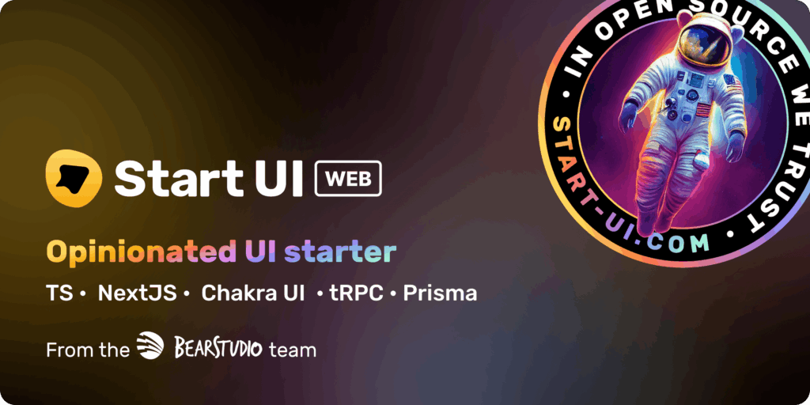

_Faire un side project est le meilleur moyen d'apprendre et s'amuser en même temps. Laisse moi t'expliquer pourquoi !_

Si:

- Toi aussi tu as au moins une vingtaine de repos sur GitHub. Ils contiennent (et c'est déjà exceptionnel) juste un README.md qui dit que c'est en cours de dev. Pourtant, ça fait plus d'un an que tu n'as pas mis le nez dedans.
- Toi aussi tu es hyper hypé par un sujet pendant 1 semaine. Puis une nouveauté arrive et ce sujet tombe dans l'oubli aussi vite qu'il est arrivé.
- Toi aussi, parmi ces sides projects aucun n'est parti en prod (et je parle pas d'une prod avec que ta famille ou tes collègues dedans, ça compte pas ^^).
- T'as acheté un nom de domaine pour 1 an mais t'as encore rien mis dessus.

**Alors t'es un goat ! Sinon, regarde pourquoi tu devrais te lancer dans un side project 😄.**

## Pourquoi tu devrais faire des sides projects ?

Je fais parti de ceux qui pensent que c'est impossible de devenir bon dans un domaine sans avoir passé pas mal de temps à pratiquer.

C'est pas en binge watchant des tutos sur youtube, en lisant une tonne d'articles sur un sujet que tu vas devenir un expert dans celui-ci. Au mieux tu comprendras des concepts, tu pourras te faire un avis (et encore, ton avis sera biaisé par les sources que tu auras consulté). Mais quand faudra mettre les mains dans le cambouis tu te rendras compte que tu ne sais rien !

Faire ça, c'est le meilleur moyen pour devenir cette personne qui te fait la morale sur "les bonnes pratiques" ou qui dit qu'une techno c'est de la merde par rapport à une autre parce-qu'il a vu 3 vidéos dessus et lu 6 posts sur X.

Ne fait pas ça — c'est le meilleur moyen pour passer pour un con auprès de tes collègues et de perdre en crédibilité.

Rappelle-toi qu’un side project pour apprendre et s’amuser te permet de te confronter à de vrais problèmes et d’acquérir de l’expérience rapidement.

Après on ne va pas se mentir. Ne pas être motivé, ne pas trouver de sujet, ne pas avoir envie, ça nous arrive à tous. Plusieurs fois je me dis "ah tiens, je testerais bien de faire un truc comme ça". Puis je regarde 15 000 tutos sur le sujet et je repousse toujours le moment où il faut vraiment init un projet pour réellement tester, alors que c’est le meilleur moyen de se faire un vrai avis.

Du coup, fort de mon expérience de projets entamés (dans le meilleur des cas) et jamais terminés (tout le temps), je vais vous donner mes tips pour pouvoir mettre les mains dans le cambouis rapidement 😄.

### 1. C'est ok de regarder des tutos

> Wtf il viens de dire l'inverse 2 lignes au dessus...

Je vais compléter: c'est ok de regarder des tutos si **tu mets en pratique rapidement ce que tu viens de voir**, quitte à le faire en parallèle. Il faut savoir se dire allez go, je prend une idée de projet et je me lance avec ce que je viens de voir.

Le fait de commencer rapidement ton projet va te permettre de rencontrer des vraies problématiques qu'il te faudra corriger ou contourner. Ça te permet de focus sur des vrais problèmes de la vraie vie (et d'éviter de regarder un tuto sur comment mettre en place un load balancer alors qu'à la base tu voulais des pistes pour faire de l'authentification). Focus !

### 2. Pas d'idées ? Tkt

Une excuse pour ne pas commencer à coder rapidement c'est de ne pas avoir de sujet, ou de ne pas avoir d'idée originale/révolutionnaire.

#### Mettons les choses au clair tout de suite:

- 90% du temps, quand tu auras une idée quelqu'un aura déjà fait la même chose
- Cette même idée est souvent déjà mieux développée que ce que toi tu avais en tête initialement, et a potentiellement déjà des milliers d'utilisateurs.

#### Ça ne doit pas te décourager.

Continue avec ton idée, on s'en fout que quelqu'un l'ai déjà fait en mieux, que ce soit déjà un produit. C'est justement parce que ce projet te motive que ça te permettra d'aller loin et d'apprendre.

Si vraiment c'est un problème, quelques idées (classiques) si tu manques d'inspiration:

- [Build your own X](https://github.com/codecrafters-io/build-your-own-x) (il y a des sujets un peu énervés, mais c'est super intéressant et ça sort des projets un peu bateau).
- Une todolist (et ouais, j'm'en fous moi, je trouve que c'est un bon projet qui peut être rapidement fonctionnel et sur lequel tu peux ajouter pleins de choses si t'es motivé).
- Un racourcisseur d'url.
- ...

Si ça ne te convient pas, trouve un sujet que tu aimes, une passion que tu as, un point de frustration que tu rencontres tous les jours et vois comment tu peux développer un truc qui t'aiderai; c'est d'autant plus motivant si c'est un sujet qui te tient à coeur.

### 3. Fais du code crado, fais des erreurs, utilise des templates

Le but c'est de s'éclater ! donc si tu veux pas passer 15 ans à faire un code ultra clean, mais que ton projet n'est toujours pas sorti ça vaut pas le coup.

C'est ok  d'avoir un truc pas super propre mais qui fonctionne; tu seras déjà allé plus loin que 80% des devs qui init un side project (je suis inclu dans ce pourcentage 👅).

Perso ce qui me décourage la plupart du temps, c'est toute la phase de setup nécessaire avant de se plonger dans ce qui est vraiment intéressant; pour éviter ça je te recommande vivement de partir d'un template (même minimaliste) qui t'évitera de te re-taper le même setup de projet en projet.

Ptit tip: faire ton template peut aussi être une idée de side-project 😉.

**Instant promo:** au Beartudio on a un starter production ready que j'utilise pour setup quelques-uns de mes side projects: [StartUI [web]](/fr/blog/articles/start-ui).  Je te recommande vivement d'y jeter un coup d'oeil si tu aimes la stack react/typescript !

## Pour conclure

Soyons bien d'accord, tout ce qui est dit au dessus est mon avis. Pour moi, le principal but d'un side project, c'est pour apprendre et s’amuser. C'est le meilleur moyen d'apprendre sans même s'en rendre compte 🙌.

Bref, ayez du fun dans ce que vous faites !
