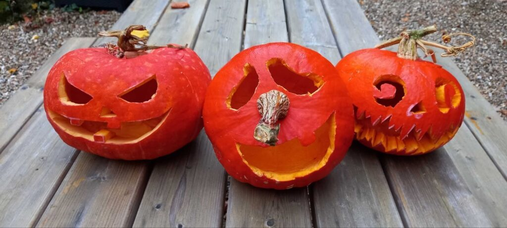
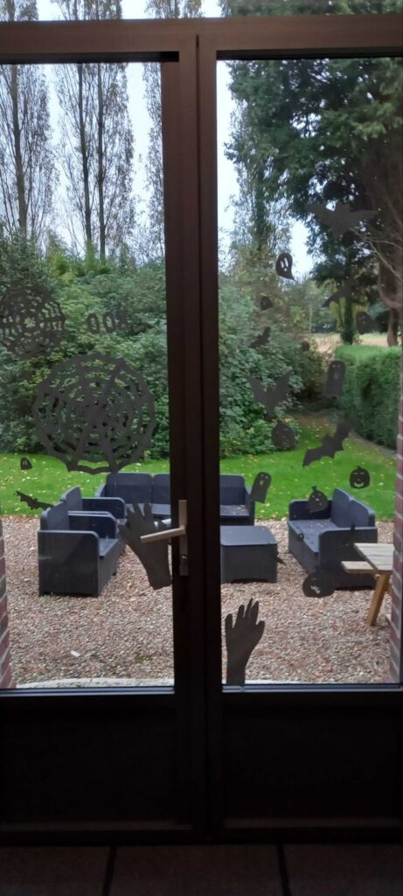

Autumn settles in, the days grow shorter, and darkness creeps in a little earlier behind our screens. The cold slips between two commits, and the first shivers set in. Hard to tell if they come from the icy wind or a bug in production.

Between ghost lines (the ones that trigger an error on line 45 even though that line doesn't even exist), and trickster bugs playing pranks on us... the scene was already set.

So here's a brief look back at October at [BearStudio](https://www.bearstudio.fr/). Where the Halloween spirit took control of the team's den. But since we're not the type to let ourselves be haunted, we also took the opportunity to keep spirits high, creativity flowing, and add a touch of eco-friendly decorating with recycled materials.

## 1. Pumpkin Carving Workshop

##### Week of October 6-13

First step: the traditional **pumpkin carving!**
Under the last rays of October sunshine, we set up outside, armed with knives, spoons, and varying levels of courage depending on the participant.
Some pumpkins became true works of art... others, unhandled exceptions.

"Nothing is lost, nothing is created, everything is transformed": the leftovers were recycled — not into a carriage (we couldn't find the right _framework_ for that) — but into a delicious **pumpkin soup** to warm us up.
And for those with a sweet tooth: **pumpkin-cranberry mini cakes**. Like Rust, it was divisive: some loved it, others preferred not to re-run the script. For the curious, you can check out Yoann's article [here](https://www.bearstudio.fr/blog/developpement/rust).

  

  

## 2. Decoration Workshop

##### Week of October 13-20

Second phase: **Halloween decorations.**
After a brief _Instagram inspiration_ session (and a few critical failures), we finally got the hang of it.
Tip of the day: gluing with water is eco-friendly... but it has a mind of its own and requires a bit of patience to hold! A bit like testing a new code snippet: sometimes it works on the first try. And sometimes you need to tweak a few details for everything to fit together perfectly.

  

  

  

### 3. Garland Workshop

##### Week of October 20-27

Time for **creative recycling!**
Toilet paper rolls, scraps of colored paper, a marker, and a piece of string later. And there you have it — an army of little ghosts, pumpkins, bats, and other strange creatures ready to invade the office.
Some characters looked terrifying, others... a bit too cute to be scary.
But the spooky vibe was there between two coffees and three commits on _Lea English_ (you can read the UX case study [here](https://www.bearstudio.fr/blog/design-css/lea-english-etude-de-cas))!

## 4. Werewolf Night

##### October 30

No full moon without **Werewolf!**
Everyone under their blanket with a hot chocolate or their dinner. Connected on the [Wolfy](https://wolfy.net/fr) website for an evening full of digital betrayals and intense debates about "who's the werewolf?", "who will be the mayor?", or "who's Cupid? We have scores to settle...".

And a little round of GarticPhone that had nothing to do with Halloween to end things on a high note (drawings made with a trackpad and questionable talent that made us laugh even harder!).

In short, a packed October at BearStudio: pumpkins, code, laughs, and a few scares... but above all, a team of bears that knows how to turn _bugs_ into candy and _pull requests_ on [Start UI](https://www.bearstudio.fr/blog/actualites-web-numerique/start-ui) into moments of sharing.

