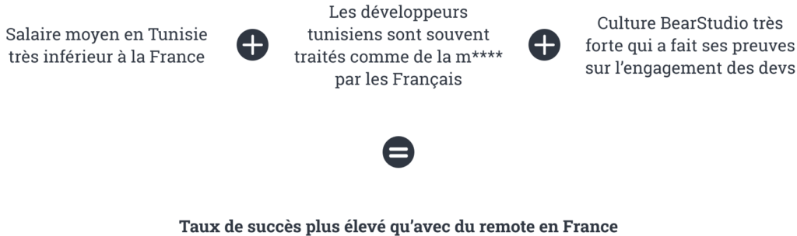
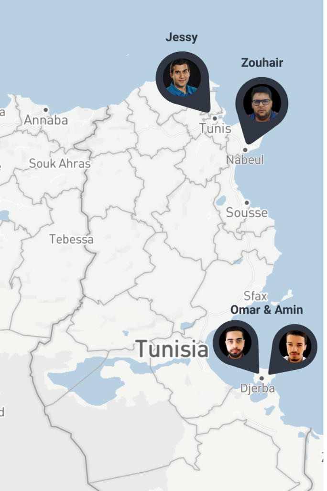
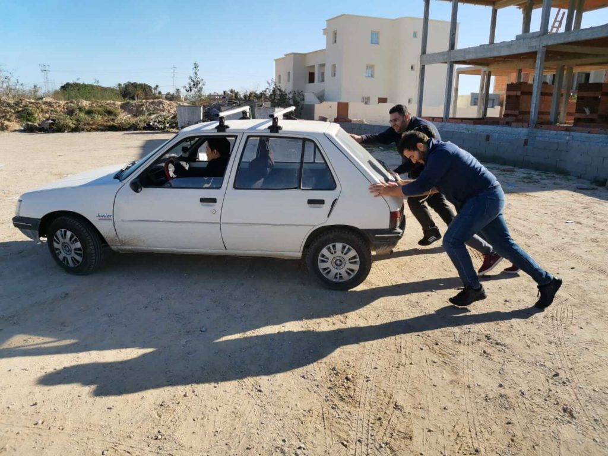

_Note : l'écriture de l’article a commencé avant la pandémie mondiale. Si seulement je m’étais bougé pour le sortir avant… j’aurais été tellement visionnaire !_

Bon ce n’est pas un vrai coming-out car on l’a toujours assumé. On a juste jamais pris le temps de communiquer là-dessus. En plus, un bon titre putaclic c’est toujours bon pour le taux d’engagement 🤪. Alors voilà : depuis 2 ans, certains de nos développeurs travaillent en Tunisie.

## Remote VS Outsourcing

En théorie, le remote c'est du télé-travail au sens où les salariés concernés travaillent hors des locaux de l'entreprise, tandis que l'outsourcing consiste à externaliser certaines tâches auprès d'un prestataire spécialisé.

Mais les gens voient généralement ça un peu différemment : le **remote** revient grosso modo à embaucher des développeurs à distance pour éviter de payer un bureau ou parce qu’ils sont suffisamment en position de force pour se permettre de travailler de chez eux.

De même, l'**outsourcing** est perçu comme un moyen de faire travailler des esclaves gens moins "compétents" et chers que les français qu’on peut jeter quand on veut. Cette vision peut d'ailleurs être transposée aux développeurs français par rapport aux managers ou _serial success_ entrepreneurs 18.0 avec un mental de winner !

## La réalité du marché

Dans le milieu du développement, l’avenir c’est le remote ! Entendons-nous bien, ce n’est pas une philosophie ou un choix, c’est le marché qui est comme ça. A partir de là, il faut s’y préparer.

Le problème c’est qu’un mauvais recrutement peut être fatal et que ça coûte cher… De la même manière qu’[au démarrage du BearStudio](/fr/blog/articles/rex-4-ans-entrepreneuriat-au-bearstudio), plutôt que de me battre sur une envolée de salaires pour des développeurs toujours plus exigeants mais pas forcément plus compétents (voire même nuls et surcotés... je ferai un papier là-dessus un de ces quatre…) j’ai choisi de **créer de la valeur avec des gens qui en ont envie** et besoin !

**Donc si on essaye d’analyser ça mathématiquement :**

On a beau être une boîte atypique, on reste fragile financièrement, on ne peut pas se permettre d'échouer dans nos expérimentations !

## Pourquoi la Tunisie ?

Il faut bien commencer quelque part et dans ces moments-là on fait avec ce qu’on a.

### Raisons perso

Il se trouve que la moitié de ma famille est tunisienne et que je connais un peu là-bas. En plus j’ai 2 petit neveux que je vois trop rarement. Je ne vais pas vous sortir la carte de l’entrepreneur trop occupé pour sa famille c’est des conneries pour se donner bonne conscience. En revanche, rapprocher mon business et ma famille éloignée me donne plus d’opportunités de les voir.

### Raisons pro

Il y a des bons ingénieurs là-bas, et une certaine proximité avec la France. C’est aussi un pays qui essaye de sortir d’une crise. En plus, on propose une offre différente de la concurrence.

## L'historique des recrutements

Actuellement nous avons 3 développeurs tunisiens.

[Amine](/fr/equipe/mohamed-amin-ziraoui) a été le premier à me suivre dans l’aventure. Je l’ai rencontré grâce à un [espace de co-working](https://cozi.tn) à Djerba et il a prononcé quelques mots magiques : 

- “[Jhipster](https://www.jhipster.tech)” : beaucoup connaissent la relation particulière que le BearStudio entretient avec ce framework
- “[Angular](https://angularjs.org)” : à l’époque c’était encore un mot magique... 
- “Non, je ne sais pas faire” : alors que j’avais peur de tomber sur des développeurs disant oui oui à tout pour obtenir le poste…

Puis [Omar](/fr/equipe/omar-borji), toujours à **Djerba** nous a rejoints après avoir assisté à une conférence sur [ReactNative](https://reactnative.dev) animée par [Nicolas Torion](/fr/equipe/nicolas-torion).

Et enfin [Zouhair](/fr/equipe/zouhair-mkassmi), en remote depuis **Nabeul**, via une recommandation d’un ancien professeur de fac d’Amine.

## Comment ça marche ?

### L'appartenance à la team

Les développeurs tunisiens **sont des membres à part entière de [l’équipe](/fr/equipe) !** Je ne peux pas donner plus d’explications que pour quelqu’un en France.  
Que ce soient les développeurs, les commerciaux, les UX designers ou l'assistante administrative, tout le monde fait le _daily meeting_, travaille sur les projets, communique avec les clients, a accès à toutes les informations de la société, etc.

### L'aspect financier

Les développeurs tunisiens sont payés un peu au-dessus du **salaire moyen dans l’IT en Tunisie**. Ce qui leur permet de vivre correctement dans leur pays, de rester proches de leurs familles et de ne pas piller l’une des “ressources” importantes et bénéfiques du pays.  
Aucune gêne à ça, comme je l’ai indiqué plus haut, c’était un test, notre société étant encore jeune et fragile. A l'avenir, il est probable que leurs salaires finissent par se rapprocher des salaires français. Si la société peut se le permettre et qu’ils font le job qui mérite le salaire, ça semble logique et intelligent **pour fidéliser des développeurs dans un contexte très compétitif.**

## Qu'est-ce que ça apporte ?

Évidemment, de la **capacité de production** et une meilleure rentabilité sur les projets. Du côté des Tunisiens, c'est l'occasion pour eux de prendre part à des projets à l'international au sein d'une équipe où tout le monde les traite d'égal à égal.

Deuxième évidence, une **diversité culturelle**, au BearStudio on ne passe pas forcément notre temps à le mettre en avant mais c’est quelque chose qui nous tient à cœur.

Mais encore : des aventures humaines ! Pour créer des liens et garder une **cohésion d’équipe**, les gens en France doivent rencontrer les gens en Tunisie une fois par trimestre (bon la pandémie complique les choses mais on arrive quand même à se rencontrer en physique…). Il faut dire que mélanger un [beauf d’Auvergne](/fr/equipe/nicolas-torion) avec un [bledard de Sfax](/fr/equipe/mohamed-amin-ziraoui), ça forge des souvenirs…

<figure>

<figcaption>

_Les gars poussant la 205 dans le désert_

</figcaption>

</figure>

Ca nous permet aussi d'améliorer nos **capacités à travailler en asynchrone**. Post-covid, j’ai plus vraiment besoin d’expliquer l’importance d'être capable de faire du remote…

De l’expérience pour un **futur** (pas si futur que ça…) développement à l'international 😉.

Enfin, essayer d’aider, avec nos petits moyens et à notre niveau, la Tunisie à sortir de la crise économique et faire avancer la communauté tech.
