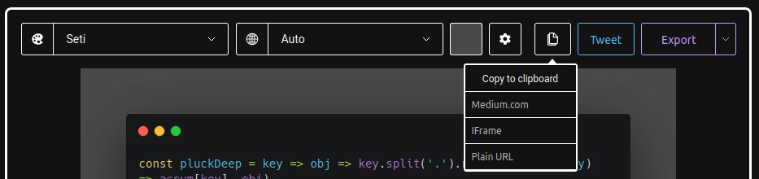

## Pourquoi optimiser les images de son site ?

Optimiser les images d’un site web, ça sert à quoi au final ? Des juniors se sont peut être déjà posés la question. La réponse est plutôt simple : **accélérer le chargement du site, et [avoir un meilleur référencement](/fr/blog/articles/checklist-seo-technique).**

Donc l’optimisation des images n’affecte pas seulement le site, mais aussi son accessibilité. De plus, sachant que les images représentent une grand partie de son poids, il est important de ne pas négliger cet aspect afin d’optimiser les performances de son site.

## Évaluer les performances de son site

[GTmetrix](https://gtmetrix.com/) est un outil simple à utiliser qui permet d’évaluer les performances de son site. En fonction des résultats, GTmetrix propose des outils et des méthodes pour améliorer celui-ci

Le rapport fourni par Gtmetrix se compose de cette façon :

- On a 2 scores différents, qui nous donne notre note GTmetrix :
  - La performance de la page
  - La structure, qui indique si notre page est construite de façon optimisée
- Pour aller dans les détails, le rapport indique aussi :
  - Le LCP (Largest Content Paint), qui indique le temps que la page met à charger
  - Le TBT (Total Blocking Time), qui indique combien de temps met la page à être interactive
  - Le CLS (Cumulative Layout Shift) est un score représentant la stabilité de la page pendant son chargement

Juste en-dessous de cet élément, on a un rapport plus détaillé, avec différents onglets.

## La compression des images

Une façon d’optimiser les images d’un [site web](/fr/blog/articles/arretez-de-vous-faire-avoir-par-votre-agence-digitale), c’est de les compresser. Plusieurs sites se sont spécialisés dans ce genre de service, pour différents formats.

**Fun Fact :**

_Ces sites ne compressent pas l’image au sens propre du terme, mais optimisent l’encodage de l’image. La taille de l’image n’est donc pas réduite, mais les informations qui ne sont pas nécessaires, comme par exemple les métadatas, sont supprimées._

Deux sites pour les compressions d'images :

- [Tinyjpg](https://tinyjpg.com/)
- [Tinypng](https://tinypng.com/)

## Afficher le terminal sans problème

Comment afficher un terminal sans que l’image soit floue ou de mauvaise qualité ? C’est une problématique à laquelle nous nous sommes confrontés au Bearstudio lors de la [rédaction d’articles](https://www.bearstudio.fr/blog).

Avant de trouver une solution, on faisait seulement une capture d’écran, mais la qualité dépendait du PC sur lequel on se trouvait, ce qui rendait le résultat trop aléatoire.

Mais maintenant, on utilise un nouvel outil : [Carbon](https://carbon.now.sh/)

Avec cet éditeur, il est possible de **personnaliser la police, la couleur du texte et la couleur du fond**. D’autres paramètres sont disponibles pour changer l’apparence du terminal.

L’image est ensuite téléchargeable en 2 formats : SVG et PNG. Une fois l’image téléchargée, il ne faut pas oublier d’optimiser l’image.

_PS : il est aussi possible, au lieu de télécharger l’image, de générer un lien ou une iFrame (une balise HTML intégrant du contenu venu d’une autre page)._

_[Grégoire Protas](https://www.bearstudio.fr/team)_
