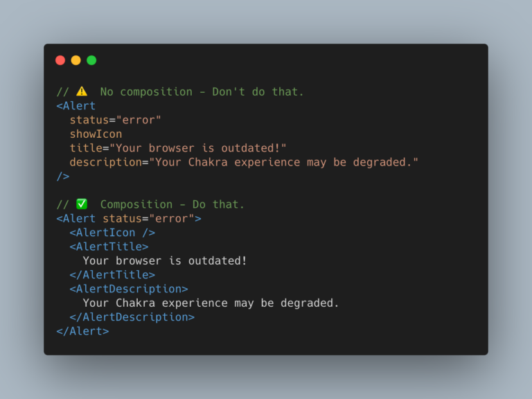

⚡ [Chakra UI](https://chakra-ui.com/) est un **projet Open Source** qui permet de simplifier l’écriture d’[interfaces utilisateurs](/fr/prestations/ux-design) avec [React JS](https://reactjs.org).

Dans ce domaine il existe déjà beaucoup de librairies Open Source comme [Material UI](https://material-ui.com/) ou [Reactstrap](https://reactstrap.github.io/)

Alors pourquoi ⚡ ️Chakra UI ?

## API de composition

Chakra UI propose une **approche utilitaire** dans l’esprit de [Tailwind CSS](https://tailwindcss.com/) mais dans l'écosystème React. 

La librairie ajoute à l’approche utilitaire la notion de [composition](https://epicreact.dev/soul-crushing-components).

La composition est un des **patterns** les plus importants dans le développement UI moderne. Elle permet d’éviter de créer des composants qui se transforment rapidement en monstruosités et de **combiner souplesse et réutilisabilité**.

## Accessibilité

Par défaut, tous les composants de Chakra UI sont disponibles. Et surtout la librairie permet d'implémenter ses propres composants en les rendant accessibles.

Gestion du focus, navigation au clavier, gestion des attributs [ARIA](https://developer.mozilla.org/fr/docs/Accessibilit%C3%A9/ARIA/Techniques_ARIA) et autres bonnes pratiques [UX/UI](/fr/prestations/ux-design) font partie intégrante de la librairie.

## Gestion du thème

Chakra arrive avec un thème de base déjà bien configuré. Mais la puissance de la solution vient du fait que changer le thème est un jeu d’enfant !

Cela permet de pouvoir gérer le fameux **Dark Mode** mais pas seulement.

Par exemple, sur le site de [Codeurs en Seine](/fr/blog/articles/codeurs-en-seine-2019-des-devs-de-lux-et-de-lagilite), tout le site change de thème entre la partie [conférence annuelle](https://www.codeursenseine.com/2020) et la partie [meetups](https://www.codeursenseine.com/meetups). On peut voir que l’ensemble des composants (navigation, boutons, etc…) change sans pour autant avoir à les réécrire ou devoir charger une autre feuille CSS.

Si vous souhaitez générer rapidement des couleurs compatibles avec Chakra UI, je ne peux que vous conseiller [Smart Swatch](https://smart-swatch.netlify.app/) 😉 (c’est d’ailleurs ce que conseille également la [documentation de Chakra](https://chakra-ui.com/docs/theming/theme) 😛).

## Communauté

En dehors de l’aspect technique, le créateur [Segun Adebayo](https://twitter.com/thesegunadebayo) et tous les contributeurs sont très accessibles et bienveillants. Participer au projet est donc super simple et avec mes petites modifications apportées, je fais aussi partie des [contributeurs](https://chakra-ui.com/team) 😇

## Conclusion 

Comme vous l’aurez peut être compris, je ne peux que vous recommander d’aller faire un tour sur la **documentation** de la version 1.0 qui vient de sortir au moment où j’écris ces mots.

Documentation de la version 1.0 [https://chakra-ui.com/](https://chakra-ui.com/)
