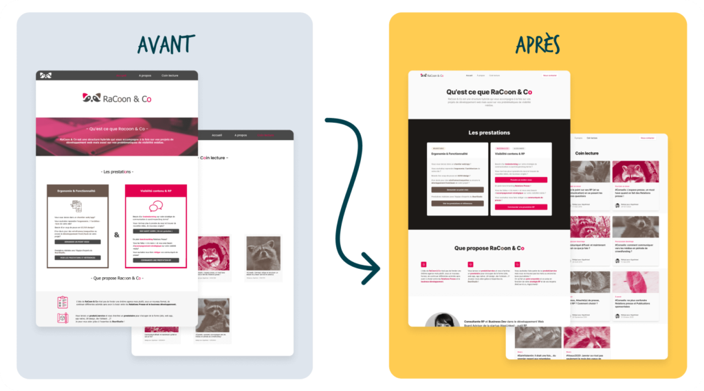

_On a demandé à Maxime et Delphin, respectivement alternants à l’époque en UX design et en Front-end au BearStudio, de se faire la main en totale autonomie sur le site d’une amie du BS (RaCoon & Co)… Évidemment tout ne s’est pas passé comme prévu et ils en ont chi…sué !_

_Nous sommes même allés jusqu’à pousser le vice et leur demander de nous pondre un petit article sur cette expérience 😈 : enjoy!_

## L’objectif : créer un site web en autonomie

Nous devions créer une landing page pour RaCoon & Co, ce qui en soit, normalement, devait être une formalité... Raté ! Nous avons passé le double du temps imaginé (1 semaine) et nous avons rencontré 1001 problèmes (taille des images, espacements inconsistants, UX (expérience utilisateur) générale, fichiers CSS lourds car le responsive était dur à gérer, etc). 

Nous finissons l’UX et le dev de cette landing page dans le délai imparti (qui au final avait été repoussé ^^) presque fiers de nous… Et prêts à présenter notre travail au reste de l'équipe.

Puis, à l’occasion d’une démo interne c’est la douche froide :

*“Euuuuhh vous avez passé combien de temps sur ce que vous nous présentez ? Mais les gars : il y avait beaucoup plus simple. Et notamment une solution qui vous aurait évité tous les problèmes que vous avez rencontré !  Facilitez-vous la vie bon sang !! … Et puis, tant qu’on y est, allez hop vous nous reprenez tout ça depuis le début. Et avec une deadline encore plus serrée pour le goût du challenge ! *Ça vous fera les pieds 😅 !! Mais n’oubliez pas que ce n’est pas une punition, c’est pour la bonne cause : vous former !!!_\_\_”_

### Plan d’attaque

Suite à cette démo en équipe, on nous “recommande” (on ne va pas se mentir si on ne partait pas sur ça… C’était la fin) une librairie nommée “Tailwind UI” et pour le développement : Next JS.

Le principe de Tailwind UI est de composer une page à l’aide de “composants” déjà pré-créés (templates) puis de l’adapter - tout simplement - aux contenus de RaCoon & Co.

*Rapidement on en profite pour vous  présenter un peu mieux ces technos puis on revient à notre histoire :* 

[_Tailwind UI_](https://tailwindui.com/) _est une bibliothèque de composants créée par les développeurs de [Tailwind CSS](https://tailwindcss.com/). Les composants \_de la bibliothèque nécessitent uniquement Tailwind CSS pour fonctionner_, parfait pour un développeur web qui veut créer un site !\_

[_Next.JS_](https://nextjs.org/) **est un framework open-source utilisant la bibliothèque [React JS](https://fr.reactjs.org/) qui prend en charge [TypeScript](https://www.typescriptlang.org/), le regroupement intelligent et le préchargement de route. Il permet de faire du SSR (Server Side Rendering) ce qui permet d’avoir une app React référencée, il permet aussi de générer des pages web statiques d’une façon simple et efficace. Il est donc particulièrement adapté au développement des sites web.**

## Partie UI/UX design avec Tailwind

(L’avis de Maxime, UX designer junior)

Après avoir passé une semaine à maquetter le site RaCoon & Co à l’aide de Figma, j’ai rencontré de nombreux problèmes en termes d’[UX design](/fr/prestations/ux-design) (user experience) qui mettaient à mal la contrainte de temps et demandaient des modifications continues. En tant qu’UX designer junior, je suis formé à la [création d’une interface graphique centrée utilisateur](/fr/blog/articles/rex-deroulement-projet-ux-bearstudio). Je me devais donc de concevoir une interface-utilisateur qui répond aux méthodologies de l’UX !

Avant-après : Le résultat après la V1 du site RaCoon & Co est bluffant, nous avons passé 3 fois moins de temps à maquetter mais aussi à intégrer avec Delphin. Et nous avons eu un rendu, nettement plus professionnel et ergonomique.

De plus, nous avions rencontré beaucoup de problèmes d’UX mais aussi graphiques sur la V1 qui ont été corrigés sur la V2, grâce à Tailwind qui met à disposition une librairie de composants ergonomiques (UX). Cela fonctionne comme le système de templating, on ajuste notre charte graphique aux composants qu’on utilise (header, hero, footer…) L’avantage ? On gagne un temps phénoménal, car on n'a plus besoin de designer/créer chaque composant un à un.

### Les avantages de Tailwind

Selon moi, les avantages de Tailwind UI sont sa simplicité, son utilisabilité ou encore sa puissance au niveau de l’ergonomie (UX). Mais aussi au niveau de l’UI design (User interface) !

De plus, Tailwind propose une variété de composants éditables, nous donnant des variantes plus différentes les unes des autres pour concevoir une interface agréable.

Enfin, sa qualité et son agilité à s’adapter dans n’importe quel contexte font sa force.

## Partie développement web sur NextJS 

(L’avis de Delphin, développeur junior)

Je présente avec un peu de stress, le fruit de nombreuses heures d’efforts intenses… Si on enlève les petits retours d'espacements, de couleurs, de marges, de placements etc. Les membres de l'équipe sont d'accord pour dire que la V1 reste du bon boulot. 

Seulement, dans mon soucis de simplicité j'ai complexifié la tâche et j'ai “réinventé la roue” en quelque sorte. S'en est suivi une discussion très intéressante sur les choix que j'aurai pu (dû) faire et les technos (frameworks et langages) que j'aurai pu (dû) utiliser. 

Ok bah let’s go : je me retrousse les manches et je vais créer une V2 de ce site avec d'autres technologies. Ce qui me permettra de monter en compétences et de voir la différence en termes de temps de développement.

Pour la V2 on est parti sur du NextJS couplé à du Tailwind (comme expliqué un peu plus haut)

### Les avantages de NextJS

NextJS est un framework JavaScript proche de React et beaucoup utilisé en [développement front](/fr/prestations/developpement-web) au BS. Son utilisation me permet de comprendre des concepts vitaux à mon apprentissage de React. 

On peut aussi écrire du HTML dans Next grâce au JSX donc la transition est plus facile pour moi ! À cela on a ajouté Tailwind CSS qui permet, pour moi, d'être plus précis qu'avec Bootstrap et de faire plus de choses et avec la ressource Tailwind UI (déjà bien utilisée par les autres collègues du BS). Nous avons pu directement utiliser des composants qui ont amélioré la qualité et la vitesse de nos développements.

Concrètement ? La deuxième version a avancé bien plus vite que la première et en à peine une semaine nous avons eu un résultat super professionnel. Aussi bien esthétiquement qu'en termes de performances (un score Google PageSpeed de 98% !!!! Quand même !! Pas mal pour le SEO ([référencement naturel](/fr/blog/articles/checklist-seo-technique)) 😉 )

## Conclusion

Ok on a travaillé deux fois et on a un peu été bousculé 😄 mais le jeu en valait clairement la chandelle. On dit qu'on apprend de ses erreurs… Nous on a surtout appris que Tailwind et Next JS c’est la vie !
